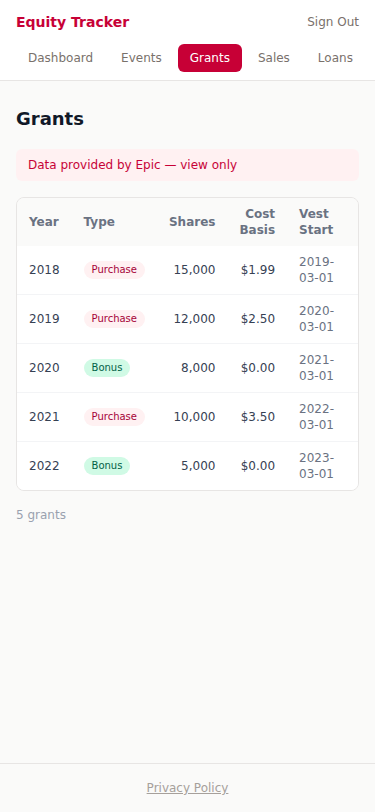
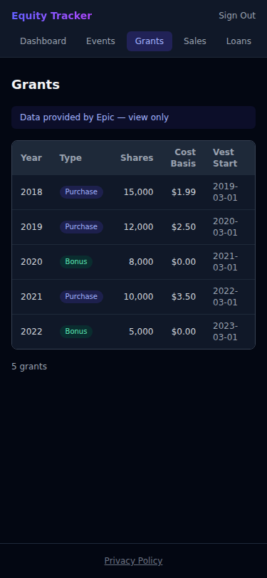
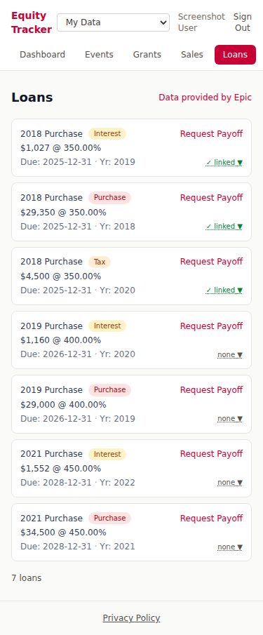

# Epic Network Deployment Notes

This document covers the Epic campus deployment track:

1. **Epic Mode** — the read-only deployment toggle that ships in the current
   app as a stepping stone toward full Epic-network deployment. Implemented.
2. **Epic campus deployment planning notes** — how the app would consume
   Epic's source-of-truth equity database, auth via Entra ID, write-back
   actions, cache invalidation, scaling, and open work. Not yet implemented.

---

## Epic Mode (Implemented)

Epic Mode is a read-only deployment mode built into the app for use with
Epic's managed data pipeline. It turns the app into a thin action layer on
top of externally-provided grant/loan/price data.

When active:

- Historical grant/price/loan/import writes are blocked (403) and the UI
  shows a "Historical data provided by Epic — view only" notice.
- Future price estimates remain writable (via **+ Price** for individual
  future dates, or **+ Estimate** for bulk growth projections).
- Each grant row shows a **Sell** button and each loan row shows a **Request
  Payoff** button (with lot allocation preview) so users can still act on
  their data.
- Sales are always writable but require a future date.
- A `POST /api/internal/cache-invalidate` webhook lets Epic's batch jobs
  pre-warm the Redis cache after writing.
- Past estimates are automatically cleaned up nightly and on page load once
  their date has passed.

Toggled from Admin → Danger Zone, or hard-locked via the `EPIC_MODE=true`
env var.

### Screenshots

| Grants Light | Grants Dark |
|-------|------|
|  |  |

| Loans Light |
|-------|
|  |

### Sales in Epic Mode

Only future dates are allowed — Plan Sale only, no Record Sale (you cannot
record historical sales against data you do not own). Both `$ Target` and
`# Shares` sizing modes work normally.

### Request Payoff

Each loan row shows a **Request Payoff** button instead of an Edit button.
This opens a modal that shows the full payoff picture before you commit:

1. **Outstanding balance** — principal + projected interest to the due date
2. **Shares to sell** — gross-up result (after-tax proceeds ≥ balance)
3. **Price per share** — share price at the due date
4. **Est. gross proceeds** — shares × price
5. **Sale date** — the loan due date
6. **Lot Allocation table** — shows which lots from the originating grant are consumed, with LT/ST classification

Tap **Confirm Payoff** to create the payoff sale. It appears immediately in
the Sales list and on the Events timeline as a "Loan Payoff Sale" event.

If a payoff sale for the loan already exists (e.g. auto-created at loan
setup), Confirm Payoff returns the existing sale rather than creating a
duplicate.

### Growth Price Estimator

Project future share prices via annual % growth from the current price.
Default start date is the next March 1 (matching Epic's typical price
announcement cadence). Generates one price per year through a configurable
end date. Estimates are visually distinguished (italic, "est." badge) and
automatically removed when a real price is added for the same date. Tap
**+ Estimate** on the Prices page.

### Admin controls

**Toggle Epic Mode** — Enable/disable read-only mode for Epic's managed data
pipeline from Admin → Danger Zone. When active, historical data writes are
blocked (403). Hard-locked on via `EPIC_MODE=true` env var if you want to
bypass the admin toggle entirely.

### Environment variables

| Variable | Required | Description |
|----------|----------|-------------|
| `EPIC_MODE` | No | Set to `true` to hard-lock Epic Mode on at the env level (overrides the admin toggle). Normally leave unset and use the Admin panel toggle instead. |
| `CACHE_INVALIDATE_SECRET` | No (Epic deployments) | Bearer token secret for `POST /api/internal/cache-invalidate`. Epic's batch systems POST to this endpoint after writing data. **Auto-generated on production deploy** and stored in `.secrets/cache_invalidate_secret`. Read the generated value off the server to configure Epic's webhook caller. Endpoint returns 503 if unset. |

### Epic-Mode-specific API endpoints

| Method | Path | Description |
|--------|------|-------------|
| POST | `/api/loans/{id}/execute-payoff` | Execute loan payoff — creates a sale (Epic Mode) |
| POST | `/api/internal/cache-invalidate` | Pre-warm Redis cache (Epic batch webhook; requires `Authorization: Bearer <CACHE_INVALIDATE_SECRET>`) |
| GET/POST | `/api/admin/epic-mode` | Get/set Epic Mode read-only state (admin only) |

### Code locations

- `backend/scaffold/epic_mode.py` — Epic Mode state (DB-backed, 1s TTL cache, env override)
- `backend/app/routers/cache.py` — `POST /api/internal/cache-invalidate` webhook

---

## Deployment Context

In the Epic deployment this app becomes a **read + action layer** on top of
Epic's existing equity database. The app does not own the data — it reads from
a source-of-truth DB managed by Epic's systems and exposes a small set of
user-initiated actions back into that system.

### Users

~15,000 employees who hold Epic equity. Auth is Azure Entra ID only (see
`CLAUDE.md` → OIDC_PROVIDERS). The `subject_claim` must be `"oid"` (the
immutable Entra Object ID, not `sub` which is per-app-scoped). User identity
maps to equity data via an employee identifier that Epic's Entra configuration
exposes as a claim — most likely `employeeId` or `onPremisesSamAccountName`.
Confirm the exact claim name with Epic's identity team before building the
auth→data join.

### Database

Epic runs MSSQL (SQL Server). Encryption at rest via Transparent Data
Encryption (TDE) — managed by Epic's DBAs, transparent to the app. The app's
current per-user AES-256-GCM column encryption (`scaffold/crypto.py`,
`KEY_ENCRYPTION_KEY`) becomes unnecessary and should be disabled for this
deployment. The app connects via a read-mostly service account; write-back for
user-initiated actions goes through a separate service account with tightly
scoped permissions.

---

## Data Change Sources (external batch processes)

The app does **not** own writes to the core equity tables. Changes arrive from
Epic's batch systems:

| Event | Affected users | Cache impact |
|---|---|---|
| Annual stock price announcement | All users | Invalidate all → fan-out recompute |
| New purchase grant + purchase loan batch | Affected employees | Invalidate per-user |
| Interest loan processing | Affected employees | Invalidate per-user |
| Batch loan payoff processing | Affected employees | Invalidate per-user |
| Exit event / liquidation | All (or subset) | Invalidate all → fan-out recompute |

Because writes come from outside this app, the current `schedule_recompute` /
`schedule_fan_out` hooks attached to write endpoints will not fire for these
events. A separate invalidation mechanism is required (see below).

---

## Cache Invalidation Strategy (external-DB scenario)

The current Redis cache uses content-addressed keys
(`timeline:{user_id}:{data_hash}`), so stale keys naturally become unreachable
when data changes. The 24h TTL provides a backstop. But for time-sensitive
events like the price announcement we need faster invalidation.

### Options (in order of preference)

**1. Webhook endpoint (recommended)**
Epic's batch process calls `POST /api/internal/cache-invalidate` with a payload
indicating what changed (`{ "scope": "all" }` for price/exit events,
`{ "user_ids": [...] }` for per-employee changes). The endpoint calls
`schedule_fan_out()` or targeted `schedule_recompute(user_id)` as appropriate.
Requires cooperation from Epic's batch team to add the webhook call at the end
of each batch job. Secured via a shared secret or mTLS.

**2. PostgreSQL / MSSQL change notifications**
If the source-of-truth DB is PostgreSQL, `LISTEN/NOTIFY` can trigger
invalidation. MSSQL equivalent is SQL Server Service Broker or Query
Notifications — more complex. Adds a persistent DB connection per app replica.

**3. Short TTL (simplest, eventual consistency)**
Reduce Redis TTL from 24h to something like 5–15 minutes. Equity data changes
infrequently (price once a year, grants/loans a few times a year). A 15-minute
stale window is acceptable for most scenarios. Not acceptable for the price
announcement spike — users would see old values for up to 15 minutes.

**4. Hybrid: short TTL + webhook for price announcements**
Use 15-minute TTL as the baseline. Add the webhook endpoint specifically for
price announcement day, which can be called manually or by batch job. This
covers the spike without requiring full webhook integration for all events.

### Recommendation

Start with option 3 (short TTL, e.g. 15 minutes) during the pilot phase since
it requires no coordination with Epic's batch team. Add the webhook endpoint
(option 1) before general rollout so the price announcement experience is
instant rather than eventually consistent.

---

## User-Initiated Actions

The two actions users can take through this app that write back to Epic's
systems:

### 1. Early Loan Payoff Request

User requests to pay off a specific loan ahead of its due date.

**Mechanics:**
- Triggers a sale of stock to cover the outstanding loan balance
- Lot selection is LIFO by default, **with an Epic-specific override**: skip
  any lots whose cost basis would result in short-term capital gains (STCG) if
  possible — i.e., prefer lots held longer than the LTCG threshold even if LIFO
  order would reach a short-term lot first
- If LTCG lots alone are insufficient to cover the loan, fall back to STCG lots
- The sale amount must cover: loan principal remaining (minus any early cash
  payments already made)
- The gross-up calculation must account for estimated tax on the gain so the
  net proceeds cover the full loan balance

**Difference from current implementation:**
Current `_compute_payoff_sale` in `loans.py` does LIFO/FIFO lot selection
without the "skip STCG if possible" logic. This needs to be added as a new lot
selection mode, e.g. `"epic_lifo"` — LIFO but prefer LTCG lots, skip STCG lots
unless unavoidable.

### 2. Stock Sale Request

User requests to sell shares of a specific tranche (grant year + type).

**Mechanics:**
- A tranche sale **must first cover any outstanding loans associated with that
  tranche** before converting the remainder to cash
- If the tranche has a linked loan: the sale size must be at least large enough
  to pay off that loan (gross-up for tax applies here too)
- Beyond the loan payoff, the user receives cash proceeds minus tax withholding
- If withholding applies: the sale must cover withholding amount + loan payoff;
  the user nets the remainder
- "What if" mode: given a desired net cash amount X, compute how many shares
  must be sold (iterative gross-up: shares → gross proceeds → tax → net → check
  against X → adjust)

**Two distinct sale scenarios:**

- **With tax withholding:** Epic withholds a fixed percentage for taxes. The
  gross sale must cover `loan_balance + withholding_amount`. Net to user is
  `gross_proceeds - taxes_withheld - loan_payoff`. User has no choice on size —
  it's determined by the obligations.
- **Without withholding (user-directed cash target):** User specifies a desired
  net cash amount X. App computes required gross sale iteratively:
  `shares → gross → taxes → net → compare to X → adjust shares`. This is a
  pure read — no write needed until the user confirms.

**Tranche targeting:**
Current sale model in `sales.py` does not enforce tranche-level lot priority or
mandatory loan coverage. The Epic version needs a sale request that specifies
`grant_year` + `grant_type`, validates the loan coverage requirement, and
computes the correct share count.

---

## Scaling Notes

See conversation history for full analysis. Summary:

- **Redis** (optional, via `REDIS_URL`) provides cross-replica L2 cache. Already
  implemented — see `backend/app/event_cache.py`.
- **Pre-warming** on data changes: `schedule_recompute(user_id)` for single-user
  changes, `schedule_fan_out()` (10-thread pool) for price changes. In the
  external-DB model these are triggered by the webhook endpoint instead of
  write-endpoint hooks.
- **Peak load**: Price announcement day — all 15k users hit the app
  simultaneously. Pre-warm the cache via fan-out before the announcement email
  goes out. Pre-scale K8s replicas the morning of announcement day.
- **Redis memory at 15k users**: ~600MB (JSON) / ~300MB (msgpack). Azure Cache
  for Redis C1 (1GB) is sufficient; C1 Standard for HA.
- **DB read replicas**: fan-out recompute reads grants/loans/prices for all
  users simultaneously — route these reads to a read replica to protect the
  primary.

---

## Remaining Work for Epic Deployment

| Item | Notes |
|---|---|
| Auth: Entra ID claim mapping | Confirm `employeeId` claim name with Epic identity team. Map `oid` as auth anchor, `employeeId` as equity DB join key. |
| Encryption: disable per-user KEK | Remove `KEY_ENCRYPTION_KEY` from Epic deploy config. TDE handles at-rest encryption at the DB level. |
| DB adapter: MSSQL | Replace `psycopg2-binary` with `pyodbc` or `pymssql`. Update `DATABASE_URL` format. SQLAlchemy dialect: `mssql+pyodbc`. |
| Cache invalidation: webhook endpoint | `POST /api/internal/cache-invalidate` with scope payload. Secured via shared secret. |
| Lot selection: `epic_lifo` mode | LIFO but prefer LTCG lots; skip STCG lots unless unavoidable. Add to `sales_engine.py`. |
| Sale action: tranche-targeted | New endpoint that enforces loan coverage before cash conversion. Gross-up for withholding. |
| Sale action: "what if" cash target | Given desired net X, iteratively compute shares needed. Can be purely read (no write) — just runs core.py with hypothetical sale injected. |
| Payoff action: write-back | Actual write to Epic's DB when user confirms a payoff/sale request. Requires write service account + approval workflow TBD. |
| Connection pooling | PgBouncer equivalent for MSSQL (e.g. SQL Server connection pooling via driver). Tune pool size for 1k+ concurrent users. |
| Pre-scale runbook | K8s deployment patch to bump replicas morning of price announcement. GitHub Actions workflow. |
