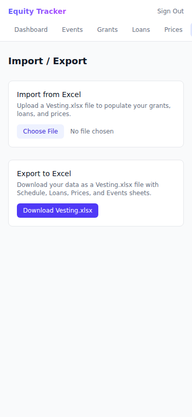
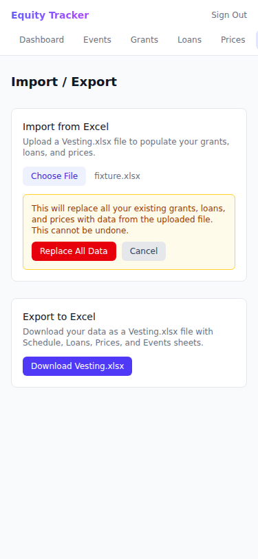
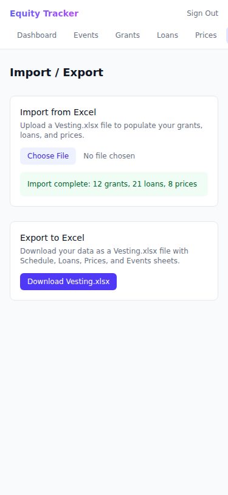
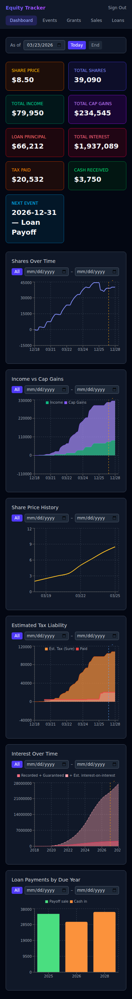
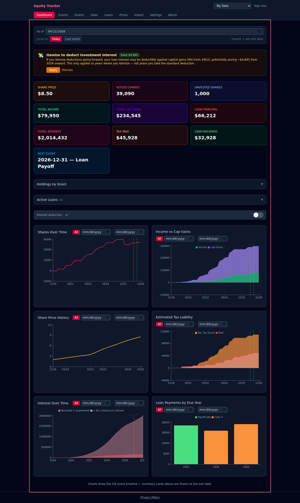
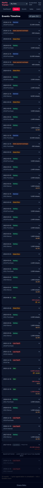
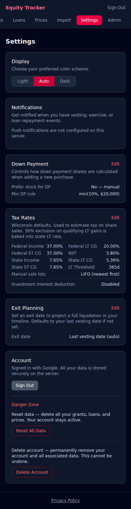
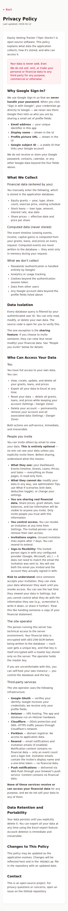

# Equity Vesting Tracker

A multi-user PWA for tracking equity compensation: grants, vesting schedules, stock loans, share price history, and derived event timelines showing income vs capital gains over time.

## Screenshots

### Import Flow

| Upload | Confirm | Success |
|--------|---------|---------|
|  |  |  |

### Dashboard

| | Light | Dark |
|--|-------|------|
| **Mobile** |  |  |
| **Desktop** |  |  |

### Events Timeline

| Light | Dark |
|-------|------|
|  |  |

### Import / Export (Template + Upload + Download)


### Stock Sales

| Light | Dark |
|-------|------|
|  |  |

### Settings (Tax Rates, Lot Selection, Down Payment & Exit Planning)

| Light | Dark |
|-------|------|
|  |  |

### Admin Dashboard

| Light | Dark |
|-------|------|
|  |  |

### Login & Privacy Policy

| Light | Dark |
|-------|------|
|  |  |



## Getting Started (User Guide)

1. **Sign in** — click the sign-in button for your organisation's identity provider (Google, Azure AD, or any OIDC provider configured by your admin). Your data is tied to that account, and you can export everything anytime.
2. **Add a price** — go to **Prices** and enter the current share price (Epic announces this each March). Without at least one price, no events will be computed.
3. **Add your data** — two options:
   - **Import from Excel** — go to **Import**, download the **Sample** (pre-filled with fake data and explanatory cell comments) to see what the format looks like, then fill in your real data and upload. Click "What do the columns mean?" for a plain-English guide to every field.
   - **Add manually** — go to **Grants** and add grants one by one. Then add any **Loans** and their annual interest loans. For bonus/free grants where you filed an **83(b) election**, tick the "Filed 83(b) election" checkbox — vesting events will show unrealized cap gains instead of ordinary income.
4. **View the Dashboard** — summary cards (share price, total shares, income, cap gains, loan principal, interest, tax paid, cash received, next event). Use the **As of** date picker to time-travel. **Today** snaps to the current date; **Last event** jumps to your final vesting date; **Exit date** appears when you've configured one (see Settings → Exit Planning) and jumps to your projected liquidation date — showing 0 shares, 0 principal, and net cash.
5. **View Events** — the full computed timeline of vesting, exercise, loan payoff, and sale events. A **Liquidation (projected)** event is automatically appended at your exit date. Tap it to see the calculation breakdown (shares × price → gross proceeds → est. tax → net). Events after the exit date are dimmed with a "beyond exit horizon" separator.
6. **Configure your exit date** — go to **Settings → Exit Planning** to set a specific date. The projected liquidation uses shares and price as of that date (even if it's before your last vesting event). Defaults to your last vesting date if not set.
7. **Record a sale** — go to **Sales**, add a sale. The lot selection method (LIFO/FIFO/same-tranche) and tax rates are set in **Settings → Tax Rates**. For a loan payoff sale, link it to a loan and the share count is auto-sized to cover the full payoff after tax.
8. **Set up notifications** — go to **Settings → Notifications**. Enable push (browser) or email, then choose timing: day-of, 3 days before, or 1 week before your events. Hit **Send test** to confirm push is working.
9. **Export your data** — go to **Import/Export → Download Vesting.xlsx** to get a full export at any time.

## Features

- **Event Timeline** — computed on the fly from grants, prices, and loans. Never stored. Shows income, capital gains, share price, and cumulative totals. A **Liquidation (projected)** event is auto-injected at the exit date: tap it to see a breakdown (shares × price → gross proceeds → est. tax → net). Events after the exit date are dimmed with a "beyond exit horizon" separator so it's clear they won't occur if you liquidate.
- **Exit Planning** — set an exit date in Settings → Exit Planning to project a full liquidation at any point, even before your last vesting event. The projection uses only the shares and price available as of that date. Dashboard quick buttons update to include an **Exit date** shortcut; card values at the exit date correctly show 0 shares, 0 loan principal, and net cash (gross proceeds − loans − tax).
- **Dashboard** — summary cards (share price, total shares, income, cap gains, loan principal, total interest, tax paid, cash received, next event) with an **As of** date picker and quick buttons: **Today**, **Last event** (final vesting date), and **Exit date** (when configured). Interactive charts include an Interest Over Time chart with guaranteed vs. projected interest-on-interest layers. Empty state shows getting-started prompts for new users.
- **Stock Sales** — record share sales with configurable lot selection (LIFO/FIFO/same-tranche), LT/ST capital gains split, and Wisconsin tax calculator. Payoff sales can be linked to loans and auto-sized to cover the cash due after tax (gross-up calculation). Use "Regen payoff sales" on the Loans page to recompute all future payoff sale share counts after changing lot selection.
- **CRUD Management** — full create/read/update/delete for Grants, Loans, Prices, and Sales.
- **Quick Flows** — convenience endpoints: "New Purchase" (grant + loan with optional stock down payment), "Annual Price", "Add Bonus".
- **83(b) Election Support** — bonus/free grants can be flagged as having an 83(b) election filed. Vesting events for these grants show unrealized cap gains (violet `~$X`) instead of ordinary income, with a tappable card explaining the cost basis and potential LT cap gains tax at eventual sale.
- **Down Payment Rules** — configurable minimum DP policy (percent of purchase and dollar cap). "Prefer stock DP" auto-calculates the minimum stock exchange down payment on new purchases. Default: 10% or $20,000, whichever is lower.
- **Excel Import/Export** — bootstrap from an existing Vesting.xlsx or export current state. The Import page includes a downloadable sample file (pre-filled with fake data, with cell comments explaining every field) and a built-in column reference guide.
- **OIDC Sign-In** — provider-agnostic PKCE flow works with any standards-compliant IdP (Google, Azure Entra ID, etc.). Multiple providers can be enabled simultaneously — the login page shows one button per provider. Automatic account creation; data is tied to the account.
- **Admin Dashboard** — user management, aggregate stats, email blocking, and system health monitoring (CPU, RAM, DB size sparklines with 24h/72h/7d/30d windows, per-table DB size breakdown). Admin cannot see financial data.
- **Push & Email Notifications** — configurable advance timing: day-of, 3 days before, or 1 week before each event. Per-user opt-in for each channel independently. Includes a "Send test" button to confirm push is working.
- **Per-User Encryption** — AES-256-GCM column-level encryption. Two-level key hierarchy: `KEY_ENCRYPTION_KEY` (env var, set once, never changes) wraps an operational master key stored encrypted in the database. The master key can be rotated live from the admin panel — all replicas pick up the new key automatically within seconds, no restart required. Each user has a unique per-user key wrapped by the master key.
- **Maintenance Mode** — two distinct mechanisms: (1) app-managed downtime stored in the database — all replicas see the toggle instantly; financial API routes return 503 while auth and admin remain accessible; (2) deploy-time full downtime via a Caddy sentinel file (`./data/full_maintenance`) that serves a static 503 page while the app container is stopped.
- **Dark/Light Mode** — auto-detects system preference, updates live.
- **Mobile-First** — designed for 375px phone viewports.

## Tech Stack

| Layer | Technology |
|-------|-----------|
| Backend | Python 3.12, FastAPI, SQLAlchemy, PostgreSQL (Alembic migrations) |
| Frontend | React 19, TypeScript, Vite, Tailwind CSS 4, Recharts |
| Auth | OIDC PKCE (any provider) → BFF session cookie (HttpOnly, XSS-safe) |
| Deploy | Docker Compose + Caddy (auto-HTTPS) + Cloudflare (DDoS protection) |
| Tests | pytest (backend), Vitest + RTL (frontend), Playwright (E2E) |

## Quick Start

### Prerequisites

- Python 3.12+
- Node.js 20+
- At least one OIDC provider configured in `OIDC_PROVIDERS` (see [Environment Variables](#environment-variables))

### Backend

```bash
cd backend
pip install -r requirements.txt
uvicorn main:app --reload --port 8000
```

The backend creates `data/vesting.db` automatically on first run. To reset the local database, delete the file: `rm backend/data/vesting.db`.

### Frontend

```bash
cd frontend
npm install
npm run dev
```

The dev server proxies `/api` requests to `localhost:8000`.

### Environment Variables

Copy the example file and fill in your secrets:

```bash
cp .env.example .env
```

| Variable | Required | Description |
|----------|----------|-------------|
| `JWT_SECRET` | Yes (local dev) | Random secret for signing JWT tokens. **Auto-generated on production deploy.** |
| `OIDC_PROVIDERS` | Yes | JSON array of OIDC provider configs — see `.env.example` for format. Supports Google, Azure Entra ID, or any OIDC-compliant IdP. Multiple providers show as separate sign-in buttons. |
| `DATABASE_URL` | Yes (prod) | PostgreSQL DSN. Docker Compose sets this automatically from `POSTGRES_PASSWORD`. |
| `POSTGRES_PASSWORD` | Yes (local dev) | Password for the `postgres` user. **Auto-generated on production deploy.** |
| `KEY_ENCRYPTION_KEY` | No | Enables per-user AES-256-GCM encryption. Set once, never changes. **Auto-generated on production deploy** and stored in `.secrets/key_encryption_key`. Wraps the operational master key stored in the database. |
| `LEGACY_MASTER_KEY` | No | One-time migration aid. Set to the old `ENCRYPTION_MASTER_KEY` value on first deploy after upgrading to the two-level key hierarchy; unset it after the first successful boot. |
| `ADMIN_EMAIL` | No | Semicolon-delimited email(s) granted admin access on login |
| `VAPID_PUBLIC_KEY` | No | Required for push notifications. **Auto-generated on production deploy.** |
| `VAPID_PRIVATE_KEY` | No | Required for push notifications. **Auto-generated on production deploy.** |
| `EMAIL_PROVIDER` | No | `resend` (default) or `smtp` |
| `RESEND_API_KEY` | No | Enables email notifications via [Resend](https://resend.com) |
| `RESEND_FROM` | No | Sender address for emails (e.g. `Equity Tracker <noreply@yourdomain.com>`) |
| `SMTP_HOST` | No | SMTP server hostname (when `EMAIL_PROVIDER=smtp`) |
| `SMTP_PORT` | No | SMTP port, default 587 |
| `SMTP_USER` | No | SMTP username |
| `SMTP_PASSWORD` | No | SMTP password |
| `SMTP_FROM` | No | Sender address for SMTP emails |
| `APP_URL` | No | Public app URL included as a link in email notifications |
| `ACME_EMAIL` | No (prod) | Email address for Let's Encrypt certificate expiry notifications. Set as a GitHub Actions variable. |
| `TRUSTED_PROXY_IPS` | No (prod) | Cloudflare IP ranges passed to Caddy for real-IP forwarding. Set as a GitHub Actions variable. |
| `COMMIT_SHA` | No | Git commit SHA injected at Docker build time. Displayed as a 7-char short hash at the bottom of the Admin and Settings pages so testers can confirm which build is running. **Set automatically by the deploy workflow.** |

### OIDC_PROVIDERS format

Set `OIDC_PROVIDERS` to a JSON array of provider objects:

```bash
OIDC_PROVIDERS='[{"name":"google","label":"Google","client_id":"YOUR_ID.apps.googleusercontent.com","client_secret":"YOUR_SECRET","discovery_url":"https://accounts.google.com/.well-known/openid-configuration"}]'
```

Each object supports:
- `name` — internal identifier (e.g. `"google"`, `"azure"`)
- `label` — displayed on the sign-in button (e.g. `"Google"`, `"Contoso Azure AD"`)
- `client_id` — from your IdP's app registration
- `client_secret` — optional; omit for PKCE-only / native-app clients
- `discovery_url` — OIDC discovery endpoint (`.well-known/openid-configuration`)
- `scopes` — optional; defaults to `["openid","email","profile"]`
- `subject_claim` — optional; defaults to `"sub"`. Set to `"oid"` for Azure Entra ID

Multiple providers show as separate "Sign in with X" buttons on the login page. Redirect URI to register in your IdP: `https://yourdomain.com/auth/callback`

Example with Google and Azure Entra ID together:
```json
[
  {
    "name": "google",
    "label": "Google",
    "client_id": "YOUR_ID.apps.googleusercontent.com",
    "client_secret": "YOUR_SECRET",
    "discovery_url": "https://accounts.google.com/.well-known/openid-configuration"
  },
  {
    "name": "azure",
    "label": "Contoso Azure AD",
    "client_id": "YOUR_AZURE_CLIENT_ID",
    "discovery_url": "https://login.microsoftonline.com/YOUR_TENANT_ID/v2.0/.well-known/openid-configuration",
    "subject_claim": "oid"
  }
]
```

For local development, generate VAPID keys with:
```bash
npx web-push generate-vapid-keys
```

The login page fetches available sign-in providers from the backend at `GET /api/auth/providers` — no frontend env vars needed.

## Production Deployment

### Multi-App Caddy (shared infrastructure)

This app uses a shared Caddy reverse proxy. The infra compose file manages Caddy and the shared `proxy` Docker network; each app manages itself.

The deploy script handles everything automatically on first deploy — it creates the `proxy` Docker network if it doesn't exist and starts (or updates) the infra Caddy container. No manual SSH steps are needed. Each deployed app writes a `caddy/app.caddy` snippet into the shared `caddy_config` volume and reloads Caddy, all handled by the deploy workflow.

### Manual VPS Setup (per app)

```bash
# One-time setup on the VPS (per app)
curl -fsSL https://get.docker.com | sh
mkdir -p /opt/epic-stocks/data
cd /opt/epic-stocks
git clone <repo-url> .
```

Set `OIDC_PROVIDERS`, `DOMAIN`, and other secrets as GitHub Actions variables/secrets — the deploy workflow writes `.env` automatically on every push to `main`. Never create `.env` on the VPS manually.

### Deploy Safety

The deploy workflow includes two safeguards against silent failures:

1. **Caddy snippet validation** — a `caddy-validate` CI job wraps `caddy/app.caddy` in a minimal Caddyfile and validates it before deploy, catching syntax errors before they reach prod.
2. **Post-deploy health polling** — after `docker compose up -d`, the deploy script polls `http://localhost/api/health` for up to 60 seconds. If the app doesn't respond, it prints `docker compose ps`, recent logs, recent commits, and manual rollback instructions, then exits 1. No auto-rollback — Alembic runs migrations on startup, so reverting code after a schema migration requires manual review.

**Downtime during deploy** — the deploy script touches a sentinel file in the shared `appdata` Docker volume before stopping the app container. Caddy serves a static "Down for Maintenance" page (auto-refreshes every 20 s, `Cache-Control: no-store`) until the sentinel is removed at the end of the script. This is separate from app-managed maintenance (rotation / admin toggle), which uses a different sentinel and keeps the app running.

For the full deploy pipeline details, uptime monitoring setup, backup strategy, and incident runbook, see **[OPERATIONS.md](OPERATIONS.md)**.

## Development

### Running Tests

```bash
# Backend unit tests (from repo root)
pytest backend/tests/ -v

# Frontend unit tests
cd frontend && npm test

# Frontend unit tests — watch mode (re-runs on file save)
cd frontend && npm run test:watch

# Lint frontend
cd frontend && npm run lint

# All unit tests
pytest backend/tests/ -v && cd frontend && npm test
```

### Running E2E Tests

E2E tests use Playwright. First-time setup:

```bash
cd frontend && npm ci && npx playwright install chromium
```

Then use the script from the repo root — it handles type-checking, spinning up a fresh backend + frontend, waiting for both to be healthy, and cleaning up on exit:

```bash
./e2e.sh
```

To pass Playwright args (filter, reporter, etc.):
```bash
./e2e.sh --grep "quick-flow"
./e2e.sh e2e/user-journey.spec.ts
./e2e.sh --reporter=list
```

### Regenerating Screenshots

First-time setup:

```bash
cd backend && pip install -r requirements.txt
cd frontend && npm ci && npx playwright install chromium
```

Then from the repo root:

```bash
./screenshots/run.sh
```

This spins up a temporary backend + frontend with seeded sample data, runs all Playwright specs (including screenshot capture), and writes PNGs to `screenshots/`. Commit any updated screenshots to the repo.

### Project Structure

The codebase is split into **scaffold** (auth, admin, crypto, notifications — reusable) and **app** (equity tracking domain logic — replaceable when forking). See [FORK_GUIDE.md](FORK_GUIDE.md) for how to fork for a different domain.

```
epic-stocks/
├── backend/
│   ├── main.py              # FastAPI app + router wiring + metrics sampler
│   ├── database.py          # SQLAlchemy engine setup
│   ├── schemas.py           # Shared Pydantic schemas
│   ├── alembic/             # Alembic migrations (run on startup)
│   ├── scaffold/            # Reusable auth/infra layer (keep when forking)
│   │   ├── auth.py          # JWT creation/verification + admin checks
│   │   ├── crypto.py        # Per-user AES-256-GCM encryption
│   │   ├── email_sender.py  # Email dispatch (delegates to providers/)
│   │   ├── maintenance.py   # Sentinel path for app-managed downtime
│   │   ├── models.py        # SQLAlchemy models (User, BlockedEmail, etc.)
│   │   ├── notifications.py # Push + email notification logic
│   │   ├── providers/
│   │   │   ├── auth/        # OIDC provider (generic PKCE + JWKS verification)
│   │   │   └── email/       # Email providers: Resend, SMTP
│   │   └── routers/
│   │       ├── auth_router.py   # OIDC PKCE endpoints + JWT issuance
│   │       ├── admin.py         # Admin dashboard, user mgmt, blocklist
│   │       ├── notifications.py # Email notification preferences
│   │       └── push.py          # Push subscription management
│   ├── app/                 # Equity tracking domain (replace when forking)
│   │   ├── core.py          # Event generation logic (frozen)
│   │   ├── sales_engine.py  # FIFO cost-basis + tax + gross-up calculations
│   │   ├── excel_io.py      # Excel read/write (openpyxl)
│   │   ├── timeline_cache.py # Memoized event computation
│   │   └── routers/
│   │       ├── grants.py    # Grant CRUD + bulk
│   │       ├── loans.py     # Loan CRUD + bulk
│   │       ├── prices.py    # Price CRUD
│   │       ├── events.py    # Computed timeline + dashboard
│   │       ├── horizon.py   # Exit date settings
│   │       ├── flows.py     # Quick flows (new purchase, bonus, price)
│   │       ├── import_export.py # Excel import/export + template
│   │       └── sales.py     # Sales CRUD + tax breakdown
│   └── tests/               # pytest tests
├── frontend/
│   ├── src/
│   │   ├── scaffold/        # Reusable UI layer (keep when forking)
│   │   │   ├── pages/       # Login, AuthCallback, Admin, Settings, PrivacyPolicy
│   │   │   ├── components/  # Layout shell, Toast
│   │   │   ├── contexts/    # ThemeContext, MaintenanceContext
│   │   │   └── hooks/       # useAuth, useConfig, useDark, usePush, useMe
│   │   ├── app/             # Equity tracking UI (replace when forking)
│   │   │   ├── pages/       # Dashboard, Events, Grants, Loans, Prices, Sales, ImportExport
│   │   │   └── hooks/       # useApiData, useDataSync
│   │   ├── App.tsx          # Router + layout wiring
│   │   └── __tests__/       # Vitest tests
│   ├── public/
│   │   ├── sw.js            # Service worker (cache busting + push)
│   │   └── manifest.json    # PWA manifest
│   ├── e2e/                 # Playwright specs
│   └── playwright.config.ts
├── infra/
│   ├── docker-compose.infra.yml  # Shared Caddy + proxy network (one per server)
│   └── Caddyfile                 # Root config: imports per-app snippets
├── caddy/
│   ├── Caddyfile            # Per-app Caddy config (reverse proxy + cache headers)
│   └── app.caddy            # Caddy snippet for multi-app mode
├── screenshots/             # Auto-generated by Playwright
│   ├── run.sh               # Screenshot capture orchestrator
│   └── seed.py              # Sample data seeder
├── Dockerfile               # Multi-stage build (frontend + backend)
├── docker-compose.yml       # App compose (joins shared proxy network; always uses shared proxy network)
├── FORK_GUIDE.md            # How to fork for a different domain
└── test_data/
    └── fixture.xlsx         # Synthetic test fixture
```

## API Overview

All authenticated endpoints require a valid `session` cookie (set automatically by the browser after sign-in). There is no Bearer token — the JWT lives only in an HttpOnly cookie that JavaScript cannot read. The companion `auth_hint` cookie (readable by JS) tells the SPA whether a session exists without exposing the credential.

| Method | Path | Description |
|--------|------|-------------|
| GET | `/api/auth/providers` | List configured OIDC providers (name + label) |
| GET | `/api/auth/login?provider=&code_challenge=&redirect_uri=&state=` | Start PKCE flow — returns IdP authorization URL |
| POST | `/api/auth/callback` | Exchange PKCE code for JWT |
| GET | `/api/me` | Current user info + is_admin flag |
| POST | `/api/me/reset` | Reset all financial data (keeps account) |
| DELETE | `/api/me` | Delete account and all associated data |
| GET | `/api/config` | Client config (VAPID key, email availability, etc.) |
| GET | `/api/health` | Health check (infra/uptime monitors — always 200) |
| GET | `/api/status` | Operational status `{"maintenance": bool}` — polled by SPA |
| GET | `/api/dashboard` | Summary cards data |
| GET | `/api/events` | Computed event timeline |
| GET/POST | `/api/grants` | List/create grants |
| GET/PUT/DELETE | `/api/grants/{id}` | Get/update/delete grant |
| POST | `/api/grants/bulk` | Bulk create grants |
| GET/POST | `/api/loans` | List/create loans |
| GET/PUT/DELETE | `/api/loans/{id}` | Get/update/delete loan |
| POST | `/api/loans/bulk` | Bulk create loans |
| GET/POST | `/api/prices` | List/create prices |
| GET/PUT/DELETE | `/api/prices/{id}` | Get/update/delete price |
| GET/POST | `/api/sales` | List/create sales |
| GET/PUT/DELETE | `/api/sales/{id}` | Get/update/delete sale |
| GET | `/api/sales/{id}/tax-breakdown` | FIFO tax breakdown for a sale |
| GET | `/api/loans/{id}/payoff-sale-suggestion` | Suggested gross-up sale for a loan |
| POST | `/api/loans/regenerate-all-payoff-sales` | Recompute all future payoff sale share counts |
| GET/POST | `/api/loan-payments` | List/create early loan payments |
| PUT/DELETE | `/api/loan-payments/{id}` | Update/delete a loan payment |
| POST | `/api/flows/new-purchase` | Create grant + optional loan |
| POST | `/api/flows/annual-price` | Add a price entry |
| POST | `/api/flows/add-bonus` | Add a bonus grant |
| POST | `/api/import/excel` | Upload Excel file to populate tables |
| GET | `/api/import/template` | Download empty Excel template |
| GET | `/api/import/sample` | Download sample Excel file pre-filled with fake data and cell comments |
| GET | `/api/export/excel` | Download Vesting.xlsx with all data |
| GET/PUT | `/api/horizon-settings` | Get/set exit date for projected liquidation |
| POST/DELETE | `/api/push/subscribe` | Subscribe/unsubscribe push notifications |
| GET | `/api/push/status` | Check push subscription status |
| POST | `/api/push/test` | Send a test push notification to the current user's subscriptions |
| GET/PUT | `/api/notifications/email` | Get/set email notification preference (returns `enabled` + `advance_days`) |
| PUT | `/api/notifications/advance-days` | Set how many days in advance to send notifications (0 = day-of, 3, or 7) |
| GET/POST | `/api/admin/maintenance` | Get/set app-managed maintenance mode (admin only) |
| GET | `/api/admin/rotation-status` | Whether a rotation snapshot exists on disk (admin only) |
| POST | `/api/admin/rotate-key` | SSE stream: rotate encryption master key (admin only) |
| POST | `/api/admin/rotation-restore` | Restore DB from on-disk snapshot after a crashed rotation (admin only) |
| GET | `/api/admin/stats` | Aggregate stats + latest CPU/RAM snapshot (admin only) |
| GET | `/api/admin/users?q=&limit=10&offset=0` | User list with metadata, searchable + paginated (admin only) |
| DELETE | `/api/admin/users/{id}` | Delete user + all data (admin only) |
| GET/POST | `/api/admin/blocked` | List/block emails (admin only) |
| DELETE | `/api/admin/blocked/{id}` | Unblock email (admin only) |
| POST | `/api/admin/test-notify` | Send a test push/email notification to any user (admin only) |
| GET | `/api/admin/errors` | List recent backend error logs (admin only) |
| DELETE | `/api/admin/errors` | Clear error log (admin only) |
| GET | `/api/admin/metrics?hours=72` | Time-series CPU/RAM/DB metrics history (admin only) |
| GET | `/api/admin/db-tables` | Per-table DB size breakdown (PostgreSQL only, admin only) |

## Admin Workflows

The admin system is opt-in via the `ADMIN_EMAIL` environment variable. Admins are designated dynamically on each login — adding or removing an email from `ADMIN_EMAIL` grants or revokes access on the user's next login.

### Accessing the Admin Dashboard

1. Set `ADMIN_EMAIL` in your `.env` (semicolon-delimited for multiple admins)
2. Sign in with a matching account via any configured OIDC provider
3. Navigate to `/admin` in the app

### What Admins Can See

- Total registered users and active users (last 30 days)
- Aggregate counts: total grants, loans, prices across all users
- Database storage usage
- **System Health** — current CPU %, RAM %, and DB size with sparkline charts (24h/72h/7d/30d windows). Sampled every 15 minutes; 30-day rolling retention.
- **Database Tables** — per-table size breakdown showing which tables are large (PostgreSQL only). Useful for diagnosing storage growth; includes a note explaining PostgreSQL's ~7–8 MB baseline overhead.
- Per-user metadata: email, name, created_at, last_login, record counts, admin badge
- Searchable user list (filter by email or name) with pagination, sorted by last active
- **Build version** — a 7-character commit SHA is shown in small muted text at the bottom of the Admin page (and the Settings page for all users), so testers can confirm exactly which build is running without needing server access

### What Admins Cannot See

- Any user's financial data (share counts, prices, loan amounts, computed events)
- Only aggregate counts and user metadata are exposed

### Admin Actions

| Action | Description |
|--------|-------------|
| **Delete user** | Permanently removes user and all their data. Blocked during maintenance (financial data unreadable mid-rotation). Admin users cannot be deleted. |
| **Block email** | Prevents an email address from logging in or creating an account. Includes optional reason field. |
| **Unblock email** | Removes an email from the blocklist, restoring login access. |
| **View user activity** | See when each user last logged in and how many records they have. |
| **Send test notification** | Immediately sends a push and/or email notification to any user for debugging. |
| **Enable / disable maintenance** | Toggles app-managed downtime. Financial API routes return 503; auth and admin remain accessible. An amber banner appears in the nav and financial pages show a placeholder. Use this before planned ops that affect financial data. |
| **Rotate encryption key** | Generates a new master key, re-wraps all per-user keys, smoke-tests, then persists to the database and clears maintenance. New key propagates to all replicas automatically within seconds — no deploy or env var change needed. A snapshot of old keys is saved to the database before any changes; restored automatically on failure. |
| **Restore from snapshot** | Appears in the admin panel when an interrupted rotation left a snapshot in the database. Writes the old per-user keys back and clears maintenance — recovers from a crash without SSH access. |

### Blocked Email System

Blocked emails are checked at login time (case-insensitive). A blocked user cannot log in or create a new account. The blocklist is managed via the admin panel or the `/api/admin/blocked` endpoints.

## Notifications

Notifications are sent once per day, at 7 AM UTC. Each user can configure how far in advance to be notified — day-of, 3 days before, or 1 week before their events. The scheduler checks events falling on `today + advance_days` for each user.

**Which events trigger a notification:**
| Event type | Notified? |
|---|---|
| Vesting | Yes |
| Exercise | Yes |
| Loan Payoff | Yes |
| Planned sale (loan payoff) | Yes |
| Share Price update | No |
| Down payment exchange | No |

**What the notification contains:**
Notifications are intentionally minimal — they contain no financial data, no share counts, and no dollar amounts. The content is identical across push and email:

- **Push notification** — a single notification with title `Equity Tracker` and a body like: `You have 2 events today: 1 Loan Repayment, 1 Vesting`. Tapping it opens the app dashboard.
- **Email** — subject: `Equity Tracker: 2 events today`. Body: the same event count summary plus a link prompt to log in and view details.

If a user has multiple events of the same type on the same day they are counted together (`2 Vesting`). Users open the app to see the full details.

**At-most-once-per-day guarantee:** A `last_notified_at` timestamp on each user ensures only one batch is sent per day regardless of server restarts or retries.

**Opt-in per channel:**
- *Push* — enabled by subscribing in the browser (Settings → Notifications → Enable). Requires VAPID keys to be configured. Each device subscribes independently; all active devices receive the notification. A **Send test** button in Settings lets users confirm push is working without waiting for a real event.
- *Email* — enabled via the toggle in Settings. Requires `RESEND_API_KEY` to be configured. Disabled by default.

**Advance timing** — users choose when to receive notifications: day-of (default), 3 days before, or 1 week before the event. This is set in Settings → Notifications and applies to both push and email.

**Admin test tool:** Admins can send an immediate test notification to any user from the Admin panel, using either a pre-built event template (Vesting, Exercise, Loan Repayment) or fully custom title/body. Test notifications respect user preferences — push only goes to active subscriptions, email only if the user has it enabled.

## Privacy & Data Security

This application stores sensitive financial data. Please read **[PRIVACY.md](PRIVACY.md)** before deploying for others.

Key points:
- **BFF auth / XSS protection** — the JWT is stored in an `HttpOnly; Secure; SameSite=Lax` session cookie, not in `localStorage` or a JavaScript variable. JavaScript cannot read it, so a successful XSS attack cannot exfiltrate the credential and replay it from an attacker's origin. A companion `auth_hint` cookie (not HttpOnly) lets the SPA know a session exists without exposing the token itself.
- **Data isolation** — every API query filters by authenticated user ID. Users cannot see each other's data.
- **Encryption at rest** — financial data (shares, prices, loan amounts) is encrypted per-user with AES-256-GCM. Two-level hierarchy: `KEY_ENCRYPTION_KEY` (env var, set once) wraps an operational master key stored encrypted in the `system_settings` DB table. Each user gets a unique key wrapped by the master key. Rotating the master key re-wraps only the per-user key wrappers — not all data — and propagates to all replicas automatically.
- **Open source** — users can audit the code, self-host their own instance, or fork the project.
- **Data portability** — users can export all their data to Excel at any time.

If you run an instance for others: secure the database, use HTTPS, set `KEY_ENCRYPTION_KEY`, and keep your secrets safe. See **[OPERATIONS.md](OPERATIONS.md)** for a full checklist of what the app does automatically vs. what you need to configure in your hosting environment (Cloudflare, SSH hardening, VPS firewall, backups, runbook).

## Key Design Decisions

- **Events are never stored.** They're computed per-request from the three source tables (Grants, Loans, Prices). This eliminates sync issues entirely.
- **core.py is frozen.** The event generation logic is tested against known-good values (89 events, cum_shares=558,500, cum_income=$144,325, cum_cap_gains=$1,224,195). Don't modify it.
- **Excel import is per-sheet, not all-or-nothing.** Only the sheets present in the uploaded file are replaced (Schedule → grants, Loans → loans + payoff sales, Prices → prices). Sheets not included in the file are left untouched. The import flow validates first, previews second, writes third — all in one transaction. A backup snapshot of the affected data is saved automatically before each import (last 3 kept per user). Restore via `GET /api/import/backups` + `POST /api/import/backups/{id}/restore`.
- **Lot selection method is user-configurable (default: LIFO).** In Tax Settings, users choose between:
  - **LIFO** (default) — newest vested lots sold first. For rising stock this maximises cost basis and minimises cap gains.
  - **FIFO** — oldest lots first. Maximises LT-qualified shares when stock was purchased long ago.
  - **Same tranche** — lots from the same grant year/type sold first (chains into LIFO for any remainder). Matches each payoff sale to its originating grant.
  - **Note:** The IRS may require a consistent lot selection method election at time of sale. Consult a tax advisor before changing this.
- **Payoff sale share counts are stored, not recomputed.** When a payoff sale is auto-generated, the share count is computed via gross-up and stored. It does not automatically update if you later change lot selection. Hit "Regen payoff sales" on the Loans page to refresh all future payoff sales at once.
- **Down payment via stock exchange is non-taxable.** The `dp_shares` field on a grant records vested shares exchanged at exercise. They reduce the loan principal and generate no income or capital gains event. Shares are consumed in lowest-cost-basis order: Bonus (RSU) lots first, then oldest Purchase lots (FIFO). This minimises the opportunity cost of the exchange by preserving higher-basis lots for future sales.
- **Cost basis for purchase grants is the purchase price, not FMV at vest.** For grants with a purchase price (`grant_price > 0`), vesting only lifts the sale restriction — it does not create a new tax event or step up the cost basis. Capital gains are computed as `sale price − purchase price`. For income/RSU grants (`grant_price = 0`), FMV at vesting is recognised as ordinary income and becomes the cost basis.
- **83(b) election is display-only.** The `election_83b` flag on a bonus grant does not change how core.py computes the timeline — `income` is still populated with `FMV × shares` at each vesting event and is used as the unrealized gain amount. The flag tells the Events page to render that value as violet `~$X` (unrealized cap gain) instead of green income, and to show potential LT cap gains tax instead of ordinary income tax. Cost basis for eventual sale remains $0 (the 83(b) price). For grants where the 83(b) was filed at a non-zero FMV, set the Cost Basis field to that price instead; core.py will treat it as a purchase grant automatically.
