# Equity Vesting Tracker

A mobile-first web app for tracking equity compensation — grants, vesting schedules, stock loans, share price history, and estimated tax impact over time. Built as a PWA so it works on any device, including your phone.

> **Epic campus deployment:** This app has an **Epic Mode** designed for deployment on Epic's internal campus network, which changes several behaviors (read-only historical data, Request Payoff flow, cache-invalidation webhook, Epic-specific env vars and admin controls). See **[EPIC_DEPLOYMENT.md](EPIC_DEPLOYMENT.md)** for details.

---

## Table of Contents

- [Understanding Your Equity](#understanding-your-equity) — key concepts explained
- [For Users](#for-users) — getting started, dashboard, sales, loans, notifications, sharing
- [For Content Admins](#for-content-admins) — editing the grant program schedule and rates
- [For Site Admins](#for-site-admins) — user management, system health, maintenance
- [For Site Operators](#for-site-operators) — deployment, environment variables, development, API reference

---

## Understanding Your Equity

A quick primer on the concepts the app uses throughout. If you're already familiar with equity compensation, skip ahead to [For Users](#for-users).

### Grants

An equity **grant** is a promise from your employer to give you company shares under specific conditions. This app handles three kinds:

| Type | What it is |
|------|-----------|
| **Purchase grant** | You buy shares at a discounted price (the *grant price* or *purchase price*). Shares are locked until the *exercise date*. You typically take out a loan to cover the cost at purchase time. |
| **Catch-up grant** | Same structure as a purchase grant — designed to let longer-tenured employees buy more shares at earlier, lower prices. |
| **Bonus / RSU grant** | Shares given to you for free (grant price = $0) on a vesting schedule. Each vest date is a taxable event. |

### Vesting

**Vesting** is the process by which you gain full ownership of your shares over time, according to a schedule in your grant agreement. Until a tranche vests, you generally can't sell those shares. After it vests, they're yours.

### Two prices are always in play

Every calculation in this app involves two prices:

| | Name | What it is |
|--|------|-----------|
| **Fixed at grant** | Grant price / purchase price | What you paid per share. $0 for Bonus/RSU grants. |
| **Changes over time** | Share price / FMV | The current fair market value per share. For private companies, this is typically set once a year by the company. |

The spread between these two prices drives all tax calculations.

### How taxes work on equity

- **Ordinary income (Bonus/RSU grants)** — on each vest date, the fair market value (FMV) of the shares that vest is treated as ordinary income and taxed at your regular income rate. The FMV at vest becomes your *cost basis* — the starting point for future capital gains.
- **Capital gains (all grants)** — when you sell shares, the profit above your cost basis is a capital gain. For purchase grants, cost basis is the purchase price. For RSU grants, cost basis is the FMV at the vest date (already taxed as income).
- **Long-term vs. short-term** — a lot held ≥ 365 days from its vest date qualifies for the lower *long-term capital gains* rate. Lots held less than that are *short-term* and taxed at the same rate as ordinary income.

### Lots

A **lot** is a bundle of shares from a single vesting event — same grant, same vest date, same cost basis. When you sell, the app needs to know which lots are consumed first, because it affects your tax bill. This is called *lot selection*.

### Events are computed, not stored

The app never saves vesting or payoff events to the database. Every time you open the dashboard or events page, the backend runs the same calculation over your grants + prices + loans. This means the timeline is always consistent — changing a price or grant date recalculates everything immediately, with no stale data.

### The four source tables

Everything in the app is derived from these four tables at request time:

| Table | What it holds |
|-------|--------------|
| **Grants** | Your equity grants: year, type, share count, purchase price, vesting schedule, exercise date |
| **Prices** | Share price history: a date and a price per share. Each entry applies forward until the next one. |
| **Loans** | Margin-style loans tied to specific grants: amount, interest rate, due date |
| **Sales** | Recorded or planned share sales: date, shares, price per share, lot selection method |

---

## For Users

### Getting Started

1. **Sign in** — click the sign-in button for your organization's identity provider (Google, Azure AD, or whatever your admin has configured). Your data is tied to that account; you can export everything at any time.

   | Light | Dark |
   |-------|------|
   | 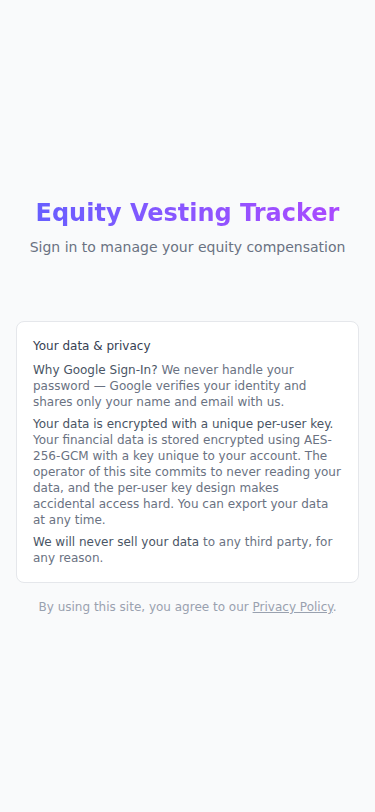 | 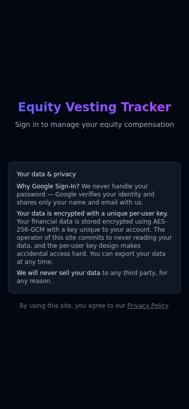 |

2. **Enter your data** — the **Setup Wizard** appears automatically when you have no grants and is always accessible from the Import page. Three options:
   - **Setup Wizard** (recommended) — Epic's company-wide grant structure is pre-filled (vest dates, periods, exercise dates). Enter your share counts, annual market prices from Epic Stocks SharePoint, and loan details grant by grant. Catch-up grants are included by default for years ≤ 2021. The 2020 Bonus has an A/B/C vesting schedule selector matching your grant agreement. If you already have data, the wizard pre-loads your existing records on each screen and lets you update them — unmatched existing records appear at the bottom so you can choose to keep or remove them. Nothing is written until you confirm at the final step.
   - **Import from Excel** — upload a `Vesting.xlsx` file (exported from this app or another user) to pre-fill the wizard. Confirm or adjust share counts before committing.
   - **Manual entry** — enter prices first, then add grants and loans one at a time.

   | Wizard welcome | Grant entry |
   |----------------|-------------|
   | 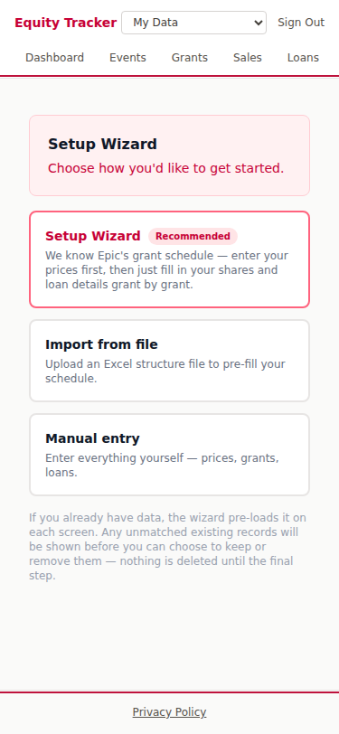 | 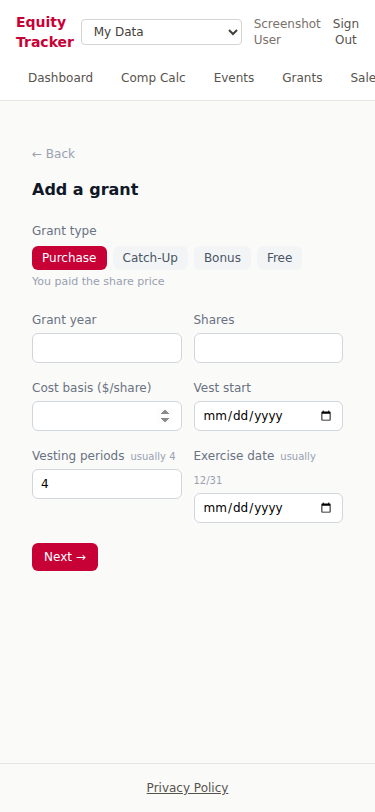 |

3. **Add share prices** — go to **Prices** and enter the annual share price (Epic announces this each March). Without at least one price, no events can be computed. Use **+ Estimate** to project future prices at an annual % growth rate — useful for modeling expected increases before they're officially announced. Estimates appear in italics with an "est." badge and are automatically removed when the real price for that date is added.

4. **View the Dashboard** — once you have grants and at least one price, the dashboard shows your full financial picture. See [The Dashboard](#the-dashboard) below.

5. **Explore the Events timeline** — the **Events** page shows the full computed timeline: every vesting tranche, exercise date, loan payoff, and recorded sale, with income, capital gains, and running totals for each event.

   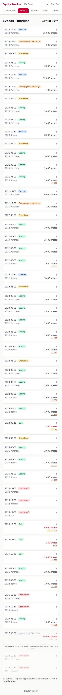

6. **Plan or record a sale** — go to **Sales → + Sale**. See [Sales](#sales) below.

7. **Set up notifications** — go to **Settings → Notifications**. Enable push (browser) or email, then choose how far in advance to be notified: day-of, 3 days before, or 1 week before your events. Tap **Send test** to confirm push is working.

8. **Share your data** — invite a financial advisor or family member by email from **Settings → Sharing**. They see your data read-only; you can revoke access at any time.

9. **Compare to a salary offer** — go to **Comp Calc** to translate your stock-loan program into a single comparable comp number. See [Total Comp Calculator](#total-comp-calculator) below.

10. **Export your data** — go to **Import/Export → Download Vesting.xlsx** for a full export at any time.

---

### The Dashboard

| Mobile | Desktop |
|--------|---------|
| 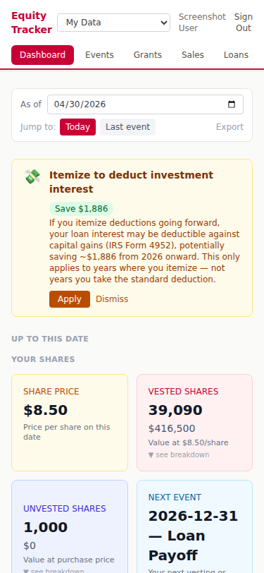 | 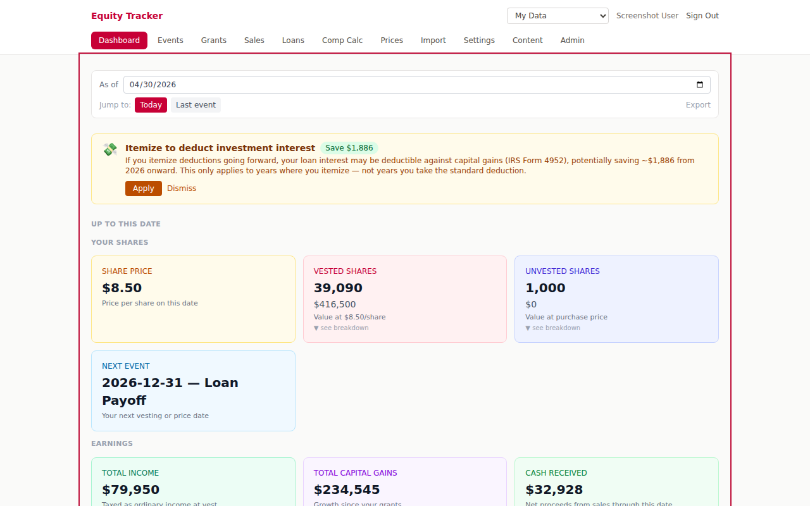 |

The dashboard is split into two stacked sections that share a single **As of** date picker (**Today** and **Last event** quick buttons). Dark mode is supported and follows your system preference.

#### "Up to this date"

Summary cards showing everything that has happened through the selected date:

| Card group | What it shows |
|-----------|--------------|
| **Your Shares** | Current share price, vested shares, unvested shares, next scheduled event |
| **Earnings** | Total ordinary income recognized from vesting, total capital gains from sales, net cash received |
| **Costs** | Outstanding loan principal, total interest accrued, estimated taxes paid |

Tap any card marked **▼ see breakdown** to see how the number was computed — per-grant, per-sale, or per-loan detail. Open breakdowns persist across visits.

The **Export** button in the date bar downloads a formatted Excel holdings report for the selected date, useful for financial or estate planners.

#### "If you exited on this date"

This section appears for today or any future date. It shows what would happen if you sold all vested shares and paid off all loans on that date:

- **Net Cash at Exit** — take-home after gross proceeds, loans paid off, and estimated divest tax
- **Gross Proceeds** — total sale value at the current share price
- **Loans Paid Off** — outstanding balances that would be repaid
- **Est. Divest Tax** — estimated capital gains and income tax on liquidation

Tap **Net Cash at Exit** to expand the full exit breakdown, including prior-sale contributions and any interest deduction tax savings.

#### Investment interest deduction toggle

The **investment interest deduction** toggle lives directly on the dashboard. Flip it to preview the estimated tax impact before applying — see [Investment Interest Deduction](#investment-interest-deduction) below.

---

### Total Comp Calculator

| Mobile | Desktop |
|--------|---------|
| 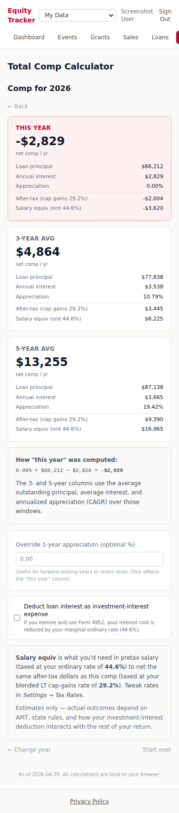 | 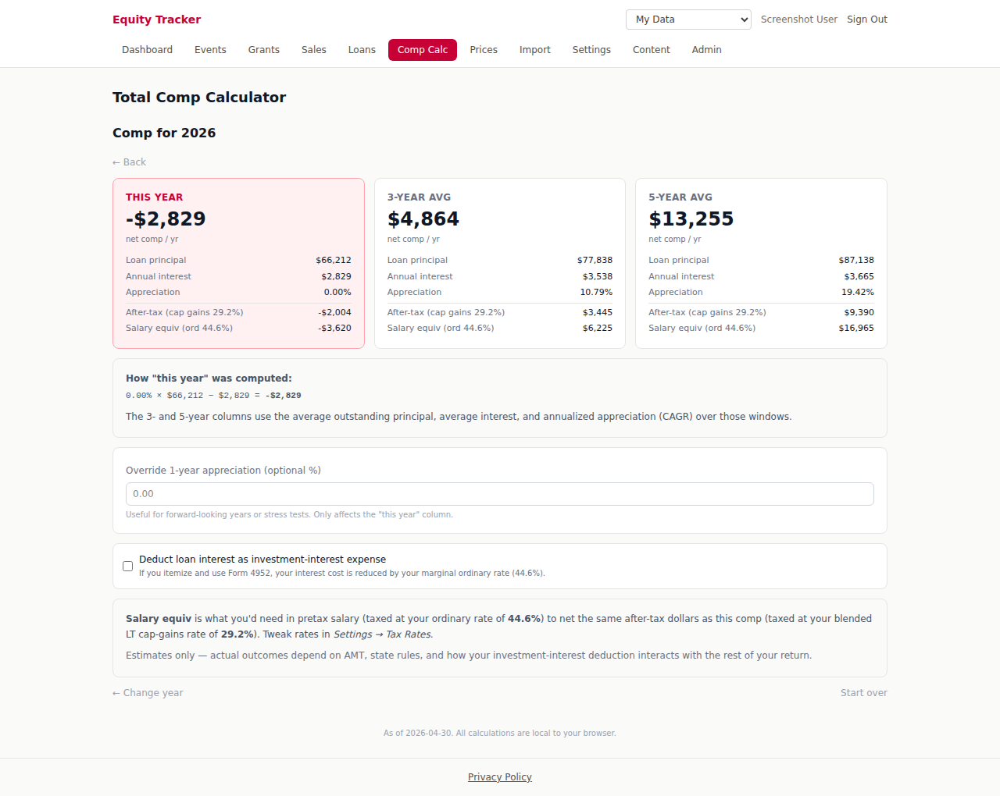 |

Epic's stock purchase program is structured as a low-rate loan to buy stock — not as a salary or RSU grant. That makes it hard to compare an Epic offer against an offer that pays cash + stock. The **Comp Calc** tab gives you a single comparable number.

The math, in plain English: if Epic loaned you $L to buy stock, and that stock grows by *r* % a year, then the appreciation on Epic's loan is *r* × *L*. Subtract the interest you pay on that loan and what's left is your comp from the program.

**The flow:**

1. **Intro** — explains the framing.
2. **Pick a year** — past, current, or up to 5 years out (as of Dec 31).
3. **Results** — three columns side-by-side: just that year, a 3-year average, and a 5-year average. Rolling averages flatten out spikes from Epic's annual repricing. Each column shows:
   - **Loan principal** — outstanding principal across all your loans (mirrors the Dashboard's "Outstanding Loan Principal" logic; for averages, this is the per-year-end average).
   - **Annual interest** — projected from your Purchase loans (principal × rate), with recorded Interest loans used where present, mirroring the Dashboard's interest math.
   - **Appreciation** — annualized CAGR from your price history. The 1-year column accepts an override for forward-looking years or stress tests.
   - **After-tax** at your blended LT cap-gains rate.
   - **Salary equiv** — what pretax salary (taxed as ordinary income) you'd need to net the same amount.
4. **Optional toggle**: deduct loan interest as investment-interest expense (IRS Form 4952) — reduces effective interest cost by your marginal ordinary rate. Defaults to your **Settings → Tax → Deduct investment interest** preference.

All math runs locally in your browser — no calculation results are stored. Tax rates come from your **Settings → Tax Rates**.

---

### Sales

| Light | Dark |
|-------|------|
| 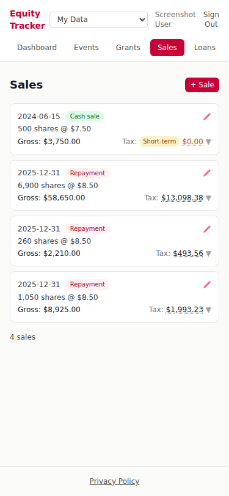 | 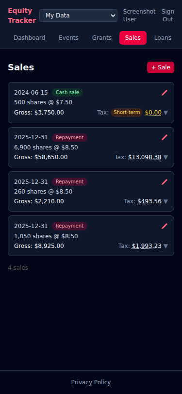 |

Go to **Sales → + Sale**.

#### Plan Sale vs. Record Sale

The form adapts based on the date you enter:

- **Plan Sale** (today or future date) — tax is a forward-looking estimate. No "actual tax paid" field.
- **Record Sale** (past date) — an **Actual tax paid** field appears so you can enter what you actually remitted. This overrides the estimate for accurate historical records.

#### $ Target vs. # Shares

Two ways to size a sale:

- **$ Target** — enter the net cash you want to receive *after tax*. The app works backwards to find the share count where after-tax proceeds ≥ your target. Useful when you need a specific dollar amount (e.g. to cover a tax bill or a loan balance).
- **# Shares** — enter shares directly. Gross proceeds, estimated tax, and net proceeds update as you type.

#### Lot Selection Methods

When you sell, the app needs to know which lots are consumed first. This matters because lots held longer may qualify for the lower long-term capital gains rate.

| Method | How it works | Good for |
|--------|-------------|---------|
| **Epic LIFO** (default) | Newest short-term lots first, but exhausts all long-term lots before touching any short-term lot | Minimizing short-term capital gains tax |
| **LIFO** | Newest lots first (typically highest cost basis on rising stock) | Minimizing total gains on rising stock |
| **FIFO** | Oldest lots first | Maximizing the proportion of long-term-qualified shares |
| **Manual** | You set the share count for each lot individually | Full control — pick exactly which lots to sell |

Your default method is set in **Settings → Tax Rates → Manual Sale Lot Method**.

> **Tax note:** The IRS may require you to elect a consistent lot identification method at time of sale. Consult a tax advisor before changing this for large or tax-sensitive sales.

#### Lot Allocation Table

As soon as you enter a date and share count (or $ target), a **Lot Allocation** table appears showing:

- Each available lot (grant year + type, vest date)
- Cost basis per share
- Available shares remaining in the lot
- How many shares will be consumed from that lot
- **LT** (long-term, green) or **ST** (short-term, amber) badge

In **Manual** mode, the Allocated column becomes an editable field. The form prevents over-allocation.

#### Tax Breakdown

After saving a sale, tap the tax amount to see the full breakdown:

- Gross proceeds
- Ordinary income component (for RSU/Bonus lots where FMV at vest was recognized as income)
- Short-term and long-term capital gains per lot
- Federal income tax, federal long-term/short-term capital gains tax, net investment income tax (3.8%), state income tax, state capital gains tax
- Estimated total tax and net proceeds

Tax rates are captured from your Settings at the time the sale is created and stored with the sale record. Changing your tax rates later does not retroactively change a saved sale's breakdown.

---

### Loan Payoff

Each loan tied to a Purchase grant can have an auto-generated payoff sale that covers the outstanding balance (principal + accrued interest through the due date) by selling just enough shares.

#### How the gross-up works

The app finds the smallest integer share count such that after-tax proceeds from selling those shares ≥ the outstanding balance. It only considers lots from the *originating grant* (same-tranche selection), regardless of your default lot method setting.

The payoff sale always shows a Lot Allocation table in the Sales page so you can see exactly which lots are being consumed and whether they are long-term or short-term.

#### Auto-generated payoff sales

When you create a loan with **Payoff loan via sale** checked (the default), a payoff sale is created automatically:

- **Date** — the loan's due date
- **Shares** — gross-up calculation at the share price on or just before the due date
- **Lot selection** — same-tranche (originating grant's lots only)
- **Tax rates** — locked to your Settings at creation time

If you later change tax rates or add new share prices, the stored share count will be stale. Use **Regen payoff sales** on the Loans page to recompute all future payoff sale share counts at once (this also updates the locked tax rates to your current settings).

---

### Investment Interest Deduction

Toggle this on the **Dashboard** or change it in **Settings → Tax Rates**.

**Background:** Investment interest is interest paid on loans used to buy investments. Under IRS Form 4952 you can elect to deduct it against *net investment income* — and you may elect to treat net capital gains as investment income for this purpose. The trade-off: gains treated as investment income lose their preferential cap-gains rate and are taxed as ordinary income instead. For large enough interest amounts, the tax saving from reducing the gain can outweigh the rate difference; this estimate helps you model that.

**How the estimate works:**

- Interest with `due_date = 1/1/YEAR` is deductible in that year (e.g. interest due 1/1/2025 → deductible in 2025).
- The deductible pool is applied first to short-term gains, then long-term gains (minimizes tax since short-term gains are taxed higher).
- Any unused deduction in a year carries forward indefinitely to future years with eligible gains.
- Use **Settings → Tax Rates → Customize by year** to exclude years where you took the standard deduction.

**What changes on the dashboard when enabled:**

- "Total Cap Gains" relabels to **"Cap Gains (after int. ded.)"** and shows the reduced amount.
- "Cash Received" relabels to **"Cash (incl. int. ded. savings)"** and includes estimated tax savings.
- The Income vs. Cap Gains and Estimated Tax Liability charts update to reflect lower taxable gains.
- An inline card shows the total deduction applied with a toggle to preview before committing.

**What changes on the Events timeline:**

- The "Cap Gains" column header changes to **"Cap Gains (adj.)"**.
- Events where a deduction is applied show an "adj." badge with a tooltip showing the gross amount.
- Expanding a vesting or price event shows the short-term/long-term capital gains split and how much of the interest pool was consumed.

> This is an estimate only, and only applies in years where you itemize deductions (not the standard deduction). Consult a tax advisor before making decisions based on it. Filing Form 4952 and electing to treat capital gains as investment income means those gains lose their preferential rate — whether this is beneficial depends on your specific situation.

---

### Smart Tips

The dashboard automatically analyzes your settings and surfaces actionable tips in a carousel above the summary cards:

- **Investment interest deduction** — shown if enabling Form 4952 would save ≥ $500 going forward. Tap **Apply** to enable in one tap.
- **Lot selection method** — shown if switching to a different method would save ≥ $1,000 vs. your current method. Tap **Apply** to update the setting.

Each tip shows estimated savings. Tips can be dismissed for the session.

---

### Notifications

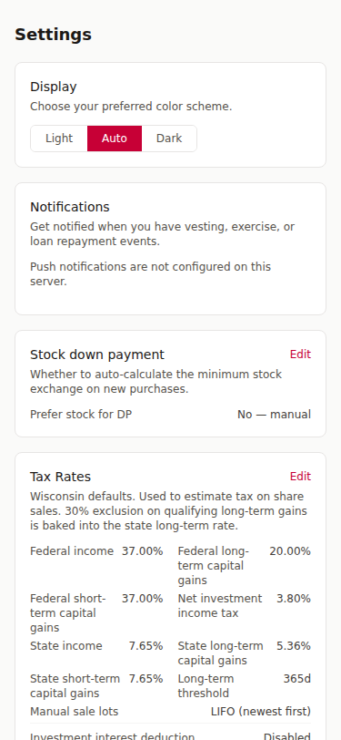

Go to **Settings → Notifications** to configure.

- **Push** (browser) — subscribe from your browser. Each device subscribes independently; all active devices receive the notification. Tap **Send test** to verify it's working without waiting for a real event.
- **Email** — enable the toggle. Enabled by default for new users. All notification emails include an unsubscribe link in the footer.

**Advance timing** — choose when to be notified: day-of (default), 3 days before, or 1 week before. This applies to both push and email.

**Which events trigger a notification:**

| Event | Notified? |
|-------|-----------|
| Vesting | Yes |
| Exercise | Yes |
| Loan Payoff | Yes |
| Planned sale (loan payoff) | Yes |
| Share price update | No |
| Down payment exchange | No |

**What the notification contains:** Only event counts and types — no dollar amounts, share counts, or any financial data. Example: *"You have 2 events today: 1 Loan Repayment, 1 Vesting."* Tapping the notification opens the relevant page.

---

### Sharing Your Data

| Sharing settings | Invite landing |
|-----------------|----------------|
| 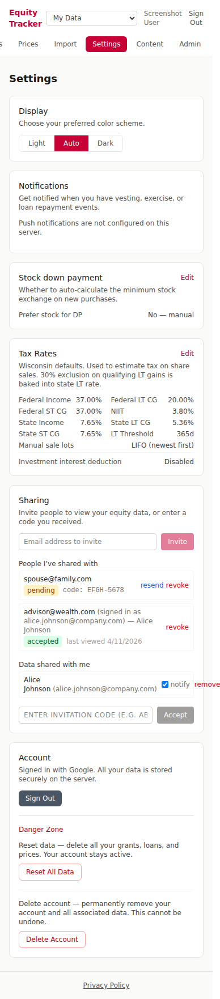 | 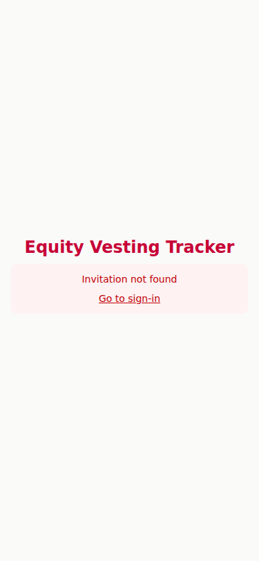 |

Invite someone (a financial advisor, accountant, or family member) to view your data read-only from **Settings → Sharing**.

They receive an email with a clickable link and a manual entry code. The link works with any sign-in provider — it doesn't need to match the email the invitation was sent to.

**What a viewer can see:** Dashboard, Events, Grants, Loans, Prices, and Sales — all read-only. They can also download your data as Excel.

**What a viewer cannot do:** Create or modify any data, see your Smart Tips, or use What If scenarios (enforced on the backend).

A financial advisor invited by multiple users can switch between them using the **account switcher** in the header. Viewers can also control whether they receive event notifications for shared accounts.

Both the inviter and the viewer can revoke access at any time. Invitation tokens expire after 7 days; inviters can resend to extend. All emails include an unsubscribe link; recipients can opt out of invitation emails without needing an account.

---

### 83(b) Election

If you filed an 83(b) election for a Bonus/RSU grant, flag it in the grant editor. This changes how the Events page displays that grant's vesting events — they show as violet "unrealized cap gains" (the amount that would have been ordinary income without the election) instead of green income, with a note showing the potential long-term cap gains tax at eventual sale.

The 83(b) flag is display-only — it doesn't change how events are computed. If you filed at a non-zero FMV, set the **Cost Basis** field to that price instead; the engine will treat it as a purchase grant automatically.

---

### Exporting Your Data

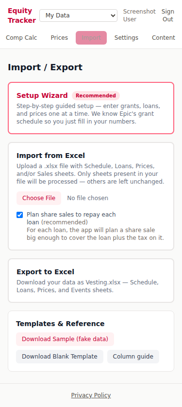

Go to **Import/Export → Download Vesting.xlsx** to export all your grants, prices, loans, and sales at any time. The same file can be re-imported to restore or transfer your data.

The **Import** page also keeps the last 3 backup snapshots from previous imports — you can restore any of them if an import goes wrong.

---

## For Content Admins

| Light | Dark |
|-------|------|
| 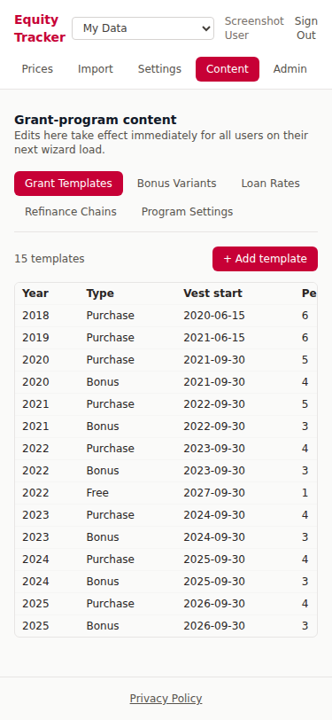 | 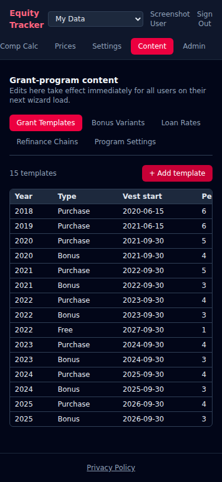 |

Content admins edit the grant-program data that drives the Setup Wizard for all users. A site admin promotes users to this role from the Admin panel (the role persists across logins). Site admins are implicitly content admins.

Content admins see a **Content** nav link. From `/content` they can edit:

| Section | What it controls |
|---------|----------------|
| **Grant templates** | The per-year, per-type grant schedule shown in the wizard: vest dates, periods, exercise dates |
| **Bonus vesting variants** | The A/B/C schedule options for the 2020 Bonus grant |
| **Loan rates** | Interest rates, tax rates, and purchase-original rates by year |
| **Loan refinance chains** | The sequence of refinance steps for purchase and tax loans |
| **Program settings** | Fallback tax rates, minimum down-payment policy (percent + dollar cap), flexible loan-payoff toggle |

Edits take effect immediately for all users on their next wizard load. The wizard automatically refreshes the cache after any content write.

> **Grant types** (Purchase, Catch-Up, Bonus, Free) are hard-coded and cannot be changed from the content editor — the core computation engine branches on those specific strings. Year ranges shown on the settings tab (price and rate bounds) are derived from the rates and templates tables and are read-only.

---

## For Site Admins

| Light | Dark |
|-------|------|
| 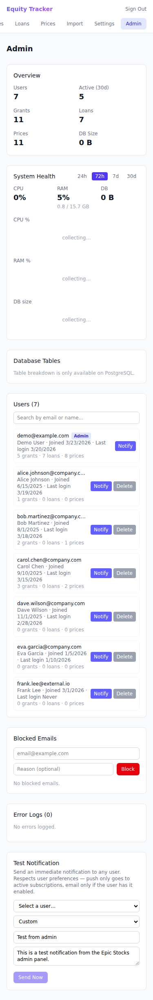 | 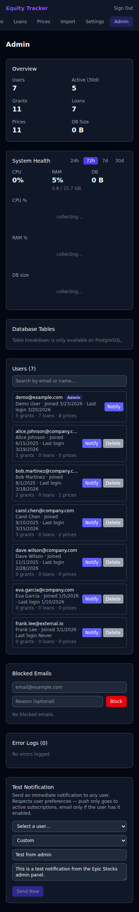 |

Site admins are designated via the `ADMIN_EMAIL` environment variable (semicolon-delimited for multiple). Access is granted dynamically on each login — adding or removing an email from `ADMIN_EMAIL` takes effect on the user's next sign-in. Navigate to `/admin` after signing in with a matching account.

### What admins can see

- Total registered users and active users (last 30 days)
- Aggregate counts: total grants, loans, prices across all users
- **System Health** — CPU %, RAM %, and DB size with sparkline charts (24h / 72h / 7d / 30d windows). Sampled every 15 minutes; 30-day rolling retention.
- **Database Tables** — per-table size breakdown (PostgreSQL only). Useful for diagnosing storage growth.
- **Smart Tips Report** — aggregate-only view: total users who accepted a tip, total estimated savings, per-type breakdown. No individual financial data.
- Per-user metadata: email, name, join date, last login, record counts, admin badge
- Searchable and paginated user list, sorted by last active
- **Build version** — a 7-character commit SHA at the bottom of the Admin page confirms exactly which build is running

> Admins **cannot** see any user's financial data (share counts, prices, loan amounts, computed events). Only aggregate counts and account metadata are exposed.

### Admin actions

Click any user in the list to open a detail card:

| Action | What it does |
|--------|-------------|
| **Delete user** | Permanently removes the user and all their data. Blocked during maintenance mode and for admin accounts. |
| **Send test notification** | Immediately sends a push or email notification to any user for debugging. |
| **Block / unblock sending** | Prevents a user from sending new invitations (e.g. for abuse). |
| **Reset invitations** | Revokes all sent invitations and removes any received access for the user. Both sides are cleaned up. |
| **Re-enable email** | Restores email notifications for a user who unsubscribed via an email footer link. |
| **Clear invitation opt-out** | Removes an email from the invitation opt-out list. Works for non-users who opted out without an account. |
| **Block / unblock email** | Prevents an email address from logging in or creating an account. |
| **Make / Revoke Content Admin** | Promotes or revokes the persistent content-admin role for a user. |
| **Enable / disable maintenance** | Toggles app-managed downtime. Financial API routes return 503; auth and admin remain accessible. Use before planned ops that affect financial data. |
| **Rotate encryption key** | Generates a new master key, re-wraps all per-user keys, smoke-tests, and persists to the database. Propagates to all replicas automatically within seconds — no deploy or env var change needed. A snapshot of old keys is saved before any changes and restored automatically on failure. |
| **Restore from snapshot** | Appears when an interrupted rotation left a snapshot in the database. Recovers from a crash without SSH access. |

### Email Lookup

The **Email Lookup** tool searches any email address across all relevant systems in one place:

- Account status (registered? name? user ID?)
- Email notification status — enabled/disabled, with a re-enable action
- Invitation opt-out status — with a clear action
- Blocked-from-receiving status — with an unblock action
- Sending-blocked status — with an unblock action
- Invitation sent/received counts

Works for non-users too — useful for clearing opt-outs set by people who received an invitation email but never created an account.

### Blocked Email System

Blocked emails are checked at login time (case-insensitive). A blocked user cannot log in or create a new account. The blocklist is managed via the admin panel.

---

## For Site Operators

### Tech Stack

| Layer | Technology |
|-------|-----------|
| Backend | Python 3.12, FastAPI, SQLAlchemy, PostgreSQL (Alembic migrations) |
| Frontend | React 19, TypeScript, Vite, Tailwind CSS 4, Recharts |
| Auth | OIDC PKCE (any provider) → BFF session cookie (HttpOnly, XSS-safe) |
| Deploy | Docker Compose + Caddy (auto-HTTPS) + Cloudflare (DDoS protection) |
| Tests | pytest (backend), Vitest + RTL (frontend), Playwright (E2E) |

---

### Quick Start (Local Development)

**Prerequisites:** Python 3.12+, Node.js 20+, and at least one OIDC provider configured.

```bash
# Copy env template and fill in OIDC_PROVIDERS (minimum required)
cp .env.example .env

# Backend
cd backend
pip install -r requirements.txt
uvicorn main:app --reload --port 8000

# Frontend (separate terminal)
cd frontend
npm install
npm run dev
```

The backend creates `data/vesting.db` (SQLite) automatically on first run. The dev server proxies `/api` to `localhost:8000`. To reset: `rm backend/data/vesting.db`.

---

### Environment Variables

| Variable | Required | Description |
|----------|----------|-------------|
| `JWT_SECRET` | Yes (local) | Random secret for signing JWT tokens. **Auto-generated on production deploy.** |
| `OIDC_PROVIDERS` | Yes | JSON array of OIDC provider configs — see [OIDC Provider Configuration](#oidc-provider-configuration). |
| `DATABASE_URL` | Yes (prod) | PostgreSQL DSN. Docker Compose sets this automatically from `POSTGRES_PASSWORD`. |
| `REDIS_URL` | No | Redis connection string for the L2 timeline cache (e.g. `redis://redis:6379/0`). When set, computed timelines are cached and pre-warmed after data writes; survives restarts and is shared across replicas. The `redis` service in `docker-compose.yml` provides this automatically. |
| `POSTGRES_PASSWORD` | Yes (local) | PostgreSQL password. **Auto-generated on production deploy.** |
| `KEY_ENCRYPTION_KEY` | No | Enables per-user AES-256-GCM encryption. Set once, never changes. **Auto-generated on production deploy.** Wraps the operational master key stored in the database. |
| `LEGACY_MASTER_KEY` | No | One-time migration aid. Set to the old `ENCRYPTION_MASTER_KEY` value on first deploy after upgrading to the two-level key hierarchy; unset after first successful boot. |
| `ADMIN_EMAIL` | No | Semicolon-delimited email(s) granted admin access on login. |
| `VAPID_PUBLIC_KEY` | No | Required for push notifications. **Auto-generated on production deploy.** |
| `VAPID_PRIVATE_KEY` | No | Required for push notifications. **Auto-generated on production deploy.** |
| `EMAIL_PROVIDER` | No | `resend` (default) or `smtp` |
| `RESEND_API_KEY` | No | Enables email notifications via Resend |
| `RESEND_FROM` | No | Sender address for emails (e.g. `Equity Tracker <noreply@yourdomain.com>`) |
| `SMTP_HOST` | No | SMTP server hostname (when `EMAIL_PROVIDER=smtp`) |
| `SMTP_PORT` | No | SMTP port, default 587 |
| `SMTP_USER` | No | SMTP username |
| `SMTP_PASSWORD` | No | SMTP password |
| `SMTP_FROM` | No | Sender address for SMTP emails |
| `APP_URL` | No | Public app URL included as a link in email notifications |
| `ACME_EMAIL` | No (prod) | Email for Let's Encrypt certificate expiry notifications. Set as a GitHub Actions variable. |
| `TRUSTED_PROXY_IPS` | No (prod) | Cloudflare IP ranges passed to Caddy for real-IP forwarding. Set as a GitHub Actions variable. |
| `COMMIT_SHA` | No | Git commit SHA injected at Docker build time. Displayed as a 7-char short hash at the bottom of Admin and Settings pages. **Set automatically by the deploy workflow.** |

---

### OIDC Provider Configuration

Set `OIDC_PROVIDERS` to a JSON array of provider objects:

```bash
OIDC_PROVIDERS='[{"name":"google","label":"Google","client_id":"YOUR_ID.apps.googleusercontent.com","client_secret":"YOUR_SECRET","discovery_url":"https://accounts.google.com/.well-known/openid-configuration"}]'
```

Each object supports:

| Field | Required | Description |
|-------|----------|-------------|
| `name` | Yes | Internal identifier (e.g. `"google"`, `"azure"`) |
| `label` | Yes | Text on the sign-in button (e.g. `"Google"`) |
| `client_id` | Yes | From your IdP's app registration |
| `discovery_url` | Yes | OIDC discovery endpoint (`.well-known/openid-configuration`) |
| `client_secret` | No | Omit for PKCE-only / native-app clients |
| `scopes` | No | Defaults to `["openid","email","profile"]` |
| `subject_claim` | No | Defaults to `"sub"`. Set to `"oid"` for Azure Entra ID |

Multiple providers show as separate "Sign in with X" buttons. Redirect URI to register in your IdP: `https://yourdomain.com/auth/callback`

**Example — Google + Azure Entra ID:**
```json
[
  {
    "name": "google",
    "label": "Google",
    "client_id": "YOUR_ID.apps.googleusercontent.com",
    "client_secret": "YOUR_SECRET",
    "discovery_url": "https://accounts.google.com/.well-known/openid-configuration"
  },
  {
    "name": "azure",
    "label": "Contoso Azure AD",
    "client_id": "YOUR_AZURE_CLIENT_ID",
    "discovery_url": "https://login.microsoftonline.com/YOUR_TENANT_ID/v2.0/.well-known/openid-configuration",
    "subject_claim": "oid"
  }
]
```

For local development, generate VAPID keys with:
```bash
npx web-push generate-vapid-keys
```

The login page fetches available providers from the backend at `GET /api/auth/providers` — no frontend env vars needed.

---

### Production Deployment

The deploy pipeline lives in `.github/workflows/deploy.yml` and runs on every push to `main`.

#### First-time VPS setup

```bash
curl -fsSL https://get.docker.com | sh
mkdir -p /opt/epic-stocks/data
cd /opt/epic-stocks
git clone <repo-url> .
```

Set secrets as GitHub Actions variables — the deploy workflow writes `.env` automatically on every push to `main`. **Never create `.env` on the VPS manually.** Manual changes get overridden by the next deploy and leave the repo out of sync with reality. Every fix must go through code → PR → merge → deploy.

#### GitHub Actions secrets and variables

| Name | Type | Description |
|------|------|-------------|
| `VPS_SSH_KEY` | Secret | Private SSH key for the deploy user |
| `VPS_USER` | Secret | SSH username on the VPS |
| `ADMIN_EMAIL` | Secret | Semicolon-delimited admin email(s) |
| `RESEND_API_KEY` | Secret | Resend email API key |
| `RESEND_FROM` | Secret | Sender address for transactional email |
| `OIDC_PROVIDERS` | Secret | JSON array of OIDC provider configs |
| `ACME_EMAIL` | Variable | Email for Let's Encrypt certificate notifications |
| `VPS_HOST` | Variable | VPS hostname or IP |
| `DOMAIN` | Variable | Your domain name |
| `TRUSTED_PROXY_IPS` | Variable | Cloudflare IP ranges for real-IP forwarding |

Cryptographic secrets (JWT, encryption key, VAPID keys, Postgres password) are generated on the server on first deploy and stored in `/opt/epic-stocks/.secrets/`. They never appear in GitHub.

#### What the deploy workflow does

1. Generates any missing server-side secrets into `/opt/epic-stocks/.secrets/`
2. Creates a 2 GB swapfile if one doesn't exist (idempotent)
3. `git reset --hard origin/main` — always matches the repo exactly
4. `docker compose build && docker compose up -d`
5. Polls `http://localhost/api/health` every 5 seconds for up to 60 seconds; prints diagnostics and exits 1 on failure

#### Multi-app Caddy (shared infrastructure)

The app uses a shared Caddy reverse proxy. Each deployed app writes a `caddy/app.caddy` snippet into the shared `caddy_config` Docker volume and reloads Caddy — all handled automatically by the deploy workflow. No manual SSH steps are needed.

#### Deploy safety

- **Caddy config validation** — a CI job validates `caddy/app.caddy` before deploy, catching syntax errors before they reach production.
- **Post-deploy health polling** — 60-second timeout with printed diagnostics on failure. No auto-rollback — Alembic runs migrations on startup, so reverting code after a schema migration requires manual review. See **[OPERATIONS.md](OPERATIONS.md) §7** for the rollback runbook.
- **Maintenance during deploy** — the deploy script touches a sentinel file before stopping the app container. Caddy serves a static "Down for Maintenance" page (auto-refreshes every 20s) until the sentinel is removed at the end of the script.

#### Branch strategy

PRs to `main` must originate from the `staging` branch — enforced by `.github/workflows/branch-check.yml`. CI runs on every push to `main` and `staging`, and on every PR: backend tests (pytest), frontend tests (vitest + npm audit), Caddy config validation, and E2E tests (Playwright). `pip-audit` runs weekly via `.github/workflows/security-audit.yml`.

For the full ops guide — uptime monitoring, backup strategy, SSH hardening, and incident runbook — see **[OPERATIONS.md](OPERATIONS.md)**.

---

### Development

#### Running Tests

```bash
# Backend unit tests
pytest backend/tests/ -v

# Frontend unit tests
cd frontend && npm test

# Frontend unit tests — watch mode
cd frontend && npm run test:watch

# Lint frontend
cd frontend && npm run lint

# All unit tests
pytest backend/tests/ -v && cd frontend && npm test
```

#### Running E2E Tests

First-time setup:
```bash
cd frontend && npm ci && npx playwright install chromium
```

Then from the repo root (handles type-checking, spinning up fresh backend + frontend, waiting for both to be healthy, and cleanup):
```bash
./e2e.sh
```

Pass Playwright args as needed:
```bash
./e2e.sh --grep "quick-flow"
./e2e.sh e2e/user-journey.spec.ts
./e2e.sh --reporter=list
```

#### Regenerating Screenshots

First-time setup:
```bash
cd backend && pip install -r requirements.txt
cd frontend && npm ci && npx playwright install chromium
```

Then from the repo root:
```bash
./screenshots/run.sh
```

Spins up a temporary backend + frontend with seeded sample data, runs all Playwright specs, and writes PNGs to `screenshots/`. Commit any updated screenshots.

---

### Project Structure

The codebase is split into **scaffold** (auth, admin, crypto, notifications — reusable across projects) and **app** (equity tracking domain logic — replaceable when forking). See [FORK_GUIDE.md](FORK_GUIDE.md) for forking instructions.

```
epic-stocks/
├── backend/
│   ├── main.py              # FastAPI app + router wiring + metrics sampler
│   ├── database.py          # SQLAlchemy engine setup
│   ├── schemas.py           # Shared Pydantic schemas
│   ├── alembic/             # Alembic migrations (run automatically on startup)
│   ├── scaffold/            # Reusable auth/infra layer (keep when forking)
│   │   ├── auth.py          # JWT creation/verification + admin checks
│   │   ├── crypto.py        # Per-user AES-256-GCM encryption
│   │   ├── email_sender.py  # Email dispatch (delegates to providers/)
│   │   ├── maintenance.py   # Sentinel path for app-managed downtime
│   │   ├── models.py        # SQLAlchemy models (User, BlockedEmail, SystemMetric, etc.)
│   │   ├── notifications.py # Push + email notification logic
│   │   ├── providers/
│   │   │   ├── auth/        # OIDC PKCE provider (joserfc for JWT/JWKS verification)
│   │   │   └── email/       # Email providers: Resend, SMTP
│   │   └── routers/
│   │       ├── auth_router.py   # OIDC PKCE endpoints + JWT issuance
│   │       ├── admin.py         # Admin dashboard, user mgmt, blocklist, email lookup
│   │       ├── notifications.py # Email notification preferences
│   │       ├── push.py          # Push subscription management
│   │       ├── sharing.py       # Email invitations + shared data viewing
│   │       └── unsubscribe.py   # Public (no-auth) email unsubscribe endpoints
│   ├── app/                 # Equity tracking domain (replace when forking)
│   │   ├── core.py          # Event generation logic (frozen)
│   │   ├── sales_engine.py  # FIFO cost-basis + tax + gross-up calculations
│   │   ├── excel_io.py      # Excel read/write (openpyxl)
│   │   ├── timeline_cache.py # L1 in-process memoized event computation
│   │   ├── event_cache.py   # L2 Redis cache + background recompute
│   │   ├── content_service.py # Seeder + load_content() for grant-program data
│   │   └── routers/
│   │       ├── grants.py    # Grant CRUD + bulk
│   │       ├── loans.py     # Loan CRUD + bulk
│   │       ├── prices.py    # Price CRUD
│   │       ├── events.py    # Computed timeline + dashboard + preview-exit
│   │       ├── flows.py     # Quick flows (new purchase, bonus, price)
│   │       ├── import_export.py # Excel import/export + template
│   │       ├── sales.py     # Sales CRUD + tax breakdown
│   │       ├── tips.py      # Smart Tips: scenario tax comparisons + acceptance recording
│   │       ├── wizard.py    # Setup Wizard: parse-file, preview (dry-run diff), submit
│   │       └── content.py   # Grant-program content: GET (any user) + content-admin CRUD
│   └── tests/               # pytest tests
├── frontend/
│   ├── src/
│   │   ├── scaffold/        # Reusable UI layer (keep when forking)
│   │   │   ├── pages/       # Login, AuthCallback, Admin, Settings, PrivacyPolicy, InviteLanding, Unsubscribe
│   │   │   ├── components/  # Layout shell, Toast
│   │   │   ├── contexts/    # ThemeContext, MaintenanceContext, ViewingContext
│   │   │   └── hooks/       # useAuth, useConfig, useDark, usePush, useMe
│   │   ├── app/             # Equity tracking UI (replace when forking)
│   │   │   ├── pages/       # Dashboard, Events, Grants, Loans, Prices, Sales, ImportExport, Content, CompCalculator
│   │   │   ├── components/  # ImportWizard, TipCarousel
│   │   │   └── hooks/       # useApiData, useDataSync, useContent
│   │   ├── App.tsx          # Router + layout wiring
│   │   └── __tests__/       # Vitest tests
│   ├── public/
│   │   ├── sw.js            # Service worker (cache busting + push)
│   │   └── manifest.json    # PWA manifest
│   ├── e2e/                 # Playwright specs
│   └── playwright.config.ts
├── infra/
│   ├── docker-compose.infra.yml  # Shared Caddy + proxy network (one per server)
│   └── Caddyfile                 # Root config: imports per-app snippets
├── caddy/
│   ├── Caddyfile            # Per-app Caddy config (reverse proxy + cache headers)
│   └── app.caddy            # Caddy snippet for multi-app mode
├── screenshots/             # Auto-generated by Playwright
│   ├── run.sh               # Screenshot capture orchestrator
│   └── seed.py              # Sample data seeder
├── .env.example             # Environment variable template
├── .github/workflows/
│   ├── deploy.yml           # Deploy to VPS on push to main
│   ├── test.yml             # CI: pytest, vitest, npm audit, Caddy validate, E2E
│   ├── security-audit.yml   # Weekly pip-audit (scheduled + workflow_dispatch)
│   └── branch-check.yml     # Enforce PRs to main come from staging
├── Dockerfile               # Multi-stage build (frontend + backend)
├── Dockerfile.e2e           # E2E test container (Playwright + chromium)
├── docker-compose.yml       # App compose (joins shared proxy network)
├── docker-compose.e2e.yml   # E2E test compose (isolated DB + app + playwright)
├── FORK_GUIDE.md            # How to fork for a different domain
└── test_data/
    └── fixture.xlsx         # Synthetic test fixture
```

---

### API Overview

All authenticated endpoints require a valid `session` cookie (set automatically by the browser after sign-in). There is no Bearer token — the JWT lives only in an HttpOnly cookie that JavaScript cannot read. A companion `auth_hint` cookie (readable by JS) tells the SPA whether a session exists without exposing the credential.

| Method | Path | Description |
|--------|------|-------------|
| GET | `/api/auth/providers` | List configured OIDC providers (name + label) |
| GET | `/api/auth/login?provider=&code_challenge=&redirect_uri=&state=` | Start PKCE flow — returns IdP authorization URL |
| POST | `/api/auth/callback` | Exchange PKCE code for JWT |
| POST | `/api/auth/logout` | Clear session cookie |
| GET | `/api/me` | Current user info + `is_admin` and `is_content_admin` flags |
| POST | `/api/me/reset` | Reset all financial data (keeps account) |
| DELETE | `/api/me` | Delete account and all associated data |
| GET | `/api/config` | Client config (VAPID key, email availability, etc.) |
| GET | `/api/health` | Health check — always 200 |
| GET | `/api/status` | Operational status `{"maintenance": bool}` — polled by SPA |
| GET | `/api/dashboard` | Summary cards data |
| GET | `/api/events` | Computed event timeline |
| GET | `/api/preview-deduction?enabled=` | Preview investment interest deduction impact without saving |
| GET | `/api/preview-exit?date=` | Preview full-liquidation scenario on a given date |
| GET/POST | `/api/grants` | List/create grants |
| GET/PUT/DELETE | `/api/grants/{id}` | Get/update/delete grant |
| POST | `/api/grants/bulk` | Bulk create grants |
| GET/POST | `/api/loans` | List/create loans |
| GET/PUT/DELETE | `/api/loans/{id}` | Get/update/delete loan |
| POST | `/api/loans/bulk` | Bulk create loans |
| GET/POST | `/api/prices` | List/create prices |
| GET/PUT/DELETE | `/api/prices/{id}` | Get/update/delete price |
| GET/POST | `/api/sales` | List/create sales |
| GET/PUT/DELETE | `/api/sales/{id}` | Get/update/delete sale |
| GET | `/api/sales/{id}/tax` | Tax breakdown for a sale |
| GET | `/api/sales/tax` | Bulk tax breakdown for all sales |
| GET | `/api/sales/lots` | Available share lots grouped by cost basis |
| GET | `/api/sales/tranche-allocation` | Lot-level allocation for a proposed sale |
| GET | `/api/sales/estimate` | Gross-up estimate: shares needed to net a target cash amount |
| GET | `/api/loans/{id}/payoff-sale-suggestion` | Suggested gross-up sale for a loan |
| POST | `/api/loans/regenerate-all-payoff-sales` | Recompute all future payoff sale share counts |
| GET/POST | `/api/loan-payments` | List/create early loan payments |
| PUT/DELETE | `/api/loan-payments/{id}` | Update/delete a loan payment |
| POST | `/api/flows/new-purchase` | Create grant + optional loan |
| POST | `/api/flows/annual-price` | Add a price entry (future dates flagged as estimates) |
| POST | `/api/flows/growth-price` | Generate yearly estimate prices from % annual growth |
| POST | `/api/flows/add-bonus` | Add a bonus grant |
| POST | `/api/import/excel` | Upload Excel file to populate tables |
| GET | `/api/import/template` | Download empty Excel template |
| GET | `/api/import/sample` | Download sample Excel file with fake data and cell comments |
| GET | `/api/import/backups` | List import backup snapshots (last 3 per user) |
| POST | `/api/import/backups/{id}/restore` | Restore data from a backup snapshot |
| GET | `/api/export/excel` | Download Vesting.xlsx with all data |
| GET | `/api/export/holdings-report` | Download formatted Excel holdings report as of a given date |
| POST | `/api/wizard/parse-file` | Parse an uploaded Excel structure file for wizard pre-fill |
| POST | `/api/wizard/preview` | Dry-run diff — returns added/updated/removed/unchanged status, no changes written |
| POST | `/api/wizard/submit` | Apply wizard data — merge mode: upserts by natural key, deletes unmatched |
| GET/PUT | `/api/tax-settings` | Get/set tax rate configuration and lot selection preferences |
| GET | `/api/tips` | Smart tips: scenario-based tax savings recommendations |
| POST | `/api/tips/accept` | Record acceptance of a tip recommendation |
| **Grant-program content** | | |
| GET | `/api/content` | Global grant-program content blob — any logged-in user |
| POST/PUT/DELETE | `/api/content/grant-templates[/{id}]` | CRUD grant templates (content admin) |
| POST/PUT/DELETE | `/api/content/bonus-schedule-variants[/{id}]` | CRUD bonus vesting variants (content admin) |
| POST/PUT/DELETE | `/api/content/loan-rates[/{id}]` | CRUD loan interest/tax/purchase rates (content admin) |
| POST/PUT/DELETE | `/api/content/loan-refinances[/{id}]` | CRUD purchase/tax refinance chain entries (content admin) |
| PUT | `/api/content/grant-program-settings` | Update singleton program settings (content admin) |
| POST/DELETE | `/api/push/subscribe` | Subscribe/unsubscribe push notifications |
| GET | `/api/push/status` | Check push subscription status |
| POST | `/api/push/test` | Send a test push notification to the current user |
| GET/PUT | `/api/notifications/email` | Get/set email notification preference |
| PUT | `/api/notifications/advance-days` | Set advance notification timing (0, 3, or 7 days) |
| **Unsubscribe** | | |
| GET | `/api/unsubscribe?token=&email=&type=` | Verify unsubscribe token (no auth required) |
| POST | `/api/unsubscribe` | Process unsubscribe — type is `invite` or `notify` (no auth required) |
| **Sharing** | | |
| GET | `/api/sharing/invite-info?token=&code=` | Validate invitation token/code (no auth required) |
| POST | `/api/sharing/invite` | Send an invitation email |
| GET | `/api/sharing/sent` | List invitations the current user has sent |
| POST | `/api/sharing/invite/{id}/resend` | Resend an expiring invitation (resets 7-day timer) |
| DELETE | `/api/sharing/invite/{id}` | Revoke a sent invitation |
| POST | `/api/sharing/accept` | Accept invitation by token or code |
| GET | `/api/sharing/received` | List accepted invitations (accounts shared with me) |
| POST | `/api/sharing/decline/{id}` | Decline a pending invitation |
| DELETE | `/api/sharing/access/{id}` | Remove my access to someone's data (invitee side) |
| PUT | `/api/sharing/access/{id}/notify` | Toggle per-inviter notifications |
| GET | `/api/sharing/view/{id}/dashboard` | Shared user's dashboard (read-only) |
| GET | `/api/sharing/view/{id}/events` | Shared user's event timeline (read-only) |
| GET | `/api/sharing/view/{id}/grants` | Shared user's grants (read-only) |
| GET | `/api/sharing/view/{id}/loans` | Shared user's loans (read-only) |
| GET | `/api/sharing/view/{id}/prices` | Shared user's prices (read-only) |
| GET | `/api/sharing/view/{id}/sales` | Shared user's sales (read-only) |
| GET | `/api/sharing/view/{id}/sales/{sale_id}/tax` | Tax breakdown for a shared user's sale |
| GET | `/api/sharing/view/{id}/export/excel` | Download shared user's data as Excel |
| **Admin** | | |
| GET/POST | `/api/admin/maintenance` | Get/set app-managed maintenance mode (admin only) |
| GET | `/api/admin/rotation-status` | Whether a rotation snapshot exists (admin only) |
| POST | `/api/admin/rotate-key` | SSE stream: rotate encryption master key (admin only) |
| POST | `/api/admin/rotation-restore` | Restore DB from on-disk snapshot after a crashed rotation (admin only) |
| GET | `/api/admin/stats` | Aggregate stats + latest CPU/RAM snapshot (admin only) |
| GET | `/api/admin/users?q=&limit=10&offset=0` | User list with metadata, searchable + paginated (admin only) |
| DELETE | `/api/admin/users/{id}` | Delete user + all data (admin only) |
| GET/POST | `/api/admin/blocked` | List/block emails (admin only) |
| DELETE | `/api/admin/blocked/{id}` | Unblock email (admin only) |
| POST | `/api/admin/test-notify` | Send a test notification to any user (admin only) |
| GET | `/api/admin/errors` | List recent backend error logs (admin only) |
| DELETE | `/api/admin/errors` | Clear error log (admin only) |
| GET | `/api/admin/metrics?hours=72` | Time-series CPU/RAM/DB metrics history (admin only) |
| GET | `/api/admin/db-tables` | Per-table DB size breakdown, PostgreSQL only (admin only) |
| GET/POST | `/api/admin/flexible-payoff` | Get/set flexible loan payoff method (admin only) |
| POST | `/api/admin/users/{id}/content-admin` | Promote user to content admin (admin only) |
| DELETE | `/api/admin/users/{id}/content-admin` | Revoke content admin role (admin only) |
| GET | `/api/admin/tips-report` | Aggregate tip acceptance report (admin only) |
| GET | `/api/admin/email-lookup?email=` | Comprehensive email lookup (admin only) |
| GET | `/api/admin/users/{id}/detail` | User detail with email status, invitations (admin only) |
| POST | `/api/admin/users/{id}/block-sending` | Block user from sending invitations (admin only) |
| DELETE | `/api/admin/users/{id}/block-sending` | Unblock user from sending invitations (admin only) |
| POST | `/api/admin/users/{id}/reset-invitations` | Revoke all sent invitations and remove received access (admin only) |
| POST | `/api/admin/users/{id}/reenable-email` | Re-enable email for a user who unsubscribed (admin only) |
| DELETE | `/api/admin/opt-outs/{id}` | Clear an invitation opt-out entry (admin only) |
| DELETE | `/api/admin/opt-outs?email=` | Clear invitation opt-out by email (admin only) |

---

### Privacy & Data Security

This application stores sensitive financial data. Read **[PRIVACY.md](PRIVACY.md)** before deploying for others.

- **BFF auth / XSS protection** — the JWT is stored in an `HttpOnly; Secure; SameSite=Lax` session cookie, not in `localStorage` or a JS variable. JavaScript cannot read it, so a successful XSS attack cannot exfiltrate the credential and replay it from an external origin.
- **Data isolation** — every API query filters by authenticated user ID. Users cannot see each other's data.
- **Encryption at rest** — financial data (shares, prices, loan amounts) is encrypted per-user with AES-256-GCM. Two-level key hierarchy: `KEY_ENCRYPTION_KEY` (env var, set once) wraps an operational master key stored encrypted in the database. Each user gets a unique key wrapped by the master key. The master key can be rotated live from the admin panel; all replicas pick it up automatically within seconds.
- **Open source** — users can audit the code, self-host, or fork.
- **Data portability** — users can export all their data to Excel at any time.

If you run an instance for others: use HTTPS, set `KEY_ENCRYPTION_KEY`, and keep your secrets safe. See **[OPERATIONS.md](OPERATIONS.md)** for the full security and ops checklist, including Cloudflare setup, SSH hardening, and VPS firewall rules.

The built-in privacy page (`/privacy`) lists the third-party services used by the reference deployment. If you use different infrastructure or identity providers, update `frontend/src/scaffold/pages/PrivacyPolicy.tsx` to reflect your own services.

---

### Key Design Decisions

- **Events are never stored.** Computed per-request from Grants + Prices + Loans. Eliminates sync issues entirely — changing a grant or price immediately recalculates everything.
- **The wizard uses merge mode, not replace mode.** Grants are upserted by natural key (year + type) and prices by effective date. Records not in the wizard payload are deleted unless their ID appears in the preserve list. Auto-generated payoff sales are deleted and regenerated; manually-entered sales are never touched. Loan matching uses loan_number when available, falling back to (type, year).
- **core.py is frozen.** The event generation logic is tested against known-good values: 89 events, cum_shares=558,500, cum_income=$144,325, cum_cap_gains=$1,224,195. Do not modify it.
- **Excel import is per-sheet.** Only sheets present in the uploaded file are replaced. A backup snapshot is saved automatically before each import (last 3 kept per user). Restore via `GET /api/import/backups` + `POST /api/import/backups/{id}/restore`.
- **Payoff sale share counts are stored, not recomputed.** Auto-generated share counts do not automatically update when you change lot selection or add prices. Use "Regen payoff sales" on the Loans page to refresh all future payoff sales at once.
- **Down payment via stock exchange is non-taxable.** The `dp_shares` field on a grant records vested shares exchanged at exercise. They reduce the loan principal and generate no income or capital gains event. Shares are consumed in lowest-cost-basis order (Bonus lots first, then oldest Purchase lots by FIFO).
- **Cost basis for purchase grants is the purchase price.** For grants with `grant_price > 0`, vesting only lifts the sale restriction — no new tax event. Capital gains = `sale price − purchase price`. For RSU/Bonus grants (`grant_price = 0`), FMV at vesting is recognized as ordinary income and becomes the cost basis.
- **83(b) election is display-only.** The `election_83b` flag changes how events are rendered (violet unrealized gains vs. green income), not how they're computed. For non-zero FMV filings, set the Cost Basis field to that price; core.py will treat it as a purchase grant automatically.
- **Schema migrations use Alembic.** Migrations live in `backend/alembic/versions/`. `alembic upgrade head` runs automatically on startup (PostgreSQL only; SQLite test environments use `create_all`). Create a new migration with `alembic revision --autogenerate -m "description"`.


