# Epic Stocks (Unofficial)

A mobile-first web app for Epic employees to track their own equity compensation — grants, vesting schedules, stock loans, share price history, and estimated tax impact over time. Built as a PWA so it works on any device, including your phone.

> **⚠️ Unofficial — this is not an Epic site.** Epic Stocks is an independent, personal
> project. It is not built, endorsed, or supported by Epic Systems Corporation, and Epic is
> not responsible for it. The name describes whose equity it tracks, not who makes it.
>
> Every figure it shows is an estimate computed from data you entered or imported yourself.
> **Your official grant, loan, and share-price records are the ones Epic gives you — not these.**
>
> The app carries this itself, in three places, and none of them are optional:
> 1. An **"Unofficial" badge beside the name** everywhere the name appears — header, login,
>    invitation landing, unsubscribe page — so the name is never shown bare.
> 2. The **full notice** on every page reachable before signing in (login, invitation
>    landing, privacy policy), above the sign-in buttons, plus a one-line version in the
>    signed-in footer.
> 3. A **plain-language disclaimer in every user-facing email** — invitations especially,
>    since an invite is a cold message asking someone to click a link and sign in with a
>    work account, which is the shape of a phishing mail.
>
> If you fork or rename this, see [Renaming and the affiliation disclaimer](#renaming-and-the-affiliation-disclaimer).

> **Epic campus deployment:** This app has an **Epic Mode** designed for deployment on Epic's internal campus network, which changes several behaviors (read-only historical data, Request Payoff flow, cache-invalidation webhook, Epic-specific env vars and admin controls). See **[EPIC_DEPLOYMENT.md](EPIC_DEPLOYMENT.md)** for details.

---

## Table of Contents

- [Understanding Your Equity](#understanding-your-equity) — key concepts explained
- [For Users](#for-users) — getting started, importing, dashboard, sales, loans, notifications, sharing
- [For Content Admins](#for-content-admins) — editing the grant program schedule and rates
- [For Site Admins](#for-site-admins) — user management, system health, maintenance
- [For Site Operators](#for-site-operators) — deployment, environment variables, development, API reference

---

## Understanding Your Equity

A quick primer on the concepts the app uses throughout. If you're already familiar with equity compensation, skip ahead to [For Users](#for-users).

### Grants

An equity **grant** is a promise from your employer to give you company shares under specific conditions. This app handles four kinds:

| Type | What it is |
|------|-----------|
| **Purchase grant** | You buy shares at the current fair market value (the *grant price* or *purchase price*) — there's no discount; you pay the actual share price. The purchase settles on the *exercise date* a few weeks after the grant, usually funded by a loan from Epic. The shares then vest in tranches over several years; until each tranche vests, the shares stay valued at your purchase price (no income event) and you can't sell them. |
| **Catch-up grant** | $0 cost basis; FMV at each vest is taxed as ordinary income. Offered for a few years starting in 2017 when Epic restarted its stock program after a period of issuing SARs instead (a switch driven by shareholder-count disclosure rules that later relaxed). The catch-up amount was a per-employee multiple of the purchase-grant shares, to compensate folks who missed out during the SARs era. |
| **Free grant** | Same tax treatment as a catch-up grant — $0 cost basis, FMV at vest taxed as ordinary income. |
| **Bonus / RSU grant** | Shares awarded as bonus compensation on a vesting schedule. The first bonus was issued pre-tax with $0 cost basis, so FMV at each vest is taxed as ordinary income. Later bonus grants were issued post-tax at FMV — effectively a purchase funded by your bonus — so the cost basis equals the grant-time price and vesting only lifts the sale restriction. |
| **Developer Bonus Shares** | A developer-specific bonus offered to people who started in 2020 and 2021. $0 cost basis, so FMV at each vest is taxed as ordinary income. Vests 20% a year over five years; both cohorts share a first vest date of 30 September 2022. |

### Vesting

**Vesting** is the process by which you gain full ownership of your shares over time, according to a schedule in your grant agreement. Until a tranche vests, you generally can't sell those shares. After it vests, they're yours.

### Two prices are always in play

Every calculation in this app involves two prices:

| | Name | What it is |
|--|------|-----------|
| **Fixed at grant** | Grant price / purchase price | What you paid per share. $0 for Catch-up, Free, Developer Bonus Shares, and pre-tax Bonus grants (FMV at vest is taxed as income); otherwise the grant-time FMV. |
| **Changes over time** | Share price / FMV | The current fair market value per share. For private companies, this is typically set once a year by the company. |

The spread between these two prices drives all tax calculations.

### How taxes work on equity

- **Ordinary income (zero-basis grants)** — on each vest date, the fair market value (FMV) of the shares that vest is treated as ordinary income and taxed at your regular income rate. The FMV at vest becomes your *cost basis* — the starting point for future capital gains. This applies to Catch-up grants, Free grants, Developer Bonus Shares, and pre-tax Bonus grants. Purchase grants and post-tax Bonus grants skip this step: vesting just lifts the sale restriction.
- **Capital gains (all grants)** — when you sell shares, the profit above your cost basis is a capital gain. For grants with a non-zero purchase price (Purchase grants and post-tax Bonus grants), cost basis is that purchase price. For zero-basis grants (Catch-up, Free, Developer Bonus Shares, pre-tax Bonus), cost basis is the FMV at the vest date (already taxed as income).
- **Long-term vs. short-term** — a lot held ≥ 365 days from its vest date qualifies for the lower *long-term capital gains* rate. Lots held less than that are *short-term* and taxed at the same rate as ordinary income.

### Lots

A **lot** is a bundle of shares from a single vesting event — same grant, same vest date, same cost basis. When you sell, the app needs to know which lots are consumed first, because it affects your tax bill. This is called *lot selection*.

### Events are computed, not stored

The app never saves vesting or payoff events to the database. Every time you open the dashboard or events page, the backend runs the same calculation over your grants + prices + loans. This means the timeline is always consistent — changing a price or grant date recalculates everything immediately, with no stale data.

### The four source tables

Everything in the app is derived from these four tables at request time:

| Table | What it holds |
|-------|--------------|
| **Grants** | Your equity grants: year, type, share count, purchase price, vesting schedule, exercise date |
| **Prices** | Share price history: a date and a price per share. Each entry applies forward until the next one. |
| **Loans** | Margin-style loans tied to specific grants: amount, interest rate, due date |
| **Sales** | Recorded or planned share sales: date, shares, price per share, lot selection method |

---

## For Users

### Getting Started

Not ready to create an account? Go to **/try** and upload your **Data for Stock Workbook** and **Stock Loan Statement** straight from Shareworks — no sign-in, no email.

What you get is the app itself, running on your numbers in that browser tab:

- a **Dashboard** tab — net worth, vested shares, share price, value, cost basis, income, capital gains, loan balance, estimated tax, next event, and the shares / income-and-gains / share-price charts;
- an **Events** tab — the full computed timeline, with everything after your as-of date dimmed as projection;
- an **as-of date control** (with Today and Last event shortcuts) that moves the whole position to any date you pick.

Tax figures use the same default rates a new account starts with, read straight off the model, so nothing shifts underneath you when you sign up. Nothing is written anywhere — refreshing clears it. If you like what you see, one button carries the computed data into sign-up, so you don't re-upload; it lands in your new account already imported.

| Upload | Preview dashboard | Preview events |
|--------|-------------------|----------------|
| 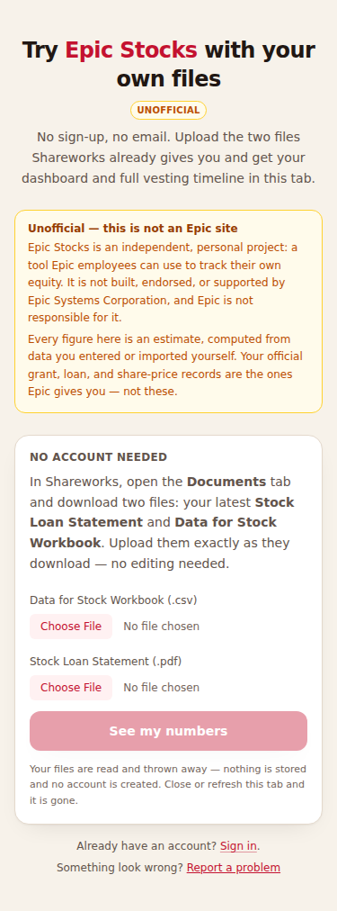 | 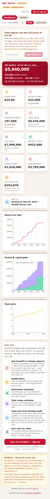 | 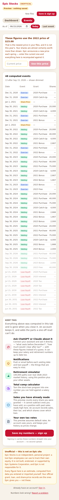 |

1. **Sign in** — click the sign-in button for your organization's identity provider (Google, Azure AD, or whatever your admin has configured). Your data is tied to that account; you can export everything at any time.

   | Light | Dark |
   |-------|------|
   | 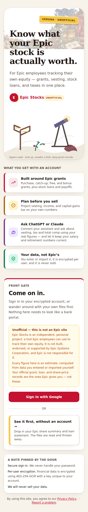 | 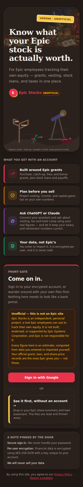 |

2. **Enter your data** — with no grants yet, the setup screen appears automatically on the dashboard, and is always reachable from the Import page. Options, fastest first:
   - **Import from Shareworks** (fastest) — download **Data for Stock Workbook** and your latest **Stock Loan Statement** from the **Documents** tab in Shareworks and upload them as-is. Share counts, cost basis, loan balances, interest rates and due dates are read straight out of them, and you check the result in the wizard before anything is saved. See [Importing from Shareworks](#importing-from-shareworks) below.
   - **Enter it myself** — no documents to hand? Epic's company-wide grant structure is pre-filled (vest dates, periods, exercise dates), so you fill in your share counts, annual market prices and loan details grant by grant. Catch-up grants are included by default for years ≤ 2021. The 2020 Bonus has an A/B/C vesting schedule selector matching your grant agreement. Developer Bonus Shares appear for the 2020 and 2021 cohorts with their cost basis fixed at $0 — leave the share count blank if you weren't offered them. If you already have data, the wizard pre-loads it on each screen — unmatched existing records appear at the bottom so you can keep or remove them. Nothing is written until you confirm at the final step.
   - **Import a Vesting.xlsx** — already have an export from this app, or a workbook someone shared? Upload it to pre-fill the wizard.
   - **Manual entry** — a blank slate, for grants that don't match the company schedule at all.

   | New user | Grant entry |
   |----------|-------------|
   | 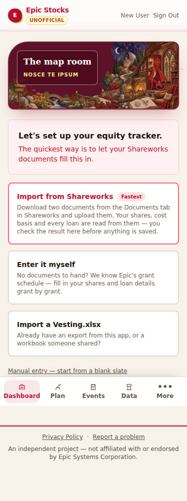 | 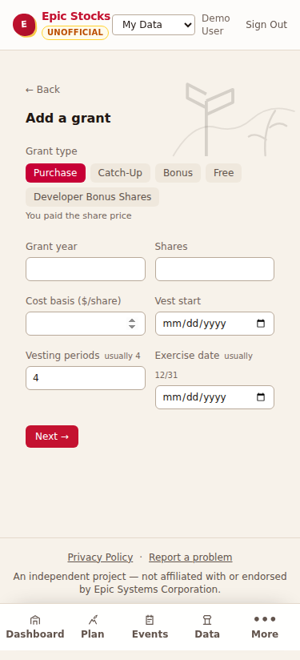 |

3. **Add share prices** — go to **Prices** and enter the annual share price (Epic announces this each March). Without at least one price, no events can be computed. Use **+ Estimate** to project future prices at an annual % growth rate — useful for modeling expected increases before they're officially announced. Estimates appear in italics with an "est." badge and are automatically removed when the real price for that date is added.

4. **View the Dashboard** — once you have grants and at least one price, the dashboard shows your full financial picture. See [The Dashboard](#the-dashboard) below.

5. **Explore the Events timeline** — the **Events** page shows the full computed timeline: every vesting tranche, exercise date, loan payoff, and recorded sale, with income, capital gains, and running totals for each event.

   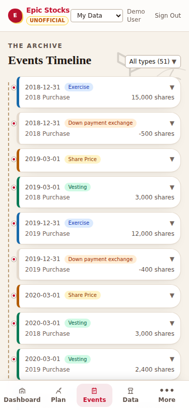

6. **Plan or record a sale** — go to **Sales → + Sale**. See [Sales](#sales) below.

7. **Set up notifications** — go to **Settings → Notifications**. Enable push (browser) or email, then choose how far in advance to be notified: day-of, 3 days before, or 1 week before your events. Tap **Send test** to confirm push is working.

8. **Share your data** — invite a financial advisor or family member by email from **Settings → Sharing**. They see your data read-only; you can revoke access at any time.

9. **Compare to a salary offer** — go to **Comp Calc** to translate your stock-loan program into a single comparable comp number. See [Total Comp Calculator](#total-comp-calculator) below.

10. **Stress-test retirement** — go to **Retirement** to run a 100,000-path simulation of your retirement using your Epic exit value plus other assets. Each path samples real months of 1928–2023 U.S. stock + bond history (block bootstrap) so crash shapes and recoveries are realistic. See [Retirement Simulator](#retirement-simulator) below.

11. **Export your data** — go to **Import/Export → Download Vesting.xlsx** for a full export at any time.

---

### The Dashboard

| Mobile | Desktop |
|--------|---------|
| 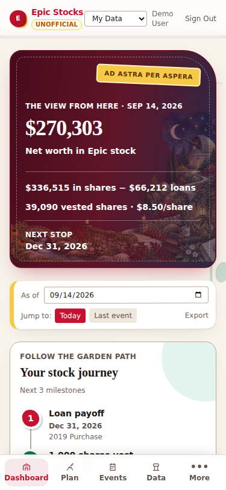 | 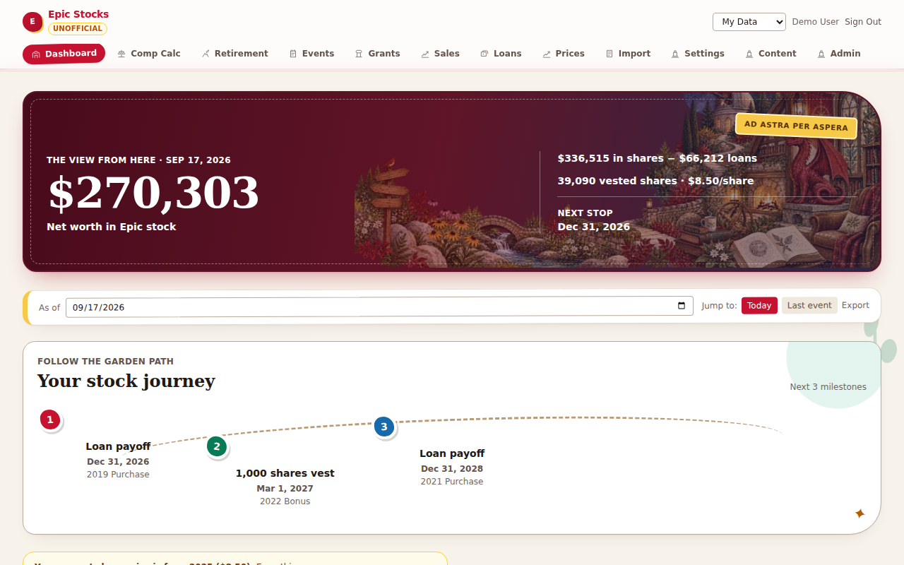 |

The dashboard is split into two stacked sections that share a single **As of** date picker (**Today** and **Last event** quick buttons). Dark mode is supported and follows your system preference.

#### "Up to this date"

Summary cards showing everything that has happened through the selected date:

| Card group | What it shows |
|-----------|--------------|
| **Your Shares** | Value today (vested shares at current FMV + unvested shares at cost basis), total cost basis, current share price, vested shares, unvested shares, next scheduled event |
| **Earnings** | Total ordinary income recognized from vesting, total capital gains from sales, net cash received |
| **Costs** | Outstanding loan principal, total interest accrued, estimated taxes paid |

Tap any card marked **▼ see breakdown** to see how the number was computed — per-grant, per-sale, or per-loan detail. Open breakdowns persist across visits.

The **Export** button in the date bar downloads a formatted Excel holdings report for the selected date, useful for financial or estate planners.

#### "If you exited on this date"

This section appears for today or any future date. It shows what would happen if you sold all vested shares and paid off all loans on that date:

- **Net Cash at Exit** — take-home after gross proceeds, loans paid off, and estimated divest tax
- **Gross Proceeds** — total sale value at the current share price
- **Loans Paid Off** — outstanding balances that would be repaid
- **Est. Divest Tax** — estimated capital gains and income tax on liquidation

Tap **Net Cash at Exit** to expand the full exit breakdown, including prior-sale contributions and any interest deduction tax savings.

#### Investment interest deduction toggle

The **investment interest deduction** toggle lives directly on the dashboard. Flip it to preview the estimated tax impact before applying — see [Investment Interest Deduction](#investment-interest-deduction) below.

---

### Total Comp Calculator

| Mobile | Desktop |
|--------|---------|
| 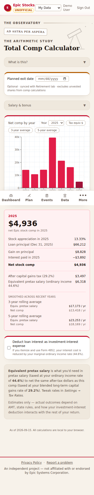 | 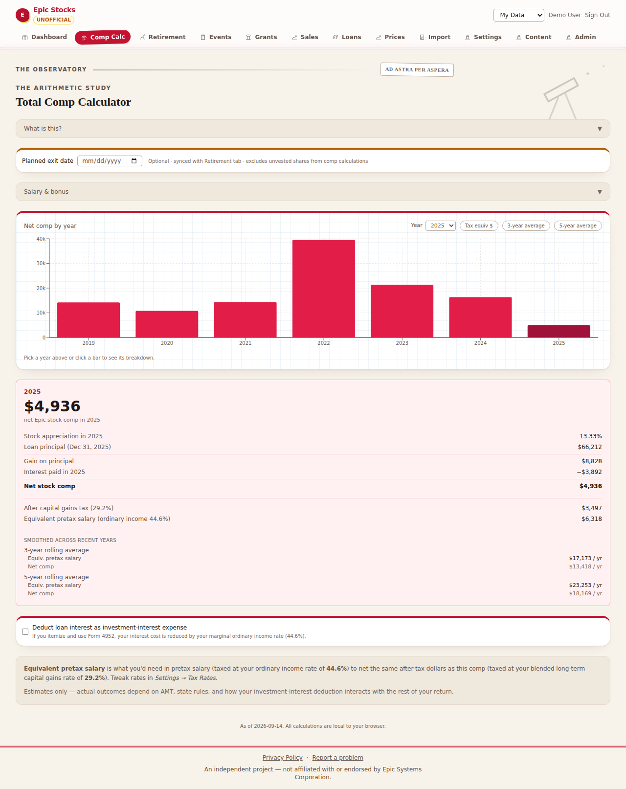 |

Epic's stock purchase program is structured as a low-rate loan to buy stock — not as a salary or RSU grant. That makes it hard to compare an Epic offer against an offer that pays cash + stock. The **Comp Calc** tab gives you a single comparable number, year by year.

The math, in plain English: if Epic loaned you $L to buy stock, and that stock grows by *r* % a year, then the appreciation on Epic's loan is *r* × *L*. Subtract the interest you pay on that loan and what's left is your comp from the program.

**The view:**

- **Bar chart of net comp by year** — one bar for every year you have price data for, from your first loan year through the latest Dec 31 price. Click a bar to drill into that year's breakdown.
- **Selected year detail** — the year's stock appreciation percentage, outstanding loan principal at Dec 31, gain on principal, interest paid, and resulting net comp. Plus after-capital-gains-tax dollars and the equivalent pretax salary at your ordinary income rate. When salary/bonus data is entered, the detail also shows a **total comp breakdown**: net Epic stock comp + base salary + bonuses for that year.
- **3-year and 5-year rolling-average overlays** — toggleable lines on the chart that smooth out spikes from Epic's annual repricing. The same averages also appear inside the year-detail panel.
- **Projected years** — if you've entered estimated prices for future Dec 31 dates in **Prices**, those years appear as striped, lighter bars and are flagged "Projected" in the detail panel. No separate override input on this page — projections live in the prices table.
- **Optional toggle**: deduct loan interest as investment-interest expense (IRS Form 4952) — reduces effective interest cost by your marginal ordinary income rate. Defaults to your **Settings → Tax → Deduct investment interest** preference.
- **Salary & bonus history** — a collapsible event log (owner only, read-only for viewers) lets you record salary changes and year-end bonuses alongside the stock comp. Salary changes can happen on any date and multiple times in a year — the calculator prorates each rate by the days it was in effect. Bonuses are tied to a year and support an optional note. Data is auto-saved and encrypted.

All math runs locally in your browser — no calculation results are stored. Tax rates come from your **Settings → Tax Rates**.

---

### Retirement Simulator

| Mobile | Desktop |
|--------|---------|
| 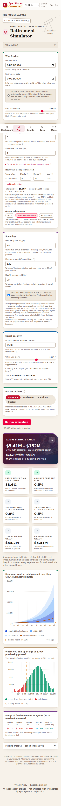 | 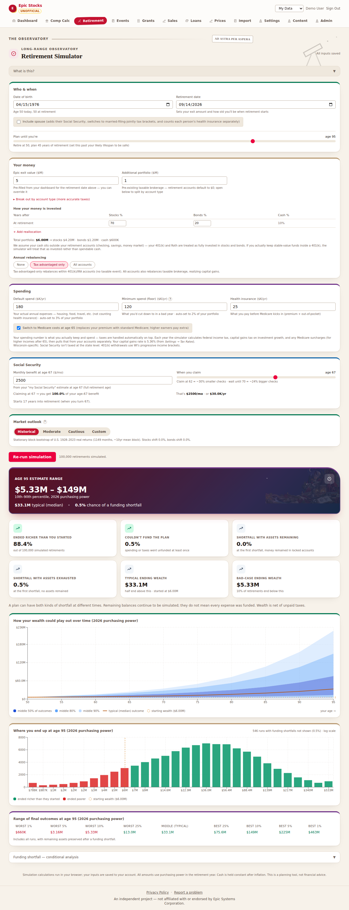 |

The **Retirement** tab runs a 100,000-path simulation of your retirement entirely in your browser. It pre-fills the Epic exit value from the dashboard's "If you exited today" net cash, lets you add a separate brokerage / 401k portfolio plus a cash buffer, then projects total wealth over time using **block-bootstrapped real returns from 1928–2023 U.S. history**.

**How returns are sampled.** Each month of every Monte-Carlo path is drawn from a real historical month (S&P 500 total return + 10-year Treasury, both inflation-adjusted using CPI). We start at a random month and walk forward; each subsequent month there's a 1-in-120 chance the path jumps to a new random month, otherwise it advances. This is the **stationary block bootstrap** of Politis & Romano (1994), with mean block length 120 months (~10 years). It preserves crash shapes, recovery patterns, and stock/bond co-movement that an i.i.d. lognormal model can't capture — Oct 1929 is usually followed by Nov 1929, Sep 2008 by Oct 2008 — while still giving plenty of inter-path Monte-Carlo variation. Blocks of ~10 years span most major market cycles (dot-com crash, 2008–09, 2020) while providing more Monte-Carlo variation across the 100,000 paths than the prior 20-year blocks.

**Inputs:**

- **Date of birth** — saved on the user account; used to estimate Social Security claim timing, Medicare eligibility (age 65), and your **age at the chosen retirement date** (which is the simulation start age). When viewing a shared account, the data owner's DOB is used (read-only).
- **Retirement date** — date picker; the Epic exit value auto-fills from the dashboard's "If you exited" net cash for that date, and the simulation horizon starts at your age on that date (so wealth and time horizon stay aligned). Viewers of a shared account can change this date to explore different exit scenarios — changes are not saved to the owner's account.
- **Epic exit value + additional portfolio** ($M) — by default the simulator treats your non-Epic wealth as a single "Additional portfolio" number, **fully appreciated** (zero cost basis) — the conservative assumption for pre-existing brokerage held for years. Click **Account types & basis (advanced)** to break it down into:
  - **Taxable cost basis** — the basis of pre-existing taxable brokerage (default $0). Withdrawals from the taxable bucket realize LTCG only on the gain portion (basis is returned tax-free); Epic exit proceeds enter this bucket with **full basis** (no embedded gain — they were just sold).
  - **Traditional 401(k) / IRA** — locked until age 59½. Withdrawals are taxed as **ordinary income**. Pre-59½ ruin is possible even with this bucket full — the bridge years must come from cash + taxable, and once a path can't fund a year of spending it's flagged ruined and zeros out (the simulator chooses the conservative accounting; in real life you'd take the 10% early-withdrawal penalty).
  - **Roth IRA / 401(k)** — locked until age 59½. Withdrawals are **tax-free**.
- **Allocation table** — an always-visible table showing Stocks %, Bonds %, and auto-computed Cash % for your portfolio. With a single row it's a fixed allocation for the whole retirement. Click **+ Add reallocation** to schedule allocation shifts over time: each extra row targets an age and the simulator linearly interpolates between rows each month. Useful for modeling a stock-heavy early retirement that gradually shifts toward bonds. Cash is auto-computed as `100 − stocks − bonds`. The cash buffer is funded from the **taxable bucket only**; tax-deferred accounts (Traditional, Roth) are treated as fully invested in stocks/bonds. This matches the typical pattern of holding emergency / spending cash in checking, HYSA, or money market — *not* inside a 401(k) — and keeps cash withdrawals tax-free in the model. If you actually hold a stable-value fund inside your 401(k), the simulator will treat that as invested rather than as a tax-free liquidity buffer; if your cash allocation exceeds your taxable bucket, the remainder stays invested in tax-deferred and a small warning surfaces in the advanced view.
- **Annual rebalancing** — three modes: **None** (let drift compound), **Tax-advantaged only** (rebalance within 401k/IRA each year at zero tax cost), **All accounts** (also rebalances taxable brokerage, realizing any capital gains). The simulator tracks stock and bond sub-buckets separately within each account type (taxable, traditional, Roth) to compute the correct LTCG when rebalancing spills into taxable.
- **Default / minimum spend** ($K/yr real, excluding health insurance) — default-spend defaults to **3%** of total portfolio; minimum-spend (the floor used in negative-return years) defaults to **2%**. A click-to-expand explainer next to "Minimum spend" walks through the formula and notes you can set the floor equal to default spend to model no spending cuts in down years. Both defaults track total portfolio until you edit them.
- **Health insurance** ($K/yr real, default $25K) — pre-Medicare premium estimate. With **Apply Medicare model after age 65** checked (default), post-65 cost is replaced by base Medicare premium (Part B + Part D) plus **IRMAA** surcharges based on each year's MAGI. With **Include spouse** on, both spouses pay separately, and the line uses pre-Medicare cost for whichever spouse is still under 65.
- **Taxes** — computed once per calendar year from 2026 federal brackets (ordinary + LTCG, MFJ when spouse is included), **NIIT** (3.8% on investment income above MAGI thresholds), Medicare **IRMAA** after 65, and Wisconsin progressive brackets on traditional 401(k)/IRA withdrawals (see WI assumption below). Withdrawal order each month: cash → taxable (LTCG on gain only) → traditional → Roth, with traditional and Roth gated until 59½. Income is accumulated monthly and the annual tax bill is settled at December 31 of each simulated year. Cost basis is tracked through the path: each month it's eroded by that sampled month's actual CPI from the historical bootstrap (basis is fixed in nominal $ in real life but the sim runs in real $, so basis loses purchasing power over time — high-inflation months boost real returns *and* erode basis simultaneously). When the cash buffer gets refilled from taxable equity gains, the gain portion realizes LTCG on top of the year's spending tax — refills are not free.
  - **Wisconsin assumption.** This app targets Epic employees (Verona, WI), so the simulator bakes in WI's tax rules: (a) **Social Security is exempt from state tax** — 85% of SS still counts toward federal taxable income (per IRS rules) but it's not in the WI bracket calc; (b) **state ordinary income tax uses WI's progressive brackets** (3.5%/4.4%/5.3%/7.65%, MFJ thresholds at $20K/$40K/$440K), not a flat marginal rate. The retirement sim knows your full income each year, so each dollar can land in its actual bracket — same justification as for federal brackets. The user's `state_income_rate` from **Settings → Tax Rates** is not consulted by the retirement sim. **State LTCG** uses your `state_lt_cg_rate` flat — set it to your post-30%-WI-exclusion effective rate (~5.36% at the top WI bracket). If we ever ship to a non-WI userbase, the WI brackets and SS exemption should both become per-user toggles.
- **Market outlook** — four options that all share the same bootstrap shape but apply a constant shift to every resampled return:
  - **Historical** — no shift; the raw 1928–2023 distribution. Average real CAGR ≈ 6.7% stocks, 2% 10yr Treasury.
  - **Moderate** — stocks −2pp, bonds −0.5pp. Roughly Vanguard's 2025 10-year outlook given current equity valuations.
  - **Cautious** — stocks −3.5pp, bonds −1pp. Stress test for materially worse forward returns.
  - **Custom** — set the stocks and bonds shifts yourself in percentage points (e.g. `−2.5` trims 2.5pp/yr off historical stock returns).
- **Simulate-until age** (slider) — sets the simulation horizon (years = end_age − age_at_retirement).
- **SS FRA monthly benefit + claim age slider** (62-70) — Social Security adjusted by the SSA early/late formula. SS reduces the portfolio withdrawal in years it's active.
- **Include spouse** (toggle) — adds a spouse DOB, spouse FRA monthly benefit, and spouse claim-age slider. The spouse SS stream uses the SSA early/late formula at the spouse's claim age and is added on top of yours; the spouse DOB also drives the Medicare step-down for health insurance. For the spousal-benefit rule (50% of higher earner's PIA), enter that as the spouse's FRA monthly directly.

**Persistence:** Every input change auto-saves (debounced) — there's a single status indicator at the top of the page (`Inputs save automatically` → `Saving…` → `All inputs saved`) and no per-field save annotations. Saved data re-loads on next visit. Shared viewers see the owner's saved scenario as the default; viewer edits run locally but are never written back, and the same header indicator surfaces that explicitly.

**Outputs:**

- 4 stat cards — % paths above starting wealth, % ruin (both pools hit zero), median final $M, P10 final $M.
- A fan chart of total wealth (real $M), x-axis in age, with p5–p95 percentile bands and a median line.
- A histogram of final-age wealth, green/red bars marking above/below starting wealth (ruin paths excluded, count noted separately).
- A percentile table at p1, p5, p10, p25, p50, p75, p90, p95, p99.

All values are real (inflation-adjusted) — federal tax brackets are CPI-indexed in real life so they're treated as real here too. Withdrawals happen at year-end after equity grows. Health insurance is added on top of base spend; post-65 the line switches to base Medicare + IRMAA when **Apply Medicare model after age 65** is checked. The simulation runs locally — no data leaves your browser. Click **Run simulation** to execute; tweak inputs and re-run any time.

**Data sources for the historical bootstrap:** Monthly S&P 500 total return (price + dividend/12), 10-year Treasury yield, and CPI from Robert Shiller's Yale dataset (Jan 1928 – Sep 2023). Stock monthly real return: `(P_t + D_t/12) / P_{t-1} - 1 - inflation_t`. Bond monthly real return: `GS10_{t-1}/100/12 + 8 × (GS10_{t-1} - GS10_t)/100 - inflation_t` (coupon + duration-adjusted price change). The full table is embedded in `frontend/src/app/pages/Retirement.math.ts` so the simulation runs offline.

---

### Sales

| Light | Dark |
|-------|------|
| 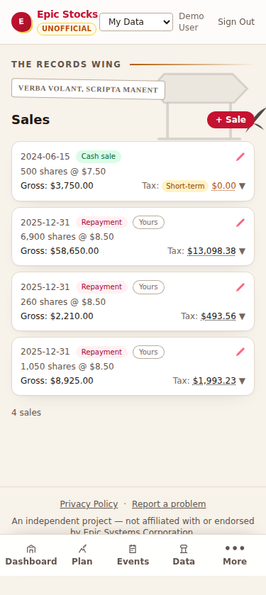 | 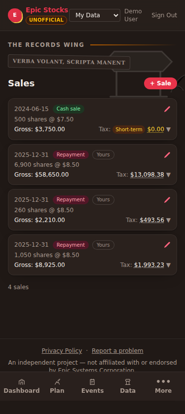 |

Go to **Sales → + Sale**.

#### Plan Sale vs. Record Sale

The form adapts based on the date you enter:

- **Plan Sale** (today or future date) — tax is a forward-looking estimate. No "actual tax paid" field.
- **Record Sale** (past date) — an **Actual tax paid** field appears so you can enter what you actually remitted. This overrides the estimate for accurate historical records.

#### $ Target vs. # Shares

Two ways to size a sale:

- **$ Target** — enter the net cash you want to receive *after tax*. The app works backwards to find the share count where after-tax proceeds ≥ your target. Useful when you need a specific dollar amount (e.g. to cover a tax bill or a loan balance).
- **# Shares** — enter shares directly. Gross proceeds, estimated tax, and net proceeds update as you type.

#### Lot Selection Methods

When you sell, the app needs to know which lots are consumed first. This matters because lots held longer may qualify for the lower long-term capital gains rate.

| Method | How it works | Good for |
|--------|-------------|---------|
| **Epic LIFO** (default) | Newest short-term lots first, but exhausts all long-term lots before touching any short-term lot | Minimizing short-term capital gains tax |
| **LIFO** | Newest lots first (typically highest cost basis on rising stock) | Minimizing total gains on rising stock |
| **FIFO** | Oldest lots first | Maximizing the proportion of long-term-qualified shares |
| **Manual** | You set the share count for each lot individually | Full control — pick exactly which lots to sell |

Your default method is set in **Settings → Tax Rates → Manual Sale Lot Method**.

> **Tax note:** The IRS may require you to elect a consistent lot identification method at time of sale. Consult a tax advisor before changing this for large or tax-sensitive sales.

#### Lot Allocation Table

As soon as you enter a date and share count (or $ target), a **Lot Allocation** table appears showing:

- Each available lot (grant year + type, vest date)
- Cost basis per share
- Available shares remaining in the lot
- How many shares will be consumed from that lot
- **LT** (long-term, green) or **ST** (short-term, amber) badge

In **Manual** mode, the Allocated column becomes an editable field. The form prevents over-allocation.

#### Tax Breakdown

After saving a sale, tap the tax amount to see the full breakdown:

- Gross proceeds
- Ordinary income component (for RSU/Bonus lots where FMV at vest was recognized as income)
- Short-term and long-term capital gains per lot
- Federal income tax, federal long-term/short-term capital gains tax, net investment income tax (3.8%), state income tax, state capital gains tax
- Estimated total tax and net proceeds

Tax rates are captured from your Settings at the time the sale is created and stored with the sale record. Changing your tax rates later does not retroactively change a saved sale's breakdown.

---

### Loan Payoff

Each loan tied to a Purchase grant can have an auto-generated payoff sale that covers the outstanding balance (principal + accrued interest through the due date) by selling just enough shares.

#### How the gross-up works

The app finds the smallest integer share count such that after-tax proceeds from selling those shares ≥ the outstanding balance. It only considers lots from the *originating grant* (same-tranche selection), regardless of your default lot method setting.

The payoff sale always shows a Lot Allocation table in the Sales page so you can see exactly which lots are being consumed and whether they are long-term or short-term.

#### Auto-generated payoff sales

When you create a loan with **Payoff loan via sale** checked (the default), a payoff sale is created automatically:

- **Date** — the loan's due date
- **Shares** — gross-up calculation at the share price on or just before the due date
- **Lot selection** — same-tranche (originating grant's lots only)
- **Tax rates** — locked to your Settings at creation time

If you later change tax rates or add new share prices, the stored share count will be stale. Use **Regen payoff sales** on the Loans page to recompute all future payoff sale share counts at once (this also updates the locked tax rates to your current settings).

---

### Investment Interest Deduction

Toggle this on the **Dashboard** or change it in **Settings → Tax Rates**.

**Background:** Investment interest is interest paid on loans used to buy investments. Under IRS Form 4952 you can elect to deduct it against *net investment income* — and you may elect to treat net capital gains as investment income for this purpose. The trade-off: gains treated as investment income lose their preferential cap-gains rate and are taxed as ordinary income instead. For large enough interest amounts, the tax saving from reducing the gain can outweigh the rate difference; this estimate helps you model that.

**How the estimate works:**

- Interest with `due_date = 1/1/YEAR` is deductible in that year (e.g. interest due 1/1/2025 → deductible in 2025).
- The deductible pool is applied first to short-term gains, then long-term gains (minimizes tax since short-term gains are taxed higher).
- Any unused deduction in a year carries forward indefinitely to future years with eligible gains.
- Use **Settings → Tax Rates → Customize by year** to exclude years where you took the standard deduction.

**What changes on the dashboard when enabled:**

- "Total Cap Gains" relabels to **"Cap Gains (after int. ded.)"** and shows the reduced amount.
- "Cash Received" relabels to **"Cash (incl. int. ded. savings)"** and includes estimated tax savings.
- The Income vs. Cap Gains and Estimated Tax Liability charts update to reflect lower taxable gains.
- An inline card shows the total deduction applied with a toggle to preview before committing.

**What changes on the Events timeline:**

- The "Cap Gains" column header changes to **"Cap Gains (adj.)"**.
- Events where a deduction is applied show an "adj." badge with a tooltip showing the gross amount.
- Expanding a vesting or price event shows the short-term/long-term capital gains split and how much of the interest pool was consumed.

> This is an estimate only, and only applies in years where you itemize deductions (not the standard deduction). Consult a tax advisor before making decisions based on it. Filing Form 4952 and electing to treat capital gains as investment income means those gains lose their preferential rate — whether this is beneficial depends on your specific situation.

---

### Smart Tips

The dashboard automatically analyzes your settings and surfaces actionable tips in a carousel above the summary cards:

- **Investment interest deduction** — shown if enabling Form 4952 would save ≥ $500 going forward. Tap **Apply** to enable in one tap.
- **Lot selection method** — shown if switching to a different method would save ≥ $1,000 vs. your current method. Tap **Apply** to update the setting.

Each tip shows estimated savings. Tips can be dismissed for the session.

---

### Notifications

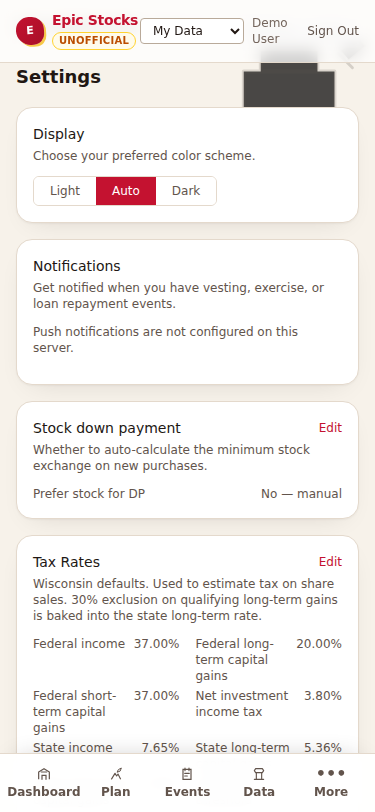

Go to **Settings → Notifications** to configure.

- **Push** — **per device, always.** A browser can only create a push subscription for itself, and only after you allow notifications on that device, so the toggle in Settings shows the state of *the device you are looking at* — never your account. Devices you have already enabled appear underneath as "also on N other devices". Tap **Send test** to verify it's working without waiting for a real event.

  Settings tells you which of five situations this device is in: on, off (tap **Enable**), blocked (you declined before — only your device settings can undo that), not available, or, on an iPhone or iPad, *add the app to your home screen first* — iOS only allows notifications for an installed app, never for a tab in Safari.

  If you have enabled push anywhere before, a new device offers a **Turn on notifications for this device?** banner. "Don't ask again" stops the offer everywhere without unsubscribing any device that already works.
- **Email** — enable the toggle. Enabled by default for new users. All notification emails include an unsubscribe link in the footer.

**Advance timing** — choose when to be notified: day-of (default), 3 days before, or 1 week before. This applies to both push and email.

**Which events trigger a notification:**

| Event | Notified? |
|-------|-----------|
| Vesting | Yes |
| Exercise | Yes |
| Loan Payoff | Yes |
| Planned sale (loan payoff) | Yes |
| Share price update | No |
| Down payment exchange | No |

**What the notification contains:** Only event counts and types — no dollar amounts, share counts, or any financial data. Example: *"You have 2 events today: 1 Loan Repayment, 1 Vesting."* Tapping the notification opens the relevant page.

---

### Signing Out

**Sign Out** (Settings → Account) clears the session on this device only — other browsers or devices stay signed in.

**Sign Out Everywhere** (Settings → Account) revokes every active session for your account in one action. Use this if you've signed in on a device you no longer have access to, or if you want to force every browser to re-authenticate. After confirming, every existing session token is invalidated immediately and you'll be sent to the login page.

Sessions otherwise last 30 days, with a sliding refresh — the app silently extends your session each time you open it, so an installed PWA stays signed in indefinitely as long as you keep using it.

---

### Sharing Your Data

| Sharing settings | Invite landing |
|-----------------|----------------|
| 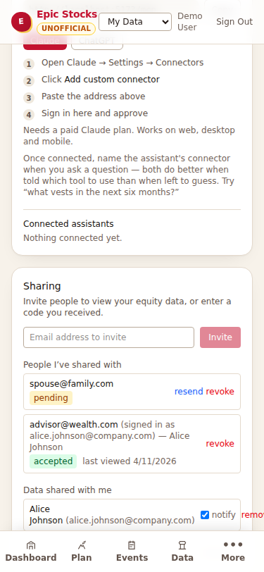 | 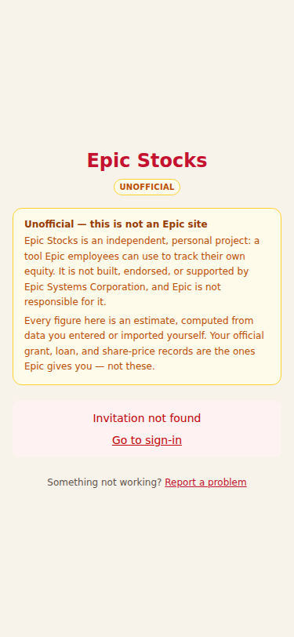 |

Invite someone (a financial advisor, accountant, or family member) to view your data read-only from **Settings → Sharing**.

They receive an email with a clickable link and a manual entry code. The link works with any sign-in provider — it doesn't need to match the email the invitation was sent to.

**What a viewer can see:** Dashboard, Events, Grants, Loans, Prices, and Sales — all read-only. They can also download your data as Excel.

**What a viewer cannot do:** Create or modify any data, see your Smart Tips, or use What If scenarios (enforced on the backend).

A financial advisor invited by multiple users can switch between them using the **account switcher** in the header. Viewers can also control whether they receive event notifications for shared accounts.

Both the inviter and the viewer can revoke access at any time. Invitation tokens expire after 7 days; inviters can resend to extend. All emails include an unsubscribe link; recipients can opt out of invitation emails without needing an account.

---

### 83(b) Election

If you filed an 83(b) election for a Bonus/RSU grant, flag it in the grant editor. This changes how the Events page displays that grant's vesting events — they show as violet "unrealized cap gains" (the amount that would have been ordinary income without the election) instead of green income, with a note showing the potential long-term cap gains tax at eventual sale.

The 83(b) flag is display-only — it doesn't change how events are computed. If you filed at a non-zero FMV, set the **Cost Basis** field to that price instead; the engine will treat it as a purchase grant automatically.

---

### Importing from Shareworks

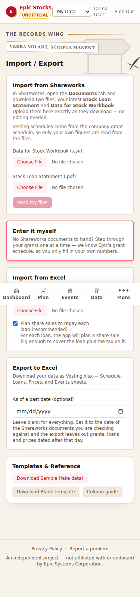

Everything the tracker needs is already in two documents on Shareworks. Sign in there, open the **Documents** tab, and download:

| Document | What is read from it |
|----------|----------------------|
| **Data for Stock Workbook** (.csv) | Shares granted and sold per grant, cost basis, 83(b) shares |
| **Stock Loan Statement** (.pdf) — the latest one | Every loan: number, name, principal balance, interest rate, due date |

Then go to **Import/Export → Import from Shareworks** and upload either or both, exactly as they downloaded. There is no need to open or edit them first.

**Only your own figures come from the files.** Vest dates, vesting periods, exercise dates, loan rates and due dates are company-wide and come from the grant schedule a content admin maintains — see [For Content Admins](#for-content-admins). Nothing in an import can change them.

**The files check each other.** Before anything is shown, the app verifies the statement adds up to its own printed subtotals and total, that the loans it attributes to each grant reproduce that grant's loan balance and annual interest in the CSV, and that share counts and rates agree with what is on record.

**Shares Epic reports as sold are reconciled before they are called sales.** Epic's CSV puts shares handed back to cover a later purchase's down payment in the same `Shares Sold` column as shares actually sold, and never says which is which. The arithmetic does: the gap between a grant's cost basis and its purchase loan is the down payment, and one paid in stock is a whole number of shares at that year's price — the policy minimum rounded up to the next whole share. When those add up to exactly the shares reported gone, they are recorded as share exchanges at exercise (not taxable disposals, no sales created) and the import says which grants they paid for. Anything left over is reported as sold for you to enter on the Sales page. A larger-than-minimum down payment, or a loan that has been paid down since, reads as unexplained shares rather than being quietly reclassified.

**Refinances are read from the rate you are paying.** Epic's documents never say when a loan was refinanced — a purchase loan is named "2018 Grant - Purchase Loan" however many times its terms have been rewritten. But a refinance is what changes the rate, so the rate on the statement is the rate of the last refinance the loan went through: the wizard matches it against the company-wide refinance chain (see [For Content Admins](#for-content-admins)) and builds only the steps up to it. A rate that matches the original one, or matches no step at all, means the loan was never refinanced and no chain is built. The refinance screen says which reading it took wherever that leaves out steps the company schedule has, and you can correct it there.

#### When it does not add up

The app never calls a language model and never sends your figures anywhere. Instead it hands you a prompt to paste into whichever assistant you already use — ChatGPT, Claude, whatever — containing the draft so far, exactly which figures failed to reconcile, the format to reply in, and the company schedule the assistant must not change. Attach your CSV and PDF to that chat, paste the reply back into the app, and it is checked exactly the same way. Repeat until it comes back clean.

Your figures go to whichever assistant you choose, by your own hand and on your own account. The app is not in that loop.

The reply can come back three ways: pasted into the box, uploaded as a `.json` file, or as a filled copy of the app's own `Vesting.xlsx` workbook.

#### Signing off

Acceptance happens in the **Setup Wizard**, prefilled with the draft — the same screens you would use to type the numbers yourself, showing grants, loans and prices as your own position. You never sign off on a file. Nothing is written until you finish the wizard.

Two things worth knowing:

- **Only arithmetic failures block.** If the statement does not match its own totals, part of it was misread and the import stops there. Everything else — the two files disagreeing, a rate that differs from the one on record — is shown and you decide. Epic's own paperwork sometimes disagrees with itself, and you should not be trapped in a loop over it.
- **There is no automatic check on share counts.** The CSV's `Shares Granted` is the only source for them, so nothing can be reconciled against. Loan balances, interest and cost basis all have arithmetic checks; share counts have you. That is why sign-off shows rendered figures rather than a row of green ticks.
- **Shares Epic reports as sold** are reported but no sales are invented — the CSV carries no sale dates or prices. Record those on the **Sales** page.

---

### Exporting Your Data

Go to **Import/Export → Download Vesting.xlsx** to export all your grants, prices, loans, and sales at any time. The same file can be re-imported to restore or transfer your data.

The **Import** page also keeps the last 3 backup snapshots from previous imports — you can restore any of them if an import goes wrong.

### Reporting a Problem

**Report a problem** sits in the footer of every page once you are signed in, and on every page you can reach without an account — login, invitation landing, and both stages of `/try` (the upload screen and the preview dashboard it computes). Someone who cannot get past sign-in, or who is looking at numbers the preview got wrong, is exactly the person who most needs to be able to say so. The app also offers it at the moment something fails:

- **A red error toast** carries a **Report** button.
- **A crash** shows a recovery screen with **Reload** and **Report this**, instead of a blank page.
- **An import that comes back with errors** offers **Report this import problem**.

Every report carries what you typed, the page you were on, and — when the failure came from the server — a short **reference id** that points at the exact stored traceback.

**"Include details that identify me" is a checkbox, and it starts off.** Ticking it attaches your account, your browser, and the last few pages you visited plus any requests that failed. Leaving it off means the report is stored anonymously, even if you are signed in. Either way it never includes any of your financial data — no share counts, no prices, no loan amounts. Press **Show exactly what gets sent** to read the whole payload before it goes.

Import reports carry only the rule ids that fired (`C1`, `G3`, …), never the finding text, because those messages quote figures from your own statement.

Your email address is always optional, and is only there so you can be reached about what you reported.

| Light | Dark |
|-------|------|
| 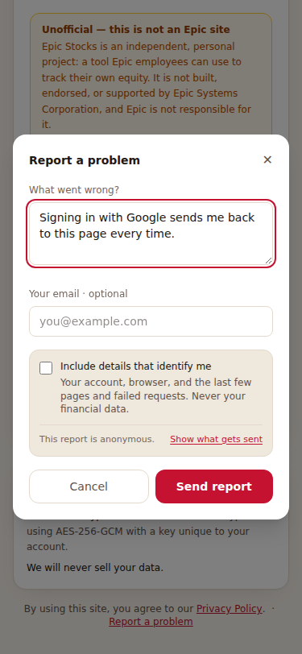 | 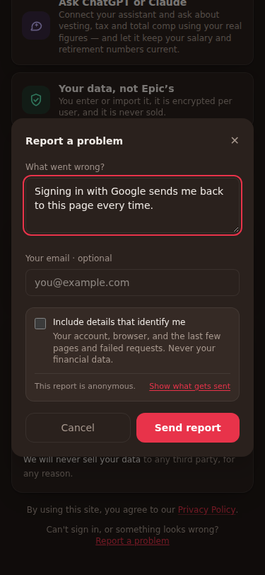 |

---

## For Content Admins

| Light | Dark |
|-------|------|
| 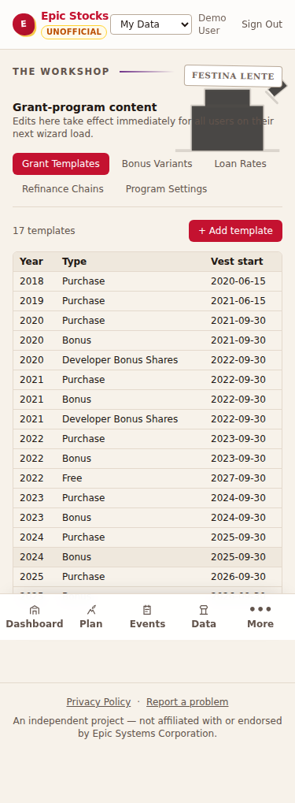 | 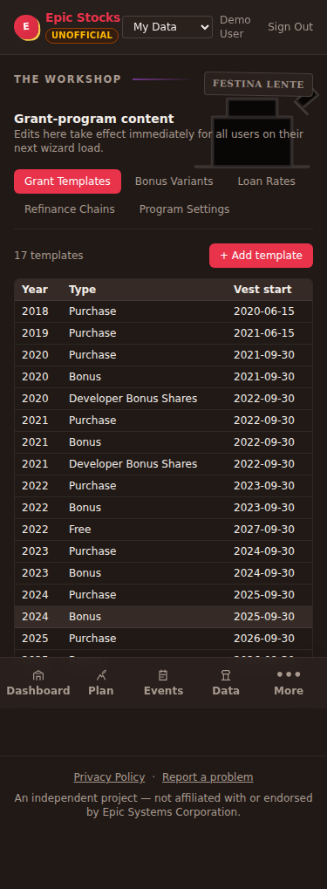 |

Content admins edit the grant-program data that drives the Setup Wizard for all users. A site admin promotes users to this role from the Admin panel (the role persists across logins). Site admins are implicitly content admins.

Content admins see a **Content** nav link. From `/content` they can edit:

| Section | What it controls |
|---------|----------------|
| **Grant templates** | The per-year, per-type grant schedule shown in the wizard: vest dates, periods, exercise dates |
| **Bonus vesting variants** | The A/B/C schedule options for the 2020 Bonus grant |
| **Loan rates** | Interest rates, tax rates, and purchase-original rates by year |
| **Loan refinance chains** | The sequence of refinance steps for purchase and tax loans. The wizard applies only the steps up to the rate a user's own loan carries |
| **Program settings** | Fallback tax rates, minimum down-payment policy (percent + dollar cap), flexible loan-payoff toggle |

Edits take effect immediately for all users on their next wizard load. The wizard automatically refreshes the cache after any content write.

> **Grant types** (Purchase, Catch-Up, Bonus, Free, Developer Bonus Shares) are hard-coded and cannot be changed from the content editor — the core computation engine branches on those specific strings. Year ranges shown on the settings tab (price and rate bounds) are derived from the rates and templates tables and are read-only.

---

## For Site Admins

| Light | Dark |
|-------|------|
| 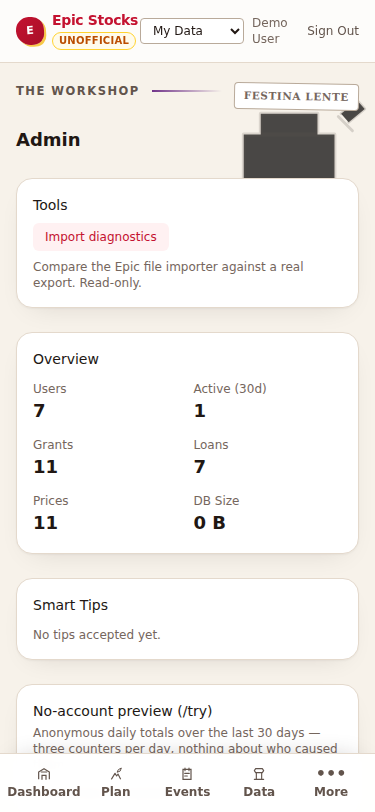 | 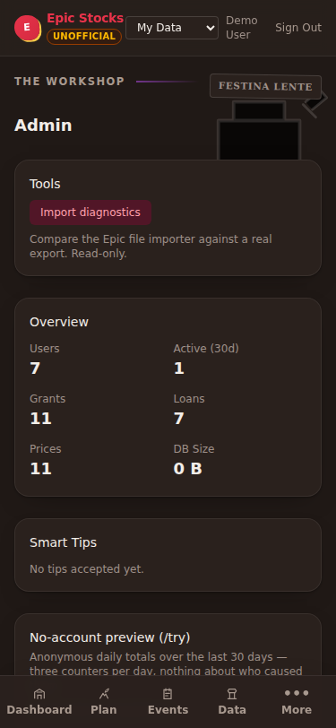 |

Site admins are designated via the `ADMIN_EMAIL` environment variable (semicolon-delimited for multiple). Access is granted dynamically on each login — adding or removing an email from `ADMIN_EMAIL` takes effect on the user's next sign-in. Navigate to `/admin` after signing in with a matching account.

### What admins can see

- Total registered users and active users (last 30 days)
- Aggregate counts: total grants, loans, prices across all users
- **System Health** — CPU %, RAM %, and DB size with sparkline charts (24h / 72h / 7d / 30d windows). Sampled every 15 minutes; 30-day rolling retention.
- **Database Tables** — per-table size breakdown (PostgreSQL only). Useful for diagnosing storage growth.
- **Smart Tips Report** — aggregate-only view: total users who accepted a tip, total estimated savings, per-type breakdown. No individual financial data.
- **No-account preview funnel** — how the `/try` preview converts: previews computed, saves pressed, signups that carried preview data, and the conversion rate, as anonymous daily totals over the last 30 days. The `trial_daily_stats` table holds exactly three integers keyed by date — no IP, no user agent, no per-visitor row — so this measures the feature without recording anything about a visitor. See the privacy policy's "Anonymous counts" section, which discloses it.
- Per-user metadata: email, name, join date, last login, record counts, admin badge
- Searchable and paginated user list, sorted by last active
- **Problem Reports** — what people actually reported, newest first, with a **new** badge for untriaged ones. Each entry expands to the reporter's account and browser (only when they opted in), the client trail, and — when the report carries a reference id — the matching server traceback pulled from the error log. Mark resolved, reopen, or delete. Reports live in their own `user_reports` table, so the nightly trim of `error_logs` to 500 rows never sweeps them away. The daily admin digest email counts the open ones, and each new report emails the admins as it lands.
- **Build version** — a 7-character commit SHA at the bottom of the Admin page confirms exactly which build is running

> Admins **cannot** see any user's financial data (share counts, prices, loan amounts, computed events). Only aggregate counts and account metadata are exposed.

### Admin actions

Click any user in the list to open a detail card:

| Action | What it does |
|--------|-------------|
| **Delete user** | Permanently removes the user and all their data. Blocked during maintenance mode and for admin accounts. |
| **Send test notification** | Immediately sends a push or email notification to any user for debugging. |
| **Block / unblock sending** | Prevents a user from sending new invitations (e.g. for abuse). |
| **Reset invitations** | Revokes all sent invitations and removes any received access for the user. Both sides are cleaned up. |
| **Re-enable email** | Restores email notifications for a user who unsubscribed via an email footer link. |
| **Clear invitation opt-out** | Removes an email from the invitation opt-out list. Works for non-users who opted out without an account. |
| **Block / unblock email** | Prevents an email address from logging in or creating an account. |
| **Make / Revoke Content Admin** | Promotes or revokes the persistent content-admin role for a user. |
| **Enable / disable maintenance** | Toggles app-managed downtime. Financial API routes return 503; auth and admin remain accessible. Use before planned ops that affect financial data. |
| **Rotate encryption key** | Generates a new master key, re-wraps all per-user keys, smoke-tests, and persists to the database. Propagates to all replicas automatically within seconds — no deploy or env var change needed. A snapshot of old keys is saved before any changes and restored automatically on failure. |
| **Restore from snapshot** | Appears when an interrupted rotation left a snapshot in the database. Recovers from a crash without SSH access. |

### Import diagnostics

**Admin → Tools → Import diagnostics** (`/import-diagnostics`) checks the Epic file importer against real data. Upload:

1. Your own export — either the `Vesting.xlsx` from **Import / Export** or a dashboard **holdings report** (see below), and
2. **Data for Stock Workbook** and/or the **Stock Loan Statement** from Shareworks, **from the same date**.

**Match the dates.** Shareworks documents are issued periodically, so the copy you have is usually months old, while an export is of today. Set the **as of** date on the Import / Export export to the statement date and the export leaves out grants, loans and prices dated after it — otherwise everything drawn in between reads as a difference. A grant is dated by its exercise date, a price by its effective date, a sale or payment by the day it happened; loans carry only the year they were drawn, so they are filtered by year.

Either export works as a baseline. The `Vesting.xlsx` is the full dataset. The dashboard holdings report is a formatted position statement rather than a dataset — it carries no loan numbers, no vesting schedule, and one share price instead of a history — so the report says once what it could not compare instead of listing those as differences on every row.

The importer runs against the Shareworks files alone, and the result is diffed field by field against the export. Every difference is listed with the id of the rule that produced the value, so the report reads as "rule `G3` reads the cost basis wrong" rather than "the import is wrong". Download it as Markdown and hand it back as a bug report. Every id is explained in [`backend/app/epic_import/RULES.md`](backend/app/epic_import/RULES.md) — what it reads, what it produces, when it fires and whether it blocks.

The page is read-only — it never touches the database, and it only ever reads the three files in the request, which is what makes it safe to run against a production export. It compares against the uploaded export, not against any stored user data, so it exposes no financial data the uploader did not already provide.

### Email Lookup

The **Email Lookup** tool searches any email address across all relevant systems in one place:

- Account status (registered? name? user ID?)
- Email notification status — enabled/disabled, with a re-enable action
- Invitation opt-out status — with a clear action
- Blocked-from-receiving status — with an unblock action
- Sending-blocked status — with an unblock action
- Invitation sent/received counts

Works for non-users too — useful for clearing opt-outs set by people who received an invitation email but never created an account.

### Blocked Email System

Blocked emails are checked at login time (case-insensitive). A blocked user cannot log in or create a new account. The blocklist is managed via the admin panel.

---

## For Site Operators

### Tech Stack

| Layer | Technology |
|-------|-----------|
| Backend | Python 3.12, FastAPI, SQLAlchemy, PostgreSQL (Alembic migrations) |
| Frontend | React 19, TypeScript, Vite, Tailwind CSS 4, Recharts |
| Auth | OIDC PKCE (any provider) → BFF session cookie (HttpOnly, XSS-safe) |
| Deploy | Docker Compose + Caddy (auto-HTTPS) + Cloudflare (DDoS protection) |
| Tests | pytest (backend), Vitest + RTL (frontend), Playwright (E2E) |

---

### Quick Start (Local Development)

**Prerequisites:** Python 3.12+, Node.js 20+, and at least one OIDC provider configured.

```bash
# Copy env template and fill in OIDC_PROVIDERS (minimum required)
cp .env.example .env

# Backend
cd backend
pip install -r requirements.txt
uvicorn main:app --reload --port 8000

# Frontend (separate terminal)
cd frontend
npm install
npm run dev
```

The backend creates `data/vesting.db` (SQLite) automatically on first run. The dev server proxies `/api` to `localhost:8000`. To reset: `rm backend/data/vesting.db`.

---

### Environment Variables

| Variable | Required | Description |
|----------|----------|-------------|
| `JWT_SECRET` | Yes (local) | Random secret for signing JWT tokens. **Auto-generated on production deploy.** |
| `OIDC_PROVIDERS` | Yes | JSON array of OIDC provider configs — see [OIDC Provider Configuration](#oidc-provider-configuration). |
| `DATABASE_URL` | Yes (prod) | PostgreSQL DSN. Docker Compose sets this automatically from `POSTGRES_PASSWORD`. |
| `REDIS_URL` | No | Redis connection string for the L2 timeline cache (e.g. `redis://redis:6379/0`). When set, computed timelines are cached and pre-warmed after data writes; survives restarts and is shared across replicas. The `redis` service in `docker-compose.yml` provides this automatically. |
| `POSTGRES_PASSWORD` | Yes (local) | PostgreSQL password. **Auto-generated on production deploy.** |
| `KEY_ENCRYPTION_KEY` | No | Enables per-user AES-256-GCM encryption. Set once, never changes. **Auto-generated on production deploy.** Wraps the operational master key stored in the database. |
| `LEGACY_MASTER_KEY` | No | One-time migration aid. Set to the old `ENCRYPTION_MASTER_KEY` value on first deploy after upgrading to the two-level key hierarchy; unset after first successful boot. |
| `ADMIN_EMAIL` | No | Semicolon-delimited email(s) granted admin access on login. |
| `VAPID_PUBLIC_KEY` | No | Required for push notifications. **Auto-generated on production deploy.** |
| `VAPID_PRIVATE_KEY` | No | Required for push notifications. **Auto-generated on production deploy.** |
| `EMAIL_PROVIDER` | No | `resend` (default) or `smtp` |
| `RESEND_API_KEY` | No | Enables email notifications via Resend |
| `RESEND_FROM` | No | Sender address for emails (e.g. `Epic Stocks <noreply@yourdomain.com>`) |
| `SMTP_HOST` | No | SMTP server hostname (when `EMAIL_PROVIDER=smtp`) |
| `SMTP_PORT` | No | SMTP port, default 587 |
| `SMTP_USER` | No | SMTP username |
| `SMTP_PASSWORD` | No | SMTP password |
| `SMTP_FROM` | No | Sender address for SMTP emails |
| `APP_URL` | No | Public app URL included as a link in email notifications |
| `ACME_EMAIL` | No (prod) | Email for Let's Encrypt certificate expiry notifications. Set as a GitHub Actions variable. |
| `TRUSTED_PROXY_IPS` | No (prod) | Cloudflare IP ranges passed to Caddy for real-IP forwarding. Set as a GitHub Actions variable. |
| `CLIENT_IP_HEADER` | No | Header carrying exactly one address, put there by the proxy in front — `CF-Connecting-IP` behind Cloudflare. Set it and `TRUSTED_PROXY_HOPS` stops mattering, because there is no counting to get wrong. **Only safe when the origin cannot be reached except through that proxy** (firewall the origin to the proxy's ranges); otherwise anyone can forge it and mint a fresh rate-limit bucket per request. Check the result at `GET /api/admin/client-ip`. |
| `TRUSTED_PROXY_HOPS` | No | How many trusted reverse proxies sit in front of the app, so anonymous rate limits can be keyed on the real caller instead of the proxy. `0` (default) ignores `X-Forwarded-For` entirely — correct for a directly-exposed app. `1` for Caddy alone, `2` when Cloudflare proxies to Caddy. docker-compose defaults it to `1`. |
| `MUTATION_RATE_LIMIT` | No | Writes (POST/PUT/PATCH/DELETE on `/api/…`) one signed-in account may make per minute. Default `120` — far above any real session, and a ceiling on how fast one account can grow the database. Shared across replicas when `REDIS_URL` is set, per-process otherwise. |
| `PDF_PARSE_SLOTS` | No | Statement PDFs parsed at once. Default `3`. Extraction is the most expensive thing an anonymous caller can reach (`POST /api/trial/analyze` takes no session) and a bounded parse still costs ~65 MB, so slots are taken without waiting and a full set sheds load with `503` instead of queueing behind the request. Raise it only with the container's memory limit. |
| `EVENT_CACHE_WORKERS` | No | Threads that recompute cached timelines in the background. Default `4`. Cache invalidations are coalesced into one queue drained by this pool, so a burst of writes never spawns a thread per write. |
| `INVITE_TOKEN_SECRET` | No | Key for the HMAC verifiers that replace plaintext invitation tokens in the database. Falls back to `JWT_SECRET`. Rotating it invalidates outstanding invitations and hides stored short codes — revoke and re-send. |
| `PUSH_ALLOW_PRIVATE_ENDPOINTS` | No | Set to `1` for local development against a push relay on a private address. Never set in production: it disables the SSRF check on push subscription endpoints. |
| `PUSH_ALLOWED_HOSTS` | No | Comma-separated hosts that may be used as push endpoints. Defaults to the browser push services (FCM, Mozilla autopush, Apple, WNS); an entry starting with `.` matches any subdomain. Set to `*` to accept any public host — only needed for a browser whose push service is not in the built-in list. |
| `COMMIT_SHA` | No | Git commit SHA injected at Docker build time. Displayed as a 7-char short hash at the bottom of Admin and Settings pages. **Set automatically by the deploy workflow.** |
| `APP_ENV` | No | Set to `staging` in the GitHub staging environment Variables tab to enable staging-specific UI: amber icon, PWA name "Epic Stocks (Staging)", and a persistent amber header banner. Defaults to `production` (no change). Injected as a Docker build arg at deploy time. |

---

### OIDC Provider Configuration

Set `OIDC_PROVIDERS` to a JSON array of provider objects:

```bash
OIDC_PROVIDERS='[{"name":"google","label":"Google","client_id":"YOUR_ID.apps.googleusercontent.com","client_secret":"YOUR_SECRET","discovery_url":"https://accounts.google.com/.well-known/openid-configuration"}]'
```

Each object supports:

| Field | Required | Description |
|-------|----------|-------------|
| `name` | Yes | Internal identifier (e.g. `"google"`, `"azure"`) |
| `label` | Yes | Text on the sign-in button (e.g. `"Google"`) |
| `client_id` | Yes | From your IdP's app registration |
| `discovery_url` | Yes | OIDC discovery endpoint (`.well-known/openid-configuration`) |
| `client_secret` | No | Omit for PKCE-only / native-app clients |
| `scopes` | No | Defaults to `["openid","email","profile"]` |
| `subject_claim` | No | Defaults to `"sub"`. Set to `"oid"` for Azure Entra ID |
| `prompt` | No | OIDC `prompt` value. Defaults to `"select_account"` so users always get the account chooser instead of being silently re-signed-in as their last account. Set to `""` to omit it |

Multiple providers show as separate "Sign in with X" buttons. Redirect URI to register in your IdP: `https://yourdomain.com/auth/callback`

**Example — Google + Azure Entra ID:**
```json
[
  {
    "name": "google",
    "label": "Google",
    "client_id": "YOUR_ID.apps.googleusercontent.com",
    "client_secret": "YOUR_SECRET",
    "discovery_url": "https://accounts.google.com/.well-known/openid-configuration"
  },
  {
    "name": "azure",
    "label": "Contoso Azure AD",
    "client_id": "YOUR_AZURE_CLIENT_ID",
    "discovery_url": "https://login.microsoftonline.com/YOUR_TENANT_ID/v2.0/.well-known/openid-configuration",
    "subject_claim": "oid"
  }
]
```

For local development, generate VAPID keys with:
```bash
npx web-push generate-vapid-keys
```

The login page fetches available providers from the backend at `GET /api/auth/providers` — no frontend env vars needed.

---

### Production Deployment

The deploy pipeline lives in `.github/workflows/deploy.yml` and runs on every push to `main`.

#### First-time VPS setup

```bash
curl -fsSL https://get.docker.com | sh
mkdir -p /opt/epic-stocks/data
cd /opt/epic-stocks
git clone <repo-url> .
```

Set secrets as GitHub Actions variables — the deploy workflow writes `.env` automatically on every push to `main`. **Never create `.env` on the VPS manually.** Manual changes get overridden by the next deploy and leave the repo out of sync with reality. Every fix must go through code → PR → merge → deploy.

#### GitHub Actions secrets and variables

| Name | Type | Description |
|------|------|-------------|
| `VPS_SSH_KEY` | Secret | Private SSH key for the deploy user |
| `VPS_USER` | Secret | SSH username on the VPS |
| `ADMIN_EMAIL` | Secret | Semicolon-delimited admin email(s) |
| `RESEND_API_KEY` | Secret | Resend email API key |
| `RESEND_FROM` | Secret | Sender address for transactional email |
| `OIDC_PROVIDERS` | Secret | JSON array of OIDC provider configs |
| `ACME_EMAIL` | Variable | Email for Let's Encrypt certificate notifications |
| `VPS_HOST` | Variable | VPS hostname or IP |
| `DOMAIN` | Variable | Your domain name |
| `TRUSTED_PROXY_IPS` | Variable | Cloudflare IP ranges for real-IP forwarding |
| `TRUSTED_PROXY_HOPS` | Variable | Reverse proxies in front of the app (default `1`; `2` with Cloudflare). Keys anonymous rate limits on the real caller. |

Cryptographic secrets (JWT, encryption key, VAPID keys, Postgres password) are generated on the server on first deploy and stored in `/opt/epic-stocks/.secrets/`. They never appear in GitHub.

#### What the deploy workflow does

1. Generates any missing server-side secrets into `/opt/epic-stocks/.secrets/`
2. Creates a 2 GB swapfile if one doesn't exist (idempotent)
3. `git reset --hard origin/main` — always matches the repo exactly
4. `docker compose build && docker compose up -d`
5. Polls `http://localhost/api/health` every 5 seconds for up to 60 seconds; prints diagnostics and exits 1 on failure

#### Multi-app Caddy (shared infrastructure)

The app uses a shared Caddy reverse proxy. Each deployed app writes a `caddy/app.caddy` snippet into the shared `caddy_config` Docker volume and reloads Caddy — all handled automatically by the deploy workflow. No manual SSH steps are needed.

#### Deploy safety

- **Caddy config validation** — a CI job validates `caddy/app.caddy` before deploy, catching syntax errors before they reach production.
- **Request body ceiling** — Caddy refuses any request body over 16 MB (`request_body max_size`), so an oversized upload dies at the edge rather than in the app. The app applies a tighter per-path ceiling of its own; both are needed, since only the app's survives a caller that reaches the container directly.
- **Post-deploy health polling** — 60-second timeout with printed diagnostics on failure. No auto-rollback — Alembic runs migrations on startup, so reverting code after a schema migration requires manual review. See **[OPERATIONS.md](OPERATIONS.md) §7** for the rollback runbook.
- **Maintenance during deploy** — the deploy script touches a sentinel file before stopping the app container. Caddy serves a static "Down for Maintenance" page (auto-refreshes every 20s) until the sentinel is removed at the end of the script.

#### Branch strategy

PRs to `main` must originate from the `staging` branch — enforced by `.github/workflows/branch-check.yml`. CI (`.github/workflows/test.yml`) runs **on pull requests only** — backend lint (`ruff`) and tests (pytest), import-boundary contracts (`lint-imports`), frontend type-check (`tsc -b`, tests included), frontend lint (`eslint`), frontend tests (vitest + npm audit), Caddy config validation, and E2E tests (Playwright). Both linters are expected to report zero. It deliberately has no `push:` trigger: branch protection already requires those checks on the incoming PR, so re-running them on the merge commit would double the cost for no extra signal. `pip-audit` runs weekly via `.github/workflows/security-audit.yml`.

**Cache warming.** Because CI runs only on PRs, the shared caches need populating separately: GitHub scopes a cache written during a PR run to that PR's own ref, and other PRs can restore only what was written on their *base* branch. `.github/workflows/warm-cache.yml` runs on pushes to `staging` and `main` and installs the dependencies without running any tests, so later PRs restore instead of reinstalling. Its cache keys must stay byte-identical to the ones in `test.yml` — if they drift, restores miss silently and every PR quietly goes back to installing 323 npm packages three times (once in `frontend`, once in `e2e`, once more inside the e2e Docker image).

For the full ops guide — uptime monitoring, backup strategy, SSH hardening, and incident runbook — see **[OPERATIONS.md](OPERATIONS.md)**.

---

### Development

#### Running Tests

```bash
# Backend unit tests
pytest backend/tests/ -v

# Lint backend (CI gates on this; config and rule rationale in pyproject.toml)
ruff check .

# Frontend unit tests
cd frontend && npm test

# Frontend unit tests — watch mode
cd frontend && npm run test:watch

# Lint frontend (CI gates on this; `-- --fix` re-indents and applies safe fixes)
cd frontend && npm run lint

# Type-check frontend, tests included
cd frontend && npx tsc -b --noEmit

# All unit tests
pytest backend/tests/ -v && cd frontend && npm test
```

#### Running E2E Tests

First-time setup:
```bash
cd frontend && npm ci && npx playwright install chromium
```

Then from the repo root (handles type-checking, spinning up fresh backend + frontend, waiting for both to be healthy, and cleanup):
```bash
./e2e.sh
```

Pass Playwright args as needed:
```bash
./e2e.sh --grep "quick-flow"
./e2e.sh e2e/user-journey.spec.ts
./e2e.sh --reporter=list
```

#### Regenerating Screenshots

First-time setup:
```bash
cd backend && pip install -r requirements.txt
cd frontend && npm ci && npx playwright install chromium
```

Then from the repo root:
```bash
./screenshots/run.sh
```

Spins up a temporary backend + frontend with seeded sample data, runs all Playwright specs, and writes PNGs to `screenshots/`. Commit any updated screenshots.

---

### Project Structure

The codebase is split into **scaffold** (auth, admin, crypto, notifications — reusable across projects) and **app** (equity tracking domain logic — replaceable when forking). See [FORK_GUIDE.md](FORK_GUIDE.md) for forking instructions.

```
epic-stocks/
├── backend/
│   ├── main.py              # FastAPI app + router wiring + metrics sampler
│   ├── database.py          # SQLAlchemy engine setup
│   ├── schemas.py           # Shared Pydantic schemas
│   ├── alembic/             # Alembic migrations (run automatically on startup)
│   ├── scaffold/            # Reusable auth/infra layer (keep when forking)
│   │   ├── auth.py          # JWT creation/verification + admin checks
│   │   ├── client_ip.py     # Real caller address behind a proxy (TRUSTED_PROXY_HOPS)
│   │   ├── crud.py          # get-or-404, the optimistic-lock 409, and the update-and-bump every user-owned endpoint does
│   │   ├── crypto.py        # Per-user AES-256-GCM encryption (fails closed without a key)
│   │   ├── email_sender.py  # Email dispatch (delegates to providers/)
│   │   ├── invite_tokens.py # HMAC verifiers + sealed short codes for invitations
│   │   ├── maintenance.py   # Sentinel path for app-managed downtime
│   │   ├── models.py        # SQLAlchemy models (User, BlockedEmail, SystemMetric, etc.)
│   │   ├── notifications.py # Push + email notification logic
│   │   ├── body_limit.py    # Request-body ceiling, applied above the app (per path)
│   │   ├── push_endpoints.py # SSRF guard on user-supplied push destinations
│   │   ├── quota.py        # Per-user row ceilings on the tables a user can grow
│   │   ├── push_transport.py # The HTTP session pushes go through — never follows a redirect
│   │   ├── rate_limit.py    # Per-user/per-IP limits; Redis counters when available
│   │   ├── safe_workbook.py # Size bounds on an uploaded .xlsx before a parser opens it
│   │   ├── user_deletion.py # The one place that erases a user (self-serve + admin)
│   │   ├── providers/
│   │   │   ├── auth/        # OIDC PKCE provider (joserfc for JWT/JWKS verification)
│   │   │   └── email/       # Email providers: Resend, SMTP
│   │   └── routers/
│   │       ├── auth_router.py   # OIDC PKCE endpoints + JWT issuance
│   │       ├── admin.py         # Admin dashboard, user mgmt, blocklist, email lookup
│   │       ├── notifications.py # Email notification preferences
│   │       ├── push.py          # Push subscription management
│   │       ├── reports.py       # Problem reports (no-auth POST) + what a report may carry
│   │       ├── sharing.py       # Email invitations + shared data viewing
│   │       └── unsubscribe.py   # Public (no-auth) email unsubscribe endpoints
│   ├── app/                 # Equity tracking domain (replace when forking)
│   │   ├── core.py          # Event generation logic (frozen)
│   │   ├── sales_engine.py  # FIFO cost-basis + tax + gross-up calculations
│   │   ├── excel_io.py      # Excel read/write (openpyxl)
│   │   ├── epic_import/     # Import from the Shareworks documents
│   │   │   ├── pdf_statement.py # Stock Loan Statement PDF -> loan rows (pdfplumber)
│   │   │   ├── share_csv.py     # Share summary CSV -> grant rows
│   │   │   ├── skeleton.py      # Content tables -> structure an import may not invent
│   │   │   ├── rules.py         # Named derivation rules (G*, L*, P*)
│   │   │   ├── draft.py         # Draft type, derivation, and the checks (C1-C11)
│   │   │   ├── prompt.py        # The brief a user pastes into their own assistant
│   │   │   ├── reconcile.py     # Diff a draft against exported data
│   │   │   ├── models.py        # Parsed value types
│   │   │   └── RULES.md         # What every rule id means (pinned to the code by tests)
│   │   ├── timeline_cache.py # L1 in-process memoized event computation
│   │   ├── event_cache.py   # L2 Redis cache + background recompute
│   │   ├── content_service.py # Seeder + load_content() for grant-program data
│   │   └── routers/
│   │       ├── grants.py    # Grant CRUD + bulk
│   │       ├── loans.py     # Loan CRUD + bulk
│   │       ├── prices.py    # Price CRUD
│   │       ├── events.py    # Computed timeline + dashboard + preview-exit
│   │       ├── flows.py     # Quick flows (new purchase, bonus, price)
│   │       ├── import_export.py # Excel import/export + template
│   │       ├── epic_import.py   # Epic CSV/PDF analyze loop + diagnostics diff
│   │       ├── trial.py     # No-account preview: computed timeline + dashboard data, plus anonymous funnel counters
│   │       ├── sales.py     # Sales CRUD + tax breakdown
│   │       ├── tips.py      # Smart Tips: scenario tax comparisons + acceptance recording
│   │       ├── wizard.py    # Setup Wizard: parse-file, preview (dry-run diff), submit
│   │       ├── retirement.py # Retirement Simulator: persist sim params + dashboard prefs
│   │       └── content.py   # Grant-program content: GET (any user) + content-admin CRUD
│   └── tests/               # pytest tests
├── frontend/
│   ├── src/
│   │   ├── config.ts        # API_BASE + apiUrl() — the one place the API origin is decided
│   │   ├── platform/        # Capabilities that differ between the PWA and a native shell
│   │   │   ├── types.ts     # auth / storage / files / push interfaces
│   │   │   ├── web.ts       # Browser implementation (cookies, blob downloads, Web Push)
│   │   │   └── index.ts     # Selects the active implementation
│   │   ├── scaffold/        # Reusable UI layer (keep when forking)
│   │   │   ├── oidc.ts      # Shared OIDC PKCE start/complete (used by Login + InviteLanding)
│   │   │   ├── pages/       # Login, AuthCallback, Admin, Settings, PrivacyPolicy, InviteLanding, Unsubscribe
│   │   │   ├── components/  # Layout shell, Toast, ErrorBoundary + ReportProblem (problem reporting), DisclaimerNotice + UnofficialBadge (affiliation notices)
│   │   │   ├── components/ui/ # The shared primitives: Card, ChartCard, Segmented, icons, ConflictBanner (the 409 "changed elsewhere" notice), and Field/SelectField/PercentField (one input style for the whole app)
│   │   │   ├── reportLog.ts # In-memory trail (routes, failed requests, JS errors) a report can attach
│   │   │   ├── contexts/    # ThemeContext, MaintenanceContext, ViewingContext, AppContext (injection interface)
│   │   │   └── hooks/       # useAuth, useConfig, useDark, usePush, useMe
│   │   ├── app/             # Equity tracking UI (replace when forking)
│   │   │   ├── pages/       # Dashboard, Events, Grants, Loans, Prices, Sales, ImportExport, ImportDiagnostics, Content, CompCalculator, Retirement, Try (no-account preview: upload → dashboard/events tabs)
│   │   │   ├── components/  # ImportWizard, EpicFileImport, FindingList, TipCarousel, AppSettingsSections
│   │   │   ├── components/importWizard/ # The wizard's parts: types, schedule (Epic's grant schedule → rows), rows (row maths), loans (tax/interest/refi generation), submit (validation + payload), fields.tsx (inputs, buttons, loan rows), screens/
│   │   │   ├── components/charts.tsx  # Shares / income / price charts + date-range plumbing (Dashboard + /try)
│   │   │   ├── components/StatCard.tsx # The dashboard stat tile (Dashboard + /try)
│   │   │   ├── format.ts    # The one set of money / number / percent / date formatters
│   │   │   ├── epicImport.ts # Client for the Epic importer endpoints
│   │   │   ├── trialImport.ts # Client for the no-account trial preview + sessionStorage handoff to signup
│   │   │   ├── refiInference.ts # How far down a refinance chain a loan's rate says it got
│   │   │   ├── hooks/       # useApiData, useDataSync, useContent
│   │   │   └── AppProvider.tsx  # Injects app name + unofficial badge, affiliation disclaimer, nav items, notify templates, privacy content into scaffold
│   │   ├── App.tsx          # Router + layout wiring
│   │   └── __tests__/       # Vitest tests
│   ├── public/
│   │   ├── sw.js            # Service worker (cache busting + push)
│   │   └── manifest.json    # PWA manifest
│   ├── e2e/                 # Playwright specs
│   └── playwright.config.ts
├── infra/
│   ├── docker-compose.infra.yml  # Shared Caddy + proxy network (one per server)
│   └── Caddyfile                 # Root config: imports per-app snippets
├── caddy/
│   ├── Caddyfile            # Per-app Caddy config (reverse proxy + cache headers)
│   └── app.caddy            # Caddy snippet for multi-app mode
├── screenshots/             # Auto-generated by Playwright
│   ├── run.sh               # Screenshot capture orchestrator
│   └── seed.py              # Sample data seeder
├── .env.example             # Environment variable template
├── .github/workflows/
│   ├── deploy.yml           # Deploy to VPS on push to main
│   ├── test.yml             # CI: ruff, pytest, lint-imports, tsc, eslint, vitest, npm audit, Caddy validate, E2E
│   ├── security-audit.yml   # Weekly pip-audit (scheduled + workflow_dispatch)
│   └── branch-check.yml     # Enforce PRs to main come from staging
├── Dockerfile               # Multi-stage build (frontend + backend)
├── Dockerfile.e2e           # E2E test container (Playwright + chromium)
├── docker-compose.yml       # App compose (joins shared proxy network)
├── docker-compose.e2e.yml   # E2E test compose (isolated DB + app + playwright)
├── FORK_GUIDE.md            # How to fork for a different domain
└── test_data/
    └── fixture.xlsx         # Synthetic test fixture
```

---

### API Overview

All authenticated endpoints accept a valid `session` cookie (set automatically by the browser after sign-in) or an `Authorization: Bearer <jwt>` header. The cookie takes precedence and is the only mechanism the web app uses: the JWT lives in an HttpOnly cookie that JavaScript cannot read, and a companion `auth_hint` cookie (readable by JS) tells the SPA whether a session exists without exposing the credential.

The Bearer header exists for a client that cannot use cookies — a native shell, whose WebView origin is not this server's, so the cookie is never attached. Such a client obtains the token by passing `return_token: true` to `POST /api/auth/callback`; the web app never asks, so no readable copy of the credential is handed to script on the page. Bearer tokens carry the same `session_version` check as cookies, so "sign out everywhere" revokes both.

Cross-origin requests are accepted only from the native shell origins (`capacitor://localhost`, `https://localhost`) with credentials disallowed — those clients authenticate by Bearer, never by cookie. The PWA is served from the same origin as the API and never reaches CORS at all.

| Method | Path | Description |
|--------|------|-------------|
| GET | `/api/auth/providers` | List configured OIDC providers (name + label) |
| GET | `/api/auth/login?provider=&code_challenge=&redirect_uri=&state=` | Start PKCE flow — returns IdP authorization URL |
| POST | `/api/auth/callback` | Exchange PKCE code for JWT. Sets the session cookie; also returns `access_token` when the body sets `return_token: true` |
| POST | `/api/auth/logout` | Clear session cookie |
| POST | `/api/auth/refresh` | Re-issue session cookie with extended expiry (sliding session) |
| POST | `/api/auth/logout-everywhere` | Bump `session_version` to revoke every outstanding token for this user |
| GET | `/api/me` | Current user info + `is_admin` and `is_content_admin` flags |
| POST | `/api/me/reset` | Reset all financial data (keeps account) |
| DELETE | `/api/me` | Delete account and all associated data |
| GET | `/api/config` | Client config (VAPID key, email availability, etc.) |
| GET | `/api/health` | Health check — always 200 |
| GET | `/api/status` | Operational status `{"maintenance": bool}` — polled by SPA |
| GET | `/api/dashboard` | Summary cards data |
| GET | `/api/events` | Computed event timeline |
| GET | `/api/preview-deduction?enabled=` | Preview investment interest deduction impact without saving |
| GET | `/api/preview-exit?date=` | Preview full-liquidation scenario on a given date |
| GET/POST | `/api/grants` | List/create grants |
| GET/PUT/DELETE | `/api/grants/{id}` | Get/update/delete grant |
| POST | `/api/grants/bulk` | Bulk create grants |
| GET/POST | `/api/loans` | List/create loans |
| GET/PUT/DELETE | `/api/loans/{id}` | Get/update/delete loan |
| POST | `/api/loans/bulk` | Bulk create loans |
| GET/POST | `/api/prices` | List/create prices |
| GET/PUT/DELETE | `/api/prices/{id}` | Get/update/delete price |
| GET/POST | `/api/sales` | List/create sales |
| GET/PUT/DELETE | `/api/sales/{id}` | Get/update/delete sale |
| GET | `/api/sales/{id}/tax` | Tax breakdown for a sale |
| GET | `/api/sales/tax` | Bulk tax breakdown for all sales |
| GET | `/api/sales/lots` | Available share lots grouped by cost basis |
| GET | `/api/sales/tranche-allocation` | Lot-level allocation for a proposed sale |
| GET | `/api/sales/estimate` | Gross-up estimate: shares needed to net a target cash amount |
| GET | `/api/loans/{id}/payoff-sale-suggestion` | Suggested gross-up sale for a loan |
| POST | `/api/loans/regenerate-all-payoff-sales` | Recompute all future payoff sale share counts |
| GET/POST | `/api/loan-payments` | List/create early loan payments |
| PUT/DELETE | `/api/loan-payments/{id}` | Update/delete a loan payment |
| POST | `/api/flows/new-purchase` | Create grant + optional loan |
| POST | `/api/flows/annual-price` | Add a price entry (future dates flagged as estimates) |
| POST | `/api/flows/growth-price` | Generate yearly estimate prices from % annual growth |
| POST | `/api/flows/add-bonus` | Add a bonus grant |
| POST | `/api/import/excel` | Upload Excel file to populate tables |
| GET | `/api/import/template` | Download empty Excel template |
| GET | `/api/import/sample` | Download sample Excel file with fake data and cell comments |
| GET | `/api/import/backups` | List import backup snapshots (last 3 per user) |
| POST | `/api/import/backups/{id}/restore` | Restore data from a backup snapshot |
| GET | `/api/export/excel` | Download Vesting.xlsx with all data. `?as_of=YYYY-MM-DD` (optional) drops records dated after that day |
| GET | `/api/export/holdings-report` | Download formatted Excel holdings report as of a given date |
| POST | `/api/epic-import/analyze` | Read the Shareworks CSV + PDF, or check a repaired draft against them — returns a draft, what failed, and a prompt to paste out. Writes nothing |
| POST | `/api/epic-import/diff` | Diff the derivation against an uploaded Excel export — read-only |
| POST | `/api/epic-import/diff.md` | The same report as a downloadable Markdown file |
| POST | `/api/trial/analyze` | No-account preview: read the Shareworks CSV + PDF and return the computed timeline, dashboard-shaped grants/loans/prices, and the default tax rates. No auth, stores none of the uploaded data, IP rate-limited |
| POST | `/api/trial/save-intent` | Add one to today's "pressed save" count. No auth, no body, IP rate-limited |
| POST | `/api/trial/converted` | Add one to today's "signed up carrying preview data" count. Requires auth |
| POST | `/api/wizard/parse-file` | Parse an uploaded Excel structure file for wizard pre-fill |
| POST | `/api/wizard/preview` | Dry-run diff — returns added/updated/removed/unchanged status, no changes written |
| POST | `/api/wizard/submit` | Apply wizard data — merge mode: upserts by natural key, deletes unmatched |
| GET/PUT | `/api/tax-settings` | Get/set tax rate configuration and lot selection preferences |
| GET | `/api/tips` | Smart tips: scenario-based tax savings recommendations |
| POST | `/api/tips/accept` | Record acceptance of a tip recommendation |
| **Grant-program content** | | |
| GET | `/api/content` | Global grant-program content blob — any logged-in user |
| POST/PUT/DELETE | `/api/content/grant-templates[/{id}]` | CRUD grant templates (content admin) |
| POST/PUT/DELETE | `/api/content/bonus-schedule-variants[/{id}]` | CRUD bonus vesting variants (content admin) |
| POST/PUT/DELETE | `/api/content/loan-rates[/{id}]` | CRUD loan interest/tax/purchase rates (content admin) |
| POST/PUT/DELETE | `/api/content/loan-refinances[/{id}]` | CRUD purchase/tax refinance chain entries (content admin) |
| PUT | `/api/content/grant-program-settings` | Update singleton program settings (content admin) |
| POST/DELETE | `/api/push/subscribe` | Subscribe/unsubscribe push notifications |
| POST | `/api/push/status` | Whether *this* device is subscribed (`registered_here`), how many devices are (`total_devices`), and whether the user wants push (`intent`). POST so the device's push endpoint stays out of URLs and access logs |
| PUT | `/api/push/intent` | Record whether to offer push on devices that have not been asked. Clearing it stops the offer; it does not unsubscribe anything |
| POST | `/api/push/test` | Send a test push notification to the current user |
| GET/PUT | `/api/notifications/email` | Get/set email notification preference |
| PUT | `/api/notifications/advance-days` | Set advance notification timing (0, 3, or 7 days) |
| **Unsubscribe** | | |
| GET | `/api/unsubscribe?token=&email=&type=` | Verify unsubscribe token (no auth required) |
| POST | `/api/unsubscribe` | Process unsubscribe — type is `invite` or `notify` (no auth required) |
| POST | `/api/report` | Submit a problem report (no auth required — works signed out, and stays open during maintenance) |
| **Sharing** | | |
| GET | `/api/sharing/invite-info?token=&code=` | Validate invitation token/code (no auth required) |
| POST | `/api/sharing/invite` | Send an invitation email |
| GET | `/api/sharing/sent` | List invitations the current user has sent |
| POST | `/api/sharing/invite/{id}/resend` | Resend an expiring invitation (resets 7-day timer) |
| DELETE | `/api/sharing/invite/{id}` | Revoke a sent invitation |
| POST | `/api/sharing/accept` | Accept invitation by token or code |
| GET | `/api/sharing/received` | List accepted invitations (accounts shared with me) |
| POST | `/api/sharing/decline/{id}` | Decline a pending invitation |
| DELETE | `/api/sharing/access/{id}` | Remove my access to someone's data (invitee side) |
| PUT | `/api/sharing/access/{id}/notify` | Toggle per-inviter notifications |
| GET | `/api/sharing/view/{id}/dashboard` | Shared user's dashboard (read-only) |
| GET | `/api/sharing/view/{id}/events` | Shared user's event timeline (read-only) |
| GET | `/api/sharing/view/{id}/grants` | Shared user's grants (read-only) |
| GET | `/api/sharing/view/{id}/loans` | Shared user's loans (read-only) |
| GET | `/api/sharing/view/{id}/prices` | Shared user's prices (read-only) |
| GET | `/api/sharing/view/{id}/sales` | Shared user's sales (read-only) |
| GET | `/api/sharing/view/{id}/sales/{sale_id}/tax` | Tax breakdown for a shared user's sale |
| GET | `/api/sharing/view/{id}/export/excel` | Download shared user's data as Excel |
| **Admin** | | |
| GET/POST | `/api/admin/maintenance` | Get/set app-managed maintenance mode (admin only) |
| GET | `/api/admin/rotation-status` | Whether a rotation snapshot exists (admin only) |
| POST | `/api/admin/rotate-key` | SSE stream: rotate encryption master key (admin only) |
| POST | `/api/admin/rotation-restore` | Restore DB from on-disk snapshot after a crashed rotation (admin only) |
| GET | `/api/admin/stats` | Aggregate stats + latest CPU/RAM snapshot (admin only) |
| GET | `/api/admin/users?q=&limit=10&offset=0` | User list with metadata, searchable + paginated (admin only) |
| DELETE | `/api/admin/users/{id}` | Delete user + all data (admin only) |
| GET/POST | `/api/admin/blocked` | List/block emails (admin only) |
| DELETE | `/api/admin/blocked/{id}` | Unblock email (admin only) |
| POST | `/api/admin/test-notify` | Send a test notification to any user (admin only) |
| GET | `/api/admin/errors` | List recent backend error logs (admin only) |
| DELETE | `/api/admin/errors` | Clear error log (admin only) |
| GET | `/api/admin/reports` | List problem reports, newest first. `?status=new\|resolved` (admin only) |
| PATCH | `/api/admin/reports/{id}` | Mark a report resolved or reopen it (admin only) |
| DELETE | `/api/admin/reports/{id}` | Delete a report (admin only) |
| GET | `/api/admin/metrics?hours=72` | Time-series CPU/RAM/DB metrics history (admin only) |
| GET | `/api/admin/db-tables` | Per-table DB size breakdown, PostgreSQL only (admin only) |
| GET/POST | `/api/admin/flexible-payoff` | Get/set flexible loan payoff method (admin only) |
| POST | `/api/admin/users/{id}/content-admin` | Promote user to content admin (admin only) |
| DELETE | `/api/admin/users/{id}/content-admin` | Revoke content admin role (admin only) |
| GET | `/api/admin/trial-funnel` | Anonymous daily totals for the /try funnel — previews, saves, signups, conversion rate (`?days=`, default 30) |
| GET | `/api/admin/tips-report` | Aggregate tip acceptance report (admin only) |
| GET | `/api/admin/email-lookup?email=` | Comprehensive email lookup (admin only) |
| GET | `/api/admin/users/{id}/detail` | User detail with email status, invitations (admin only) |
| POST | `/api/admin/users/{id}/block-sending` | Block user from sending invitations (admin only) |
| DELETE | `/api/admin/users/{id}/block-sending` | Unblock user from sending invitations (admin only) |
| POST | `/api/admin/users/{id}/reset-invitations` | Revoke all sent invitations and remove received access (admin only) |
| POST | `/api/admin/users/{id}/reenable-email` | Re-enable email for a user who unsubscribed (admin only) |
| DELETE | `/api/admin/opt-outs/{id}` | Clear an invitation opt-out entry (admin only) |
| DELETE | `/api/admin/opt-outs?email=` | Clear invitation opt-out by email (admin only) |

---

### Privacy & Data Security

This application stores sensitive financial data. Read **[PRIVACY.md](PRIVACY.md)** before deploying for others.

- **BFF auth / XSS protection** — the JWT is stored in an `HttpOnly; Secure; SameSite=Lax` session cookie, not in `localStorage` or a JS variable. JavaScript cannot read it, so a successful XSS attack cannot exfiltrate the credential and replay it from an external origin.
- **Data isolation** — every API query filters by authenticated user ID. Users cannot see each other's data.
- **Encryption at rest** — all sensitive user data is encrypted per-user with AES-256-GCM: grants, loans, prices, sale prices, sale notes, actual tax paid, loan payment amounts, loan payment notes, tax rates, date of birth, retirement scenario parameters, and import backup snapshots. Two-level key hierarchy: `KEY_ENCRYPTION_KEY` (env var, set once) wraps an operational master key stored encrypted in the database. Each user gets a unique key wrapped by the master key. The master key can be rotated live from the admin panel; all replicas pick it up automatically within seconds.
- **Open source** — users can audit the code, self-host, or fork.
- **Data portability** — users can export all their data to Excel at any time.

If you run an instance for others: use HTTPS, set `KEY_ENCRYPTION_KEY`, and keep your secrets safe. See **[OPERATIONS.md](OPERATIONS.md)** for the full security and ops checklist, including Cloudflare setup, SSH hardening, and VPS firewall rules.

#### Renaming and the affiliation disclaimer

The name and the disclaimer are app-level copy, not scaffold — nothing in `scaffold/`
hard-codes either. Five strings in `frontend/src/app/AppProvider.tsx` carry them:

| Field | Feeds |
|-------|-------|
| `appName` | Header wordmark, login and invitation headings, `<title>` (mirror it in `frontend/index.html` and `frontend/public/manifest.json`) |
| `appNameBadge` | The `UnofficialBadge` pill beside the name, everywhere the name appears |
| `appDisclaimerTitle`, `appDisclaimerBody` | The `DisclaimerNotice` block on the pre-login pages |
| `appDisclaimerShort` | The one-line version in the signed-in footer |

`APP_DISCLAIMER` in `backend/scaffold/email_sender.py` is the email copy. Setting
`appNameBadge` or `appDisclaimerBody` to `undefined` renders that element nowhere.

**Keep both if your fork is named after an employer, or reads as belonging to one.** A
name like this one is the thing that creates the confusion, so the disclaimer is not a
footnote — it is why the name is safe to use. The badge exists so the name cannot appear
without it.

The built-in privacy page (`/privacy`) lists the third-party services used by the reference deployment. If you use different infrastructure or identity providers, update the `privacyDataCollected` and `privacyThirdParties` props in `frontend/src/app/AppProvider.tsx` — no scaffold files need to change.

---

### Key Design Decisions

- **Events are never stored.** Computed per-request from Grants + Prices + Loans. Eliminates sync issues entirely — changing a grant or price immediately recalculates everything.
- **The app never calls a language model.** When a parse cannot be trusted it hands the user a prompt for their own assistant instead. That needs no API key, no cost cap, no billing, no secret to store, and no outbound request from the server — and the user's figures go where they choose rather than where the app decides. Whatever comes back is checked by exactly the same arithmetic that rejected the draft, so the repair path is no more trusted than the parser.
- **Structure comes from the content tables; only figures come from the files.** Vest dates, periods, exercise dates, rates and due dates are company-wide, so an import fills numbers into a skeleton it cannot alter. Inferring a vesting schedule from a share summary was the one part of the import with no way to check itself, and it was wrong exactly where it had no evidence.
- **Only arithmetic failures block an import.** A statement that does not match its own printed totals was misread, and nothing downstream can be trusted. Everything else is shown and overridable — Epic's own paperwork sometimes disagrees with itself, and a user should not be trapped in a repair loop by it.
- **Shares reported sold are reconciled, not assumed sold.** Epic reports a down-payment share exchange and a sale in the same column. Calling every one a sale invented taxable disposals; the down payment implied by each purchase loan is checkable arithmetic, and only an exact, unique match against the shares reported gone is acted on. Rule `G8`, checked back by `C11`.
- **A refinance chain is inferred from the rate, not assumed.** The company-wide chain says what Epic did; the rate on a user's own statement says how much of it happened to them. Applying the whole chain to everyone silently invented history for anyone who did not refinance with the crowd, and rates are the one piece of evidence the documents do carry. `frontend/src/app/refiInference.ts`.
- **Sign-off happens in the wizard, not on a file.** An import ends by prefilling the Setup Wizard, so what a user confirms is their rendered position. Asking someone to eyeball a CSV or a JSON blob is not validation.
- **Every derived field records the rule that produced it.** Tagging each field with a rule id turns "the import is wrong" into "rule G3 reads the cost basis wrong", which is what the diagnostics report is for. The ids are documented in `backend/app/epic_import/RULES.md`, and a test pins that reference to the code: a rule the importer can report but the reference cannot explain fails the suite, which is the only way a document like that stays true.
- **The wizard uses merge mode, not replace mode.** Grants are upserted by natural key (year + type) and prices by effective date. Records not in the wizard payload are deleted unless their ID appears in the preserve list. Auto-generated payoff sales are deleted and regenerated; manually-entered sales are never touched. Loan matching uses loan_number when available, falling back to (type, year).
- **core.py is frozen.** The event generation logic is tested against known-good values: 89 events, cum_shares=558,500, cum_income=$144,325, cum_cap_gains=$1,224,195. Do not modify it.
- **Excel import is per-sheet.** Only sheets present in the uploaded file are replaced. A backup snapshot is saved automatically before each import (last 3 kept per user). Restore via `GET /api/import/backups` + `POST /api/import/backups/{id}/restore`.
- **Payoff sale share counts are stored, not recomputed.** Auto-generated share counts do not automatically update when you change lot selection or add prices. Use "Regen payoff sales" on the Loans page to refresh all future payoff sales at once.
- **Down payment via stock exchange is non-taxable.** The `dp_shares` field on a grant records vested shares exchanged at exercise. They reduce the loan principal and generate no income or capital gains event. Shares are consumed in lowest-cost-basis order (Bonus lots first, then oldest Purchase lots by FIFO).
- **Cost basis for purchase grants is the purchase price.** For grants with `grant_price > 0`, vesting only lifts the sale restriction — no new tax event. Capital gains = `sale price − purchase price`. For RSU/Bonus grants (`grant_price = 0`), FMV at vesting is recognized as ordinary income and becomes the cost basis.
- **83(b) election is display-only.** The `election_83b` flag changes how events are rendered (violet unrealized gains vs. green income), not how they're computed. For non-zero FMV filings, set the Cost Basis field to that price; core.py will treat it as a purchase grant automatically.
- **Push state is device truth; only the wish is stored on the account.** A push subscription can only be created by the device it belongs to, after that device grants permission, so nothing on the account can say whether push works somewhere — a stored "enabled" is unenforceable. The UI therefore derives its toggle from `Notification.permission` plus this device's own `getSubscription()`, and uses the account only for context ("also on N other devices") and for `notify_push_intent`, which decides whether to *offer* push on a device that has not been asked. Deriving the toggle from the account's subscription count was the bug this replaces: enabling push on a laptop made an iPhone that had never been asked render as "Enabled", so it never prompted and no notification ever arrived.
- **A push is never allowed to follow a redirect.** `validate_push_endpoint` checks the URL that gets stored — it cannot see where a `302` would send the request next, and `requests` follows redirects by default, so a push service answering `Location: http://169.254.169.254/` would walk the request past every SSRF check from inside the network. `scaffold/push_transport.py` hands pywebpush a session that refuses to follow one and re-validates each URL on its way out. A stored endpoint must also be one of the browser push services (`PUSH_ALLOWED_HOSTS`): "somewhere public" is not the same as "a push service".
- **The request body is capped above the application.** A multipart POST is fully spooled by the parser before any dependency runs — before authentication, before the rate limit, before the handler's own 5 MB per-file check — and parts an endpoint never declared are spooled just the same. `scaffold/body_limit.py` refuses an oversized body in the ASGI layer: a declared `Content-Length` over the ceiling is rejected without reading a byte, and a chunked body (which declares no length at all) is counted as it arrives and abandoned the moment it goes over. Caddy carries the same ceiling in front of the app; the app's copy is the one that survives something reaching the container directly, and the one that can differ per path.
- **An upload's size on the wire is not its size once opened.** An `.xlsx` is a zip of XML, and deflate reaches roughly 1000:1 on repetitive markup, so a 5 MB upload inside the body limit can carry several gigabytes of sheet data — and `openpyxl.load_workbook` builds all of it in memory before the endpoint sees a cell. Against a 512 MB container that is one request that ends the process for everyone. `read_only=True` does not save it either: worksheet rows stream, but `sharedStrings.xml` is still loaded whole. `scaffold/safe_workbook.py` measures the archive before any parser touches it — member count, declared sizes, and then the bytes actually counted on the way out — and every endpoint that opens a caller-supplied workbook goes through it. A new one must too.
- **The audience shares one address, so anonymous budgets are sized for an office, not a person.** Everyone browsing from one company network leaves through a handful of addresses — IPv4 NAT does this regardless of the IPv6 grouping below — so every anonymous limit is shared by all of them. A budget tuned for one person per address locks out colleagues who have done nothing. `/api/auth/callback` was the sharp edge: it is hit once per sign-in, so at 20 per 15 minutes the twenty-first person on a shared network could not log in at all, which on a campus is the morning after the app gets passed around. The budgets are now sized so an office of ~60 active people fits in one window, and each is justified by what it actually protects rather than by a round number — sign-in costs one token exchange and is protected by single-use PKCE codes, not by this; the trial parser is bounded by `MAX_TEXT_CHARS` and `PDF_PARSE_SLOTS`, so its limit is a courtesy layer. A test pins a floor under all of them. The 429 says so too: it names the network rather than the caller and carries `Retry-After`, because the person reading it has usually made exactly one request.
- **An anonymous rate limit is only as good as its key and its store, and Redis fixes only the store.** The endpoints a stranger can reach (`/api/trial/*`, `/api/report`, `/api/unsubscribe`, `/api/sharing/invite-info`, `/api/auth/callback`) have no user id to count against, so the caller's address is all there is. Those now use `check_rate_ip_shared`, which counts in Redis: a per-process counter is multiplied by worker count and starts empty after every deploy, which is a reset an attacker can simply wait for. The key matters at least as much. IPv6 callers are handed a whole **/64** — 18 quintillion addresses — so counting per address let one caller rotate through unlimited buckets while an IPv4 caller got exactly one: measured against the old code, 50 requests from a single /64 all passed a limit of 5. `_ip_bucket` collapses IPv6 to its /64 (and an IPv4-mapped address to the IPv4 it is) before counting. Redis unreachable falls back to the per-process counter — a limiter that stops limiting when its store blips is worse than a leaky one.
- **PDF cost is measured before the page is interpreted, and pages are not the measure.** `POST /api/trial/analyze` takes no account at all, so statement extraction is the most expensive thing an anonymous caller can reach. Measured against this parser: 64 sparse pages cost 0.2 s and 8 MB, while 64 dense pages — a **36 KB** upload — cost 24 s and ~980 MB, and one page carrying 400k text operators exhausted a 1.5 GB ceiling outright. Against a 512 MB container that is a single small request ending the process for everyone, and a page limit does not touch it. Characters are the driver, at roughly 2 KB of resident memory each, so `_measure` in `pdf_statement.py` decompresses the content streams and counts the bytes inside text-show operators — 1–80 ms against the seconds it guards — and refuses anything past `MAX_TEXT_CHARS`. A real statement measures 1.4k characters and a 200-row one 13.6k, so the 25k budget has room; the worst request that now gets through costs 0.8 s and 69 MB, and `PDF_PARSE_SLOTS` bounds how many of those run at once.
- **A malformed upload is a finding, not an exception.** A bad figure in a statement row, an impossible date, a CSV field past the `csv` module's 128 KB limit, or a grant year outside 1900–2100 all come back as findings. That matters beyond tidiness: an unhandled exception is a 500, every 500 writes an `error_logs` row, and the nightly job trims that table to 500 rows — so cheap 500s flush real tracebacks out of the window an admin debugs from.
- **A cell is text unless the server wrote the formula.** The Events sheet is built from formulas that reference the other sheets, so the writer in `app/excel_io.py` has to emit real formulas — but a grant type is free text a user typed, and one starting with `=` used to reach the workbook as a formula, which the shared-account export then delivers to somebody else's spreadsheet. `w()` now escapes every value that opens with `=`, `+`, `-`, `@`, tab or carriage return; the server's own formulas go through `wf()`, which is the only way to write one. Anything reading user data into a workbook takes the same route.
- **Cache invalidation is coalesced, never one thread per write.** Each write used to start its own daemon thread, and every price change started an all-user fan-out with a ten-worker pool of its own — so a loop of ordinary mutations could exhaust threads, connections and CPU. `app/event_cache.py` keeps one dispatcher draining a set of pending user ids into a fixed pool (`EVENT_CACHE_WORKERS`): repeats for the same user collapse into one recompute and concurrent fan-outs into one. Price rows belong to a single user, so price writes recompute that user only; the all-user fan-out is left to the internal invalidation webhook, which authenticates with a shared secret.
- **What a write may store is bounded three ways.** The body limit caps one request, but not a run of them. Free-text fields carry explicit lengths in `schemas.py` (`MAX_LABEL_LEN`, `MAX_NOTES_LEN`) — an encrypted note stores several times the bytes it is given, so an unbounded one is a disk-exhaustion path against every user on the box. Bulk bodies cap their item count, `scaffold/quota.py` caps rows per user per table, and `MUTATION_RATE_LIMIT` caps writes per account per minute. A new user-writable field or list needs all three considered.
- **The invitation limit counts sends, not rows.** It used to count rows in `invitations`, and inviting an address that had been revoked *deletes* the earlier row — the unique constraint on (inviter, email) requires it. Deleting the row deleted the record of the email already sent, so invite → revoke → invite spent the same slot forever. The counter is now its own append-only table (`invite_send_events`), covering new invitations and resends alike, reserved before anything is written so a refusal leaves no pending invitation for an email that never went out.
- **Only the push service may retire a subscription.** `send_push` distinguishes a dead subscription (404/410) from a transient failure, and just the former is deleted. Deleting on any failure meant one timeout or one 500 silently unsubscribed a device for good — and with `VAPID_PRIVATE_KEY` unset, every send "failed", which would have wiped every subscription of every user in a single nightly pass. A device whose subscription was lost that way now re-registers itself silently on next load, since permission is already granted and no prompt is needed.

- **The API accepts two credentials, and the safer one wins where it works.** The web app uses an HttpOnly cookie, which script on the page cannot read; a native shell cannot use a cookie at all, because its WebView origin is not the server's, so it presents a Bearer token instead. `_token_from_request` reads the cookie first, so no existing browser request changed behaviour. The token is only ever handed out to a client that just completed a full PKCE exchange and explicitly asked for it.
- **CORS is native-only, and credential-free.** The middleware wraps the ASGI stack outermost so preflights are answered and CORS headers reach even the maintenance and epic-mode guards — without that a native client sees an opaque network error instead of a 503 it can explain. The allowed origins are constants from `capacitor.config.ts`, not env vars, because they are decided by a file in this repo rather than by the deployment. `allow_credentials` is off: native clients authenticate by Bearer, so there is no reason to let a cross-origin caller send or receive cookies. Were the API ever split onto its own subdomain, the PWA would become cross-origin and both of those choices would have to be revisited.

- **The frontend never assumes it is same-origin with the API.** Every request resolves through `apiUrl()` in `frontend/src/config.ts`, and `apiFetchRaw` in `api.ts` is the only place `fetch` is called. `API_BASE` is empty by default, so the PWA keeps issuing relative `/api` requests exactly as before — a PWA deploy neither sets nor needs an API origin, and baking one in would tie the built image to one domain. The `VITE_API_BASE` build arg it reads is an internal detail of a future native-shell build, whose WebView origin is not the server; its value is always `https://$DOMAIN`, so it should be derived from the `DOMAIN` already set at deploy time rather than configured separately.
- **Anything a native shell would have to do differently lives behind `frontend/src/platform/`.** Four capabilities — how a session is authenticated and stored, key-value storage, handing the user a file, and push registration — are interfaces with a browser implementation. Feature code calls `platform.files.saveBlob(...)` rather than building an `<a download>`, and `platform.auth.openAuthorizationUrl(...)` rather than assigning `window.location`. These are the exact points where a WebView behaves differently from a browser (blob downloads are inert, `PushManager` does not exist, OAuth in an embedded WebView is refused by identity providers), so isolating them keeps one codebase serving both targets.

- **Schema migrations use Alembic.** Migrations live in `backend/alembic/versions/`. `alembic upgrade head` runs automatically on startup (PostgreSQL only; SQLite test environments use `create_all`). Create a new migration with `alembic revision --autogenerate -m "description"`.


